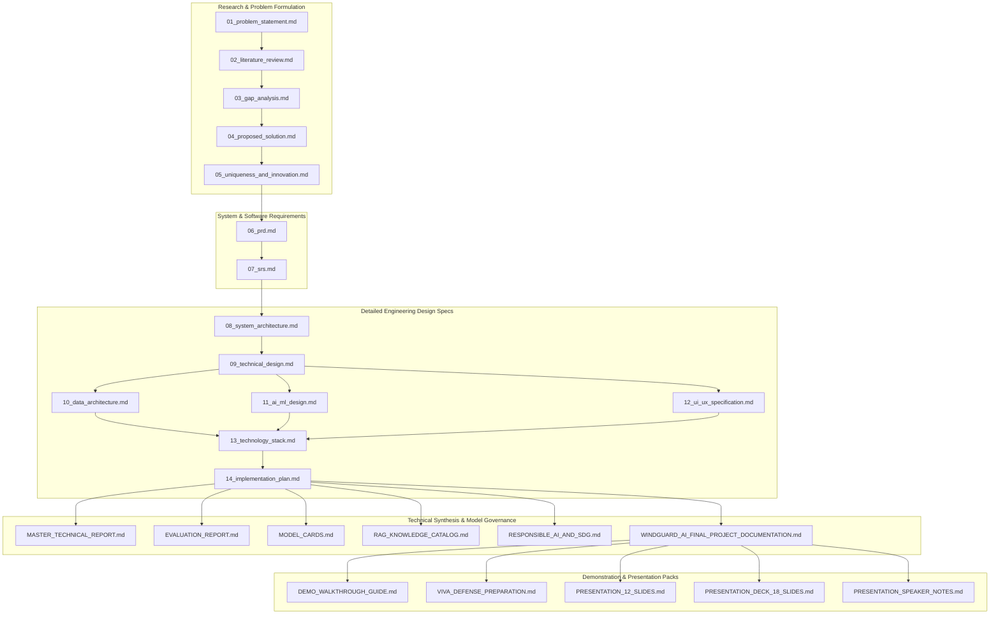

# 00. Documentation Index & Architecture Master Directory — WindGuard AI

## 1. Purpose of the Documentation System

The **WindGuard AI Documentation Suite** serves as the authoritative, self-contained engineering specification and academic reporting baseline for all research, architecture, implementation, evaluation, and demonstration facets of the project. It establishes an unbroken traceability chain connecting domain research findings, user requirements, mathematical models, system architecture, API contracts, empirical benchmarks, and oral viva defense materials.

---

## 2. Documentation Hierarchy & Dependency Flow

---

## 3. Master Document Registry

### 3.1 Foundational Specifications (00–14)

| File Name | Document Title | Status | Authoritative Scope |
| :--- | :--- | :---: | :--- |
| [`00_documentation_index.md`](file:///c:/Users/shriv/OneDrive/Desktop/WindGuardAI/docs/00_documentation_index.md) | Documentation Index & Governance | `PUBLISHED` | Master documentation map, hierarchy, and traceability. |
| [`01_problem_statement.md`](file:///c:/Users/shriv/OneDrive/Desktop/WindGuardAI/docs/01_problem_statement.md) | Problem Statement & Objectives | `PUBLISHED` | O&M crisis, stakeholders, scope, and SDG 7 alignment. |
| [`02_literature_review.md`](file:///c:/Users/shriv/OneDrive/Desktop/WindGuardAI/docs/02_literature_review.md) | Academic Literature Review | `PUBLISHED` | State-of-the-art condition monitoring, 5 intelligence generations. |
| [`03_gap_analysis.md`](file:///c:/Users/shriv/OneDrive/Desktop/WindGuardAI/docs/03_gap_analysis.md) | Technical & Operational Gap Analysis | `PUBLISHED` | 8-dimension gap matrix, research & field evidence. |
| [`04_proposed_solution.md`](file:///c:/Users/shriv/OneDrive/Desktop/WindGuardAI/docs/04_proposed_solution.md) | Proposed Solution Architecture | `PUBLISHED` | Hybrid decision-support philosophy, 8 core modules. |
| [`05_uniqueness_and_innovation.md`](file:///c:/Users/shriv/OneDrive/Desktop/WindGuardAI/docs/05_uniqueness_and_innovation.md) | Uniqueness & Novelty Analysis | `PUBLISHED` | 4-tier contribution taxonomy, core innovation hypothesis. |
| [`06_prd.md`](file:///c:/Users/shriv/OneDrive/Desktop/WindGuardAI/docs/06_prd.md) | Product Requirements Document | `PUBLISHED` | User personas, user journeys, FR-001–FR-013, NFR-001–NFR-007. |
| [`07_srs.md`](file:///c:/Users/shriv/OneDrive/Desktop/WindGuardAI/docs/07_srs.md) | Software Requirements Specification | `PUBLISHED` | Technical specs, JSON schemas, REST endpoints, traceability. |
| [`08_system_architecture.md`](file:///c:/Users/shriv/OneDrive/Desktop/WindGuardAI/docs/08_system_architecture.md) | High-Level System Architecture | `PUBLISHED` | Canonical 6-layer architecture, subsystem flows, ADR-001–ADR-006. |
| [`09_technical_design.md`](file:///c:/Users/shriv/OneDrive/Desktop/WindGuardAI/docs/09_technical_design.md) | Subsystem Technical Design | `PUBLISHED` | Class designs, algorithms, sequence flows, guardrail logic. |
| [`10_data_architecture.md`](file:///c:/Users/shriv/OneDrive/Desktop/WindGuardAI/docs/10_data_architecture.md) | Data Architecture & Schemas | `PUBLISHED` | Data sources, ER model, tariff provenance, validation rules. |
| [`11_ai_ml_design.md`](file:///c:/Users/shriv/OneDrive/Desktop/WindGuardAI/docs/11_ai_ml_design.md) | AI/ML & RAG System Design | `PUBLISHED` | Mathematical formulations, feature engineering, evaluation metrics. |
| [`12_ui_ux_specification.md`](file:///c:/Users/shriv/OneDrive/Desktop/WindGuardAI/docs/12_ui_ux_specification.md) | UI/UX & Operator Studio Spec | `PUBLISHED` | Information architecture, screen inventory, tariff display, wireframes. |
| [`13_technology_stack.md`](file:///c:/Users/shriv/OneDrive/Desktop/WindGuardAI/docs/13_technology_stack.md) | Technology Stack & Selection | `PUBLISHED` | Framework evaluations, justifications, and trade-offs. |
| [`14_implementation_plan.md`](file:///c:/Users/shriv/OneDrive/Desktop/WindGuardAI/docs/14_implementation_plan.md) | Phased Implementation Roadmap | `PUBLISHED` | Phased roadmap, modules, tests, and milestone deliverables. |

---

### 3.2 Master Reports, Model Governance & Evaluation

| File Name | Document Title | Status | Primary Purpose & Deliverables |
| :--- | :--- | :---: | :--- |
| [`MASTER_TECHNICAL_REPORT.md`](file:///c:/Users/shriv/OneDrive/Desktop/WindGuardAI/docs/MASTER_TECHNICAL_REPORT.md) | Master Technical Architecture Report | `PUBLISHED` | Comprehensive capstone technical report across all subsystems. |
| [`WINDGUARD_AI_FINAL_PROJECT_DOCUMENTATION.md`](file:///c:/Users/shriv/OneDrive/Desktop/WindGuardAI/docs/WINDGUARD_AI_FINAL_PROJECT_DOCUMENTATION.md) | Complete Final Project Documentation | `PUBLISHED` | End-to-end documentation monograph for final evaluation and archiving. |
| [`EVALUATION_REPORT.md`](file:///c:/Users/shriv/OneDrive/Desktop/WindGuardAI/docs/EVALUATION_REPORT.md) | Master Empirical Evaluation Report | `PUBLISHED` | Authoritative measured benchmark results across all 6 layers. |
| [`MODEL_CARDS.md`](file:///c:/Users/shriv/OneDrive/Desktop/WindGuardAI/docs/MODEL_CARDS.md) | Standardized ML Model Cards | `PUBLISHED` | Transparent ML model cards with physical boundaries and lag limits. |
| [`RAG_KNOWLEDGE_CATALOG.md`](file:///c:/Users/shriv/OneDrive/Desktop/WindGuardAI/docs/RAG_KNOWLEDGE_CATALOG.md) | Technical RAG Knowledge Catalog | `PUBLISHED` | Provenance catalog of 7 documents / 29 chunks (SHA-256). |
| [`RESPONSIBLE_AI_AND_SDG.md`](file:///c:/Users/shriv/OneDrive/Desktop/WindGuardAI/docs/RESPONSIBLE_AI_AND_SDG.md) | Responsible AI & SDG 7 Impact Report | `PUBLISHED` | HITL governance, non-actuation protocol, UN SDG 7 alignment. |

---

### 3.3 Demonstrations, Guides & Presentation Dossier

| File Name | Document Title | Status | Primary Purpose & Deliverables |
| :--- | :--- | :---: | :--- |
| [`DEMO_WALKTHROUGH_GUIDE.md`](file:///c:/Users/shriv/OneDrive/Desktop/WindGuardAI/docs/DEMO_WALKTHROUGH_GUIDE.md) | 10-Stage Demonstration Guide | `PUBLISHED` | Walkthrough guide for interactive 10-stage operator studio. |
| [`VIVA_DEFENSE_PREPARATION.md`](file:///c:/Users/shriv/OneDrive/Desktop/WindGuardAI/docs/VIVA_DEFENSE_PREPARATION.md) | Viva Voce & Oral Defense Pack | `PUBLISHED` | 32 categorized technical defense questions and model answers. |
| [`PRESENTATION_12_SLIDES.md`](file:///c:/Users/shriv/OneDrive/Desktop/WindGuardAI/docs/PRESENTATION_12_SLIDES.md) | 12-Slide Final Academic Presentation | `PUBLISHED` | 12-slide academic pitch presentation specification. |
| [`PRESENTATION_DECK_18_SLIDES.md`](file:///c:/Users/shriv/OneDrive/Desktop/WindGuardAI/docs/PRESENTATION_DECK_18_SLIDES.md) | Master 18-Slide Presentation Deck | `PUBLISHED` | 18 technical slides with layouts, scripts, and timing. |
| [`PRESENTATION_SPEAKER_NOTES.md`](file:///c:/Users/shriv/OneDrive/Desktop/WindGuardAI/docs/PRESENTATION_SPEAKER_NOTES.md) | Final Presentation Speaker Notes | `PUBLISHED` | Complete spoken scripts, technical defense points, and viva Q&A. |

---

### 3.4 Root Packaging & Execution Tooling

| File Name | Purpose | Format | Status |
| :--- | :--- | :---: | :---: |
| [`README.md`](file:///c:/Users/shriv/OneDrive/Desktop/WindGuardAI/README.md) | Root project overview, architecture summary, and quickstart guide. | Markdown | `PUBLISHED` |
| [`requirements.txt`](file:///c:/Users/shriv/OneDrive/Desktop/WindGuardAI/requirements.txt) | Pinned production & evaluation environment dependencies. | Pip | `PUBLISHED` |
| [`run_demo.py`](file:///c:/Users/shriv/OneDrive/Desktop/WindGuardAI/run_demo.py) | Standalone launcher for backend server & operator studio dashboard. | Python 3 | `PUBLISHED` |

---
*WindGuard AI Documentation Suite — Authoritative & Verified.*
