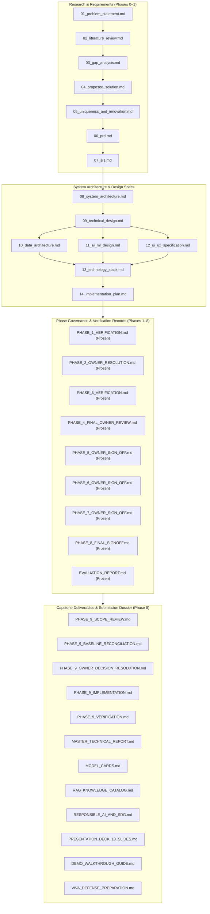

# 00. Documentation Index & Master Governance — WindGuard AI

## 1. Purpose of the Documentation System

The **WindGuard AI Documentation Baseline** serves as the authoritative, self-contained engineering specification for all research, architecture, implementation, evaluation, and deployment phases. It establishes an unbroken traceability chain connecting domain research findings (**Bhagwatikar & Bhagwatikar, 2026**), user requirements, mathematical models, system architecture, API contracts, empirical benchmarks, and oral viva defense materials.

---

## 2. Documentation Hierarchy & Dependency Flow

---

## 3. Master Document Registry

### 3.1 Foundational Specifications (Phases 0–1)

| File Name | Document Title | Version | Status | Authoritative Scope |
| :--- | :--- | :---: | :---: | :--- |
| [`00_documentation_index.md`](file:///c:/Users/shriv/OneDrive/Desktop/WindGuardAI/docs/00_documentation_index.md) | Documentation Index & Governance | 1.0 | `PUBLISHED` | Master documentation map, hierarchy, and traceability. |
| [`01_problem_statement.md`](file:///c:/Users/shriv/OneDrive/Desktop/WindGuardAI/docs/01_problem_statement.md) | Problem Statement & Objectives | 0.2 | `FROZEN` | O&M crisis, stakeholders, scope, and SDG 7 alignment. |
| [`02_literature_review.md`](file:///c:/Users/shriv/OneDrive/Desktop/WindGuardAI/docs/02_literature_review.md) | Academic Literature Review | 0.2 | `FROZEN` | State-of-the-art, 5 intelligence generations, Bhagwatikar 2026. |
| [`03_gap_analysis.md`](file:///c:/Users/shriv/OneDrive/Desktop/WindGuardAI/docs/03_gap_analysis.md) | Technical & Operational Gap Analysis | 0.2 | `FROZEN` | 8-dimension gap matrix, research & field evidence. |
| [`04_proposed_solution.md`](file:///c:/Users/shriv/OneDrive/Desktop/WindGuardAI/docs/04_proposed_solution.md) | Proposed Solution Architecture | 0.2 | `FROZEN` | Hybrid decision-support philosophy, 8 core modules. |
| [`05_uniqueness_and_innovation.md`](file:///c:/Users/shriv/OneDrive/Desktop/WindGuardAI/docs/05_uniqueness_and_innovation.md) | Uniqueness & Novelty Analysis | 0.2 | `FROZEN` | 4-tier contribution taxonomy, core innovation hypothesis. |
| [`06_prd.md`](file:///c:/Users/shriv/OneDrive/Desktop/WindGuardAI/docs/06_prd.md) | Product Requirements Document | 0.2 | `FROZEN` | User personas, user journeys, FR-001–FR-013, NFR-001–NFR-007. |
| [`07_srs.md`](file:///c:/Users/shriv/OneDrive/Desktop/WindGuardAI/docs/07_srs.md) | Software Requirements Specification | 0.2 | `FROZEN` | Technical specs, JSON schemas, REST endpoints, traceability. |
| [`08_system_architecture.md`](file:///c:/Users/shriv/OneDrive/Desktop/WindGuardAI/docs/08_system_architecture.md) | High-Level System Architecture | 0.2 | `FROZEN` | Canonical 6-layer architecture, subsystem flows, ADR-001–ADR-006. |
| [`09_technical_design.md`](file:///c:/Users/shriv/OneDrive/Desktop/WindGuardAI/docs/09_technical_design.md) | Subsystem Technical Design | 0.2 | `FROZEN` | Class designs, algorithms, sequence flows, guardrail logic. |
| [`10_data_architecture.md`](file:///c:/Users/shriv/OneDrive/Desktop/WindGuardAI/docs/10_data_architecture.md) | Data Architecture & Schemas | 0.2 | `FROZEN` | Data sources, ER model, tariff provenance, validation rules. |
| [`11_ai_ml_design.md`](file:///c:/Users/shriv/OneDrive/Desktop/WindGuardAI/docs/11_ai_ml_design.md) | AI/ML & RAG System Design | 0.2 | `FROZEN` | Mathematical formulations, feature engineering, evaluation metrics. |
| [`12_ui_ux_specification.md`](file:///c:/Users/shriv/OneDrive/Desktop/WindGuardAI/docs/12_ui_ux_specification.md) | UI/UX & Operator Studio Spec | 0.2 | `FROZEN` | Information architecture, screen inventory, tariff display, wireframes. |
| [`13_technology_stack.md`](file:///c:/Users/shriv/OneDrive/Desktop/WindGuardAI/docs/13_technology_stack.md) | Technology Stack & Selection | 0.2 | `FROZEN` | Framework evaluations, justifications, and trade-offs. |
| [`14_implementation_plan.md`](file:///c:/Users/shriv/OneDrive/Desktop/WindGuardAI/docs/14_implementation_plan.md) | Phased Implementation Roadmap | 0.2 | `FROZEN` | Authoritative 10-phase plan, tasks, tests, exit criteria. |

---

### 3.2 Phase Governance & Empirical Sign-Off Records (Phases 1–8)

| File Name | Document Title | Status | Primary Focus & Verification Artifacts |
| :--- | :--- | :---: | :--- |
| [`PHASE_1_VERIFICATION.md`](file:///c:/Users/shriv/OneDrive/Desktop/WindGuardAI/docs/PHASE_1_VERIFICATION.md) | Phase 1 Verification Record | `FROZEN` | 10-minute SCADA schema, 1st-order thermal ODEs, S1–S5. |
| [`PHASE_2_OWNER_RESOLUTION.md`](file:///c:/Users/shriv/OneDrive/Desktop/WindGuardAI/docs/PHASE_2_OWNER_RESOLUTION.md) | Phase 2 Owner Resolution | `FROZEN` | GBR Expected Power ($R^2=1.0$), RF Thermal, thermal lag bounds. |
| [`PHASE_3_VERIFICATION.md`](file:///c:/Users/shriv/OneDrive/Desktop/WindGuardAI/docs/PHASE_3_VERIFICATION.md) | Phase 3 Verification Record | `FROZEN` | Context engine precedence, 100% curtailment suppression, tariffs. |
| [`PHASE_4_FINAL_OWNER_REVIEW.md`](file:///c:/Users/shriv/OneDrive/Desktop/WindGuardAI/docs/PHASE_4_FINAL_OWNER_REVIEW.md) | Phase 4 Final Owner Review | `FROZEN` | Local hybrid RAG (7 docs / 29 chunks, MRR=1.0, Recall@3=96.67%). |
| [`PHASE_5_OWNER_SIGN_OFF.md`](file:///c:/Users/shriv/OneDrive/Desktop/WindGuardAI/docs/PHASE_5_OWNER_SIGN_OFF.md) | Phase 5 Owner Sign-Off | `FROZEN` | Deterministic Mode A synthesis, 100% numerical guardrails. |
| [`PHASE_6_OWNER_SIGN_OFF.md`](file:///c:/Users/shriv/OneDrive/Desktop/WindGuardAI/docs/PHASE_6_OWNER_SIGN_OFF.md) | Phase 6 Owner Sign-Off | `FROZEN` | 19 REST endpoints across 18 unique paths, atomic file store. |
| [`PHASE_7_OWNER_SIGN_OFF.md`](file:///c:/Users/shriv/OneDrive/Desktop/WindGuardAI/docs/PHASE_7_OWNER_SIGN_OFF.md) | Phase 7 Owner Sign-Off | `FROZEN` | Operator dashboard, 10-stage demo stepper, printable work orders. |
| [`PHASE_8_FINAL_SIGNOFF.md`](file:///c:/Users/shriv/OneDrive/Desktop/WindGuardAI/docs/PHASE_8_FINAL_SIGNOFF.md) | Phase 8 Final Sign-Off | `FROZEN` | Multi-layer evaluation harness, SLA latency $185.57\,\text{ms}$. |
| [`EVALUATION_REPORT.md`](file:///c:/Users/shriv/OneDrive/Desktop/WindGuardAI/docs/EVALUATION_REPORT.md) | Master Empirical Evaluation Report | `FROZEN` | Authoritative measured benchmark results across all 6 layers. |

---

### 3.3 Phase 9 Capstone Deliverables & Submission Dossier

| File Name | Document Title | Version | Status | Primary Purpose & Deliverables |
| :--- | :--- | :---: | :---: | :--- |
| [`PHASE_9_SCOPE_REVIEW.md`](file:///c:/Users/shriv/OneDrive/Desktop/WindGuardAI/docs/PHASE_9_SCOPE_REVIEW.md) | Phase 9 Scope Review | 1.1 | `VERIFIED` | Formal scope review and workstream classification. |
| [`PHASE_9_BASELINE_RECONCILIATION.md`](file:///c:/Users/shriv/OneDrive/Desktop/WindGuardAI/docs/PHASE_9_BASELINE_RECONCILIATION.md) | Phase 9 Baseline Reconciliation | 1.0 | `VERIFIED` | Reconciliation of RAG counts, REST routes, and evaluation tooling. |
| [`PHASE_9_OWNER_DECISION_RESOLUTION.md`](file:///c:/Users/shriv/OneDrive/Desktop/WindGuardAI/docs/PHASE_9_OWNER_DECISION_RESOLUTION.md) | Phase 9 Owner Decision Resolution | 1.2 | `APPROVED` | Approved determinations for decisions `OD-P9-01` to `OD-P9-06`. |
| [`PHASE_9_IMPLEMENTATION.md`](file:///c:/Users/shriv/OneDrive/Desktop/WindGuardAI/docs/PHASE_9_IMPLEMENTATION.md) | Phase 9 Implementation Record | 1.0 | `COMPLETE` | Implementation audit of workstreams `WS-P9-01` through `WS-P9-06`. |
| [`PHASE_9_VERIFICATION.md`](file:///c:/Users/shriv/OneDrive/Desktop/WindGuardAI/docs/PHASE_9_VERIFICATION.md) | Phase 9 Gate Verification Report | 1.0 | `PASS` | Gate verification for `GATE-P9-01` through `GATE-P9-12`. |
| [`PHASE_9_FINAL_SIGNOFF.md`](file:///c:/Users/shriv/OneDrive/Desktop/WindGuardAI/docs/PHASE_9_FINAL_SIGNOFF.md) | Phase 9 Final Owner Sign-Off & Freeze | 1.0 | `FROZEN` | Formal Owner sign-off and permanent project baseline freeze record. |
| [`MASTER_TECHNICAL_REPORT.md`](file:///c:/Users/shriv/OneDrive/Desktop/WindGuardAI/docs/MASTER_TECHNICAL_REPORT.md) | Master Technical Architecture Report | 1.0 | `PUBLISHED` | 12-chapter comprehensive capstone technical report. |
| [`MODEL_CARDS.md`](file:///c:/Users/shriv/OneDrive/Desktop/WindGuardAI/docs/MODEL_CARDS.md) | Standardized ML Model Cards | 1.0 | `PUBLISHED` | IEEE/ACM model cards with transparent thermal lag bounds. |
| [`RAG_KNOWLEDGE_CATALOG.md`](file:///c:/Users/shriv/OneDrive/Desktop/WindGuardAI/docs/RAG_KNOWLEDGE_CATALOG.md) | Technical RAG Knowledge Catalog | 1.0 | `PUBLISHED` | Provenance catalog of 7 documents / 29 chunks (SHA-256). |
| [`RESPONSIBLE_AI_AND_SDG.md`](file:///c:/Users/shriv/OneDrive/Desktop/WindGuardAI/docs/RESPONSIBLE_AI_AND_SDG.md) | Responsible AI & SDG 7 Impact Report | 1.0 | `PUBLISHED` | HITL governance, non-actuation protocol, UN SDG 7 alignment. |
| [`PRESENTATION_DECK_18_SLIDES.md`](file:///c:/Users/shriv/OneDrive/Desktop/WindGuardAI/docs/PRESENTATION_DECK_18_SLIDES.md) | Master 18-Slide Presentation Deck | 1.0 | `PUBLISHED` | 18 technical slides with layouts, scripts, and 20-min timing. |
| [`DEMO_WALKTHROUGH_GUIDE.md`](file:///c:/Users/shriv/OneDrive/Desktop/WindGuardAI/docs/DEMO_WALKTHROUGH_GUIDE.md) | 10-Stage Demonstration Guide | 1.0 | `PUBLISHED` | Examiner walkthrough guide for 10-stage operator studio. |
| [`VIVA_DEFENSE_PREPARATION.md`](file:///c:/Users/shriv/OneDrive/Desktop/WindGuardAI/docs/VIVA_DEFENSE_PREPARATION.md) | Viva Voce & Oral Defense Pack | 1.0 | `PUBLISHED` | 32 categorized technical defense questions and model answers. |

---

### 3.4 Phase 10 Final Presentation & Defense Dossier (Phase 10)

| File Name | Document Title | Version | Status | Primary Purpose & Deliverables |
| :--- | :--- | :---: | :---: | :--- |
| [`PRESENTATION_12_SLIDES.md`](file:///c:/Users/shriv/OneDrive/Desktop/WindGuardAI/docs/PRESENTATION_12_SLIDES.md) | 12-Slide Final Academic Presentation | 1.0 | `PUBLISHED` | Authoritative 12-slide presentation specification. |
| [`PRESENTATION_SPEAKER_NOTES.md`](file:///c:/Users/shriv/OneDrive/Desktop/WindGuardAI/docs/PRESENTATION_SPEAKER_NOTES.md) | Final Presentation Speaker Notes | 1.0 | `PUBLISHED` | 12-slide spoken scripts, technical points & viva Q&A. |
| [`PHASE_10_PRESENTATION_VERIFICATION.md`](file:///c:/Users/shriv/OneDrive/Desktop/WindGuardAI/docs/PHASE_10_PRESENTATION_VERIFICATION.md) | Phase 10 Verification Report | 1.0 | `VERIFIED` | Quality audit and metric reconciliation record. |

---

### 3.5 Root Packaging & Execution Tooling

| File Name | Purpose | Language / Format | Governance Status |
| :--- | :--- | :---: | :---: |
| [`README.md`](file:///c:/Users/shriv/OneDrive/Desktop/WindGuardAI/README.md) | Root project overview, architecture summary, and quickstart guide. | Markdown | `PUBLISHED` |
| [`requirements.txt`](file:///c:/Users/shriv/OneDrive/Desktop/WindGuardAI/requirements.txt) | Pinned production & evaluation environment dependencies. | Text / Pip | `PUBLISHED` |
| [`run_demo.py`](file:///c:/Users/shriv/OneDrive/Desktop/WindGuardAI/run_demo.py) | Standalone Python launcher for backend server & operator dashboard. | Python 3 | `PUBLISHED` |

---
*WindGuard AI Documentation Index — Phase 10 Complete & Verified.*

