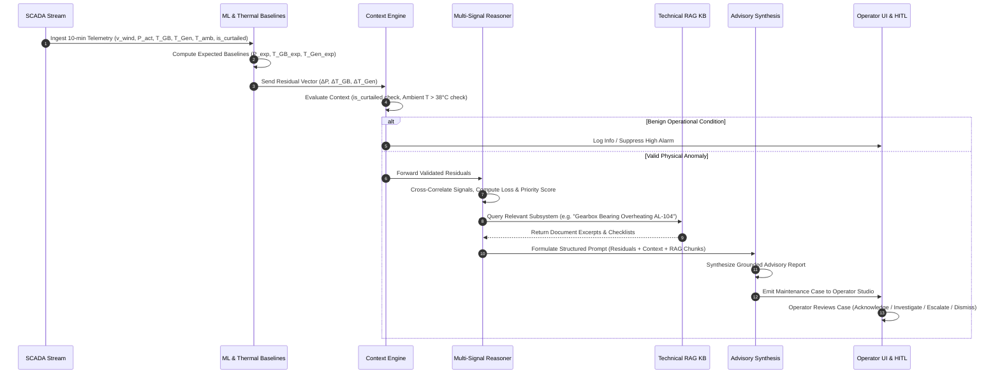

# 04. Proposed Solution — WindGuard AI

## 1. Solution Overview

**WindGuard AI** is an explainable, physics-grounded, and technical-knowledge-integrated decision-support platform engineered to transform raw, non-stationary wind turbine operational telemetry into verifiable, actionable maintenance intelligence.

Rather than acting as a black-box failure predictor or attempting unconstrained autonomous control, WindGuard AI functions as an **intelligent operational co-pilot** for wind farm O&M engineers, control room operators, and asset managers. The platform unites physics-informed empirical modeling, operational context filtering, multi-signal residual reasoning, and technical document Retrieval-Augmented Generation (RAG) into a unified, human-in-the-loop decision pipeline.

```
┌─────────────────────────────────────────────────────────────────────────────┐
│                       WINDGUARD AI SOLUTION PIPELINE                        │
└─────────────────────────────────────────────────────────────────────────────┘

  SCADA Telemetry Streams ──► Physics Baseline Regressors (Power & Thermal)
                                            │
                                            ▼
                                Multi-Signal Residuals
                                            │
                                            ▼
                              Operational Context Engine
                       (Filters is_curtailed & Ambient Heat)
                                            │
                                            ▼
                             Multi-Signal Subsystem Reasoner
                        (Drivetrain vs. Generator vs. Pitch)
                                            │
                                            ▼
                           Technical RAG Knowledge Retrieval
                        (OEM Manuals, Alarm Codes, SOPs)
                                            │
                                            ▼
                         Constrained LLM Advisory Synthesis
                       (Structured JSON: Facts + Checklists)
                                            │
                                            ▼
                           Operator Decision & HITL Center
                      (Acknowledge | Investigate | Escalate)
```

---

## 2. Design Philosophy

The architecture of WindGuard AI is governed by five foundational design principles [PROPOSED]:

1. **Bridging Detection to Action**:
   Every analytical output must directly answer four engineering questions:
   - *What is abnormal?* (Identified subsystem and specific sensor metrics).
   - *Why is it abnormal?* (Calculated physical residual relative to environmental baseline).
   - *What evidence supports it?* (Multi-signal correlation, persistence duration, confidence score).
   - *What should be done next?* (Referenced OEM manual section, inspection checklist, required tooling).
2. **Strict Hybrid Separation (ML vs. LLM)**:
   - Machine learning and statistical algorithms compute all quantitative metrics (residuals, $z$-scores, energy loss kWh, priority scores).
   - The architecture prevents the generative layer from independently generating or modifying numerical diagnostic values by enforcing strict schema bounding over deterministic outputs.
3. **Context-First Anomaly Validation**:
   No anomaly is elevated to high priority without contextual verification against external environmental conditions (ambient temperature, wind shear) and grid operational commands (`is_curtailed`).
4. **Human-in-the-Loop (HITL) Supremacy**:
   AI outputs are strictly advisory. The system enforces deterministic software boundaries that prevent direct actuation of turbine control loops (pitch, yaw, generator torque, emergency trip), ensuring that maintenance decisions and field escalations remain under human engineering authority.
5. **Transparency & Uncertainty Quantification**:
   All diagnostic claims communicate explicit confidence ratings ($0\%-100\%$) and temporal persistence intervals ($W \ge 6$ intervals), avoiding unwarranted absolute deterministic assertions.

---

## 3. Core Components

The WindGuard AI platform comprises eight tightly integrated functional modules within the canonical 6-layer architecture:

```
┌─────────────────────────────────────────────────────────────────────────────┐
│                     WINDGUARD AI CORE COMPONENT SUITE                       │
└─────────────────────────────────────────────────────────────────────────────┘

  1. SCADA INGESTION & DATA ENGINE (Layer 1: Data Ingestion)
     ├── Standard 10-minute SCADA parsing, validation, is_curtailed, and Indian profiles.

  2. EXPECTED-BEHAVIOUR ML ENGINE (Layer 2: Analytical Engine)
     ├── Empirical Power Curve Regressor: P_exp = f(v_wind, T_amb, pitch).
     └── Component Thermal Equilibrium Models: T_GB_exp, T_Gen_exp.

  3. OPERATIONAL CONTEXT ENGINE (Layer 3: Context Engine)
     ├── Validates external ambient heat, turbulence, and is_curtailed grid derating.

  4. MULTI-SIGNAL SUBSYSTEM REASONER (Layer 3: Context Engine)
     ├── Correlates power, thermal, and rotational slips to isolate subsystem origin.

  5. ANOMALY PRIORITIZATION & TARIFF ENGINE (Layer 3: Context Engine)
     ├── Transparent multi-factor ranking & loss valuation via Applicable Tariff.

  6. TECHNICAL KNOWLEDGE BASE & RAG (Layer 4: Technical Knowledge)
     ├── Vector-embedded OEM manuals, SCADA alarm codes (IEC 61400), and O&M SOPs.

  7. EVIDENCE-GROUNDED ADVISORY ENGINE (Layer 5: Evidence-Grounded Synthesis)
     ├── Constrained LLM/template synthesis generating structured JSON maintenance cases.

  8. OPERATOR DASHBOARD & CASE STUDIO (Layer 6: Presentation & HITL Governance)
     ├── High-performance web interface for fleet overview, deep dives, RAG Q&A, and HITL.
```

---

## 4. System & Operational Workflows

### 4.1 End-to-End System Workflow



---

## 5. Major Functionalities

### 5.1 Physics-Informed Expected Power & Thermal Modeling
- **Expected Power**: Predicts aerodynamic power output $\hat{P} = f(v_{\text{wind}}, T_{\text{ambient}}, \theta_{\text{pitch}})$ using gradient-boosted tree ensembles and non-linear logistic baselines trained on certified normal operating intervals.
- **Thermal Equilibrium**: Models steady-state component heating $\hat{T}_{\text{component}} = f(P_{\text{active}}, T_{\text{ambient}}, \omega_{\text{rotor}})$ to detect abnormal thermal rise caused by mechanical friction, lubrication breakdown, or electrical winding degradation.

### 5.2 Context-Aware Filtering
- **Curtailment Recognition**: Identifies when power output is depressed due to grid operator curtailment commands rather than aerodynamic or generator failure.
- **Ambient Thermal Derating**: Decouples external seasonal ambient heatwaves (e.g., $T_{\text{ambient}} > 40^\circ\text{C}$ in Indian summer regimes) from internal friction-induced thermal anomalies.

### 5.3 Technical RAG Knowledge Assistant
- Enables natural language querying over technical documentation (e.g., *"What is the standard inspection protocol for alarm code AL-104?"* or *"What are the lubrication flush intervals under high dust conditions?"*).
- Delivers exact source citations (Document Title, Section, Chapter, Page).

### 5.4 Human-in-the-Loop Case Management Studio
- Provides an interactive decision interface allowing operators to review active anomalies, inspect live sensor curves, analyze RAG recommendations, record engineering notes, and execute formal case actions:
  - **Acknowledge**: Confirm alert review and continue automated monitoring.
  - **Investigate**: Request deeper diagnostic telemetry and sensor calibration review.
  - **Escalate**: Generate a formal maintenance work order and dispatch site technicians.
  - **Dismiss/Monitor**: Mark anomaly as known benign operational state with audit justification.

---

## 6. How the Solution Addresses Identified Gaps

| Identified Gap (Doc 03) | Proposed Solution Component | Expected Operational Benefit |
| :--- | :--- | :--- |
| **GAP-CTX-01**: False alarms from ambient summer heat. | **Context Engine (Thermal Rise $\Delta T$ Check)** | Suppresses false alarms by verifying whether component heating matches ambient rise or exceeds physical equilibrium. |
| **GAP-CTX-02**: False alarms during grid curtailment. | **Context Engine (`is_curtailed` & Pitch Filter)** | Correctly classifies operator-commanded power curtailment, preventing spurious hardware fault alarms. |
| **GAP-XAI-01**: Black-box ungrounded predictions. | **Multi-Signal Residual Attribution** | Provides exact numerical residuals ($\Delta P$, $\Delta T_{\text{GB}}$, $\Delta T_{\text{Gen}}$) and dominant signal breakdown. |
| **GAP-XAI-02**: Unquantified prediction certainty. | **Uncertainty & Persistence Engine** | Emits confidence ratings ($0\%-100\%$) and enforces 60-minute persistence windows ($W=6$) to eliminate transient noise. |
| **GAP-KNOW-01**: Disconnected technical documentation. | **Local Technical RAG Subsystem** | Automatically surfaces relevant OEM manual chapters and alarm playbooks directly inside the maintenance alert. |
| **GAP-KNOW-02**: LLM hallucination risk in engineering. | **Deterministic Hybrid Separation** | Telemetry and metrics are computed strictly by ML; LLM is restricted to explaining verified analytical outputs and retrieved manual text. |
| **GAP-ATTR-01**: Inability to isolate subsystem root cause. | **Cross-Subsystem Correlation Engine** | Differentiates aerodynamic (pitch/yaw), mechanical (gearbox), and electrical (generator) faults based on joint multi-signal patterns. |
| **GAP-GOV-01**: Lack of human engineering oversight. | **Human-in-the-Loop Case Center** | Strictly locks out autonomous control; requires operator engineering sign-off for all maintenance work orders. |
| **GAP-UX-01**: Cluttered SCADA alarm interfaces. | **Structured O&M Advisory Studio** | Presents structured, intuitive 5-part reports (Summary $\to$ Evidence $\to$ Hypotheses $\to$ RAG Sources $\to$ Inspection Checklist). |

---

## 7. Expected Outcomes (Project Targets)

1. **Reduction in Unplanned Drivetrain Downtime [TARGET]**: Early identification of bearing friction and lubrication failure modes enables pre-emptive maintenance during scheduled low-wind windows.
2. **Elimination of Nuisance Alarm Fatigue [TARGET]**: Context filtering targets suppressing $\ge 95\%$ of false alarms caused by weather transients and grid curtailment (`is_curtailed`).
3. **Accelerated Maintenance Response Time [TARGET]**: Automated RAG lookup reduces technician troubleshooting time by immediately surfacing relevant OEM procedures and required tooling.
4. **Enhanced Clean Energy Generation (SDG 7)**: Mitigating catastrophic downtime improves overall wind farm availability and Capacity Utilization Factor (CUF).

---

## 8. Known Limitations & Boundaries

1. **SCADA 10-Minute Averaging Resolution [SOURCE-DERIVED BOUNDARY]**: The system operates on 10-minute statistical intervals. Sub-second transient electrical faults (e.g., microsecond converter IGBT switching transients) cannot be resolved without high-speed transient recorders.
2. **Advisory Nature [SAFETY BOUNDARY]**: WindGuard AI provides decision support; it does not replace certified mechanical/electrical engineering inspections or OEM warranty sign-offs.
3. **Dataset Scope [BOUNDARY]**: Baseline models require a calibration window of normal operational data (typically 14 to 30 days of diverse wind speeds) to establish reliable expected-behaviour baselines.

---

## 9. Core Assumptions & Tariff Strategy

1. **Telemetry Availability [ASSUMPTION]**: Standard SCADA parameters (wind speed, power, pitch, component temperatures, `is_curtailed`) are recorded and transmitted reliably via standard industrial protocols (Modbus, OPC-UA, or REST APIs).
2. **Documentation Grounding [ASSUMPTION]**: The technical RAG corpus is populated with authentic, verified OEM manuals and standard operating procedures.
3. **Deterministic Governance [PROPOSED]**: System administrators will maintain human approval policies and will not bypass the HITL safety lock.
4. **Tariff Strategy & Provenance [ASSUMPTION / CONFIGURABLE BASELINE]**: Estimated financial loss is calculated as $\text{Energy Loss (kWh)} \times \text{Applicable Tariff (₹/kWh)}$. The system supports Project-Specific PPA Tariffs, Official CERC/SERC Regulatory Reference Tariffs, and User Scenario Tariffs. A representative baseline of INR ₹3.20/kWh is used as an initial configurable assumption, but is explicitly configurable and traceable to its source.
