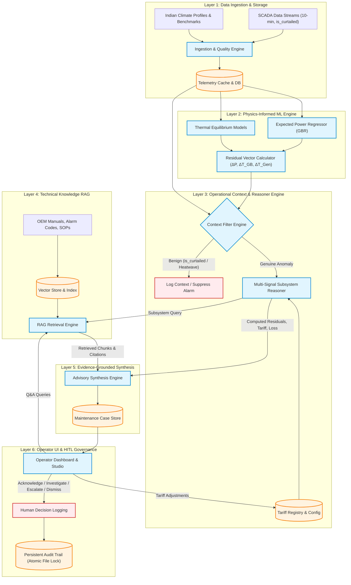

# 08. System Architecture — WindGuard AI

## 1. Architecture Goals & Principles

The system architecture of **WindGuard AI** is engineered to realize an explainable, modular, and human-in-the-loop wind turbine decision-support platform. The architecture is guided by six core principles:

1. **Strict Decoupling of Analytics from Synthesis**: Quantitative numerical ML baselines and residual algorithms are strictly decoupled from generative LLM reasoning layers.
2. **Context-First Verification**: Anomaly signals must pass through domain contextual filters (`is_curtailed`, ambient heat) before escalating to advisory generation.
3. **Deterministic Grounding & Constrained Synthesis**: Every generated recommendation is deterministically bounded by verified telemetry residuals and retrieved technical documentation.
4. **Deterministic Safety Boundaries**: Complete architectural lockout preventing automated software systems from directly actuating physical turbine control loops.
5. **Lightweight & Deployable**: Operates seamlessly on standard edge gateways, workstation CPUs, or cloud containers without requiring mandatory high-end GPU clusters.
6. **High Observability & Auditability**: Every analytical inference, RAG retrieval query, tariff resolution, and human operator decision is permanently logged in a structured audit trail.

---

## 2. Canonical 6-Layer Architecture Diagram

---

## 3. Major Architectural Subsystems

### 3.1 Data Ingestion & Preprocessing Subsystem (Layer 1)
- **Purpose**: Ingests, validates, cleans, and standardizes multi-turbine 10-minute SCADA data streams.
- **Responsibilities**: Outlier rejection, missing value handling, timestamp alignment, canonical `is_curtailed` parsing (with `curtailment_flag` alias support), and climate profile conditioning.
- **Dependencies**: Pandas, NumPy.
- **Interfaces**: Internal Python APIs (`DataLoader`, `DataPreprocessor`).

### 3.2 Expected Behaviour ML Subsystem (Layer 2)
- **Purpose**: Establishes empirical physics-informed baselines for healthy turbine performance.
- **Responsibilities**: Non-linear regression of power curves ($\hat{P} = f(v_{\text{wind}}, T_{\text{amb}}, \theta)$) and component thermal equilibrium ($\hat{T} = f(P, T_{\text{amb}}, \omega)$); computes physical residuals.
- **Dependencies**: Scikit-Learn (GradientBoostingRegressor / RandomForestRegressor), SciPy.
- **Interfaces**: `ExpectedPowerModel`, `ThermalModel`.

### 3.3 Operational Context Engine Subsystem (Layer 3)
- **Purpose**: Decouples benign environmental transients and operational grid derating from physical equipment faults.
- **Responsibilities**: Evaluates `is_curtailed` grid dispatch commands, ambient temperature thresholds, and low-wind states.
- **Dependencies**: Pure deterministic rule engine.
- **Interfaces**: `ContextEngine.evaluate_context(telemetry, residuals)`.

### 3.4 Multi-Signal Reasoner & Prioritization Subsystem (Layer 3)
- **Purpose**: Cross-correlates multi-channel residuals to isolate subsystem root causes, compute normalized priority scores, and resolve financial loss using the Applicable Tariff hierarchy.
- **Responsibilities**: Joint correlation of $\Delta P$, $\Delta T_{\text{GB}}$, $\Delta T_{\text{Gen}}$, and $\Delta\omega$; computes estimated lost generation ($\text{kWh}$) and revenue impact.
- **Dependencies**: NumPy.
- **Interfaces**: `MultiSignalReasoner.analyze_signals(residuals, context, tariff_config)`.

### 3.5 Technical RAG Knowledge Subsystem (Layer 4)
- **Purpose**: Provides semantic and lexical retrieval over OEM maintenance manuals, IEC alarm codes, and Indian wind SOPs.
- **Responsibilities**: Document chunking, vector embedding, cosine similarity ranking, citation metadata extraction.
- **Dependencies**: Local dense embeddings (SentenceTransformers / TF-IDF Vectorizer), SQLite / JSON vector index.
- **Interfaces**: `KnowledgeBase.query(query_text, top_k)`.

### 3.6 Constrained Advisory Synthesis Subsystem (Layer 5)
- **Purpose**: Synthesizes computed analytical metrics and retrieved technical documentation into structured JSON maintenance advisory cases.
- **Responsibilities**: Strict schema enforcement, prompt bounding, deterministic guardrails, fallback template engine.
- **Dependencies**: Pydantic v2, HTTP client (FastAPI).
- **Interfaces**: `AdvisoryEngine.generate_case(telemetry, residuals, context, rag_chunks, tariff_provenance)`.

### 3.7 Operator Dashboard & Human-in-the-Loop Governance Subsystem (Layer 6)
- **Purpose**: Renders the complete web interface for fleet triage, turbine deep-dive analytics, conversational RAG, tariff display, and operator case action logging.
- **Responsibilities**: Telemetry visualization (Chart.js), real-time power curve rendering, operator action dispatch, atomic audit logging.
- **Dependencies**: FastAPI, HTML5/CSS3/JavaScript (Tailwind CSS, Chart.js, Lucide).
- **Interfaces**: REST API endpoints (`/api/fleet/*`, `/api/turbines/*`, `/api/cases`, `/api/cases/*`, `/api/tariffs`, `/api/rag/*`, `/api/demo/*`).

---

## 4. Architecture Decision Records (ADRs)

### ADR-001: Hybrid Separation of ML Analytics and Generative LLM Reasoning
- **Context**: Black-box neural networks lack domain grounding, while pure conversational LLMs suffer from numerical hallucinations when processing raw sensor streams.
- **Decision**: Enforce a strict hybrid architecture where numerical ML models calculate exact residuals ($\Delta P, \Delta T$), and the LLM is restricted to explaining verified numbers and retrieved RAG document chunks.
- **Status**: APPROVED.
- **Trade-offs**: Requires explicit schema modeling between ML and LLM layers; completely prevents generative layer from modifying numerical facts.

### ADR-002: Localized RAG Knowledge Base and Deterministic Fallback Engine
- **Context**: Industrial wind farm operations may run in low-connectivity or air-gapped environments where third-party public cloud LLM APIs are inaccessible or restricted.
- **Decision**: Implement a lightweight local vector store and deterministic high-fidelity template synthesis engine as a default fallback, with optional pluggable cloud LLM providers (IBM Granite, OpenAI).
- **Status**: APPROVED.
- **Trade-offs**: Slightly less conversational fluidity in fallback mode; guarantees $100\%$ offline availability, reproducibility, and zero external data leakage.

### ADR-003: Software Safety Lockout for Autonomous Turbine Control
- **Context**: Academic research often discusses autonomous turbine pitch/yaw control, but industrial deployment requires strict adherence to IEC 61400 safety standards and human engineering oversight.
- **Decision**: Strictly omit any automated control/actuation write endpoints from the architecture. All outputs are strictly advisory decision-support cases requiring human operator sign-off.
- **Status**: APPROVED.
- **Trade-offs**: Prevents fully autonomous closed-loop control; guarantees total operational safety and regulatory compliance.

### ADR-004: Gradient Boosted Trees for Expected Power Curve Modeling
- **Context**: Need high-accuracy non-linear power curve prediction conditioned on wind speed, ambient temperature, and pitch angle with low computational latency.
- **Decision**: Select Gradient Boosted Regressors (GBR) / Random Forests over heavy Deep Learning architectures (Transformers/LSTMs).
- **Status**: APPROVED.
- **Trade-offs**: Tabular tree models train in seconds, execute in $<1\,\text{ms}$, provide native feature importance, and target $R^2 \ge 0.95$ on standard SCADA data.

### ADR-005: Zero-Build Frontend Single Page Architecture
- **Context**: Need a responsive, modern web interface that eliminates complex node build toolchains, Webpack compilation latency, and dependency vulnerabilities.
- **Decision**: Build the frontend using standard modern HTML5, Tailwind CSS, Vanilla JavaScript (ES6+), Chart.js, and Lucide SVG icons served directly by FastAPI.
- **Status**: APPROVED.
- **Trade-offs**: Manual state management in vanilla JS; guarantees zero-build instant startup, clean portability, and sub-100ms UI responsiveness.

### ADR-006: Thread-Safe Atomic File-Locked JSON & SQLite Persistence
- **Context**: Operator decision logging, telemetry caching, and case persistence must prevent write collisions or data corruption in local multi-request environments.
- **Decision**: Use atomic file write locks (`portalocker` / Python `threading.Lock`) for JSON append-only audit logs and SQLite stores.
- **Status**: APPROVED.
- **Trade-offs**: Slight file-lock synchronization overhead on write; guarantees 100% audit log consistency and ACID durability for operator compliance logs.
