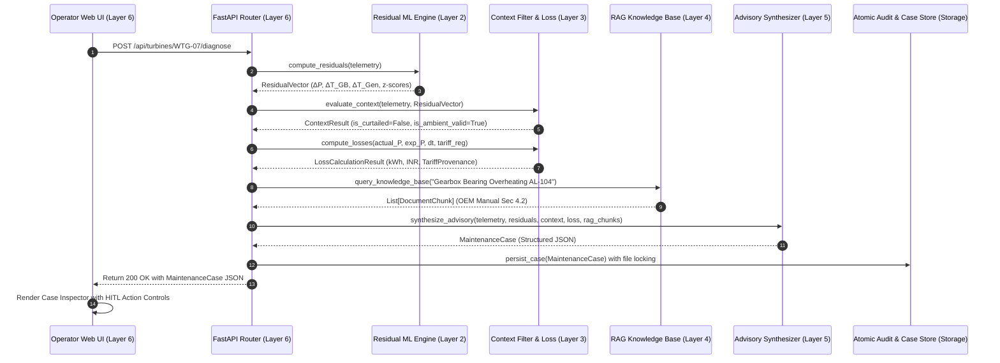

# 09. Technical Design — WindGuard AI

## 1. Executive Summary

This document specifies the internal technical designs, class hierarchies, algorithmic workflows, data structures, error handling mechanisms, persistence layer, and REST API contracts for all core software components of **WindGuard AI**. The technical design adheres strictly to the canonical **6-Layer Architecture** established in [`docs/08_system_architecture.md`](file:///c:/Users/shriv/OneDrive/Desktop/WindGuardAI/docs/08_system_architecture.md).

---

## 2. Canonical Subsystem Technical Designs

```
Layer 1: Data Ingestion & SCADA Simulator Layer
Layer 2: Deterministic Analytical ML & Residual Engine
Layer 3: Operational Context Filter, Multi-Signal Reasoner & Loss Engine
Layer 4: Technical Knowledge Retrieval (RAG) Engine
Layer 5: Evidence Synthesis, Guardrail & Diagnostic Generation Layer
Layer 6: Presentation, REST API & HITL Governance Layer
```

---

### 2.1 Layer 1: Data Ingestion & SCADA Simulator Subsystem

#### Class & Module Structure
- **Module**: `backend.data.scada_engine`
- **Classes**:
  - `SCADADataLoader`: Ingests and standardizes external tabular datasets (CSV/JSON), mapping input fields to canonical schema (e.g. mapping legacy `curtailment_flag` to canonical `is_curtailed`).
  - `SCADASimulator`: Generates multi-turbine operational streams with physics-based heating dynamics, aerodynamic curves, and failure injection scenarios.
  - `SCADAPreprocessor`: Handles missing values, range validation, anomaly filtering, and sliding-window feature engineering.

#### Core Algorithmic Formulation: Physics & Thermal Evolution
```python
import math
from typing import Optional
from pydantic import BaseModel, Field

class TurbineState(BaseModel):
    turbine_id: str
    rated_power: float = 2000.0  # kW
    cut_in_speed: float = 3.0     # m/s
    rated_speed: float = 12.0     # m/s
    cut_out_speed: float = 25.0   # m/s
    aerodynamic_derate_factor: float = 0.0
    is_curtailed: bool = False
    curtailment_limit_kw: float = 2000.0
    temp_gearbox_bearing: float = 45.0
    temp_gen_stator: float = 55.0
    bearing_wear_heat_c: float = 0.0
    gen_cooling_loss_heat_c: float = 0.0
    tau_thermal_gb: float = 60.0   # Thermal time constant (min)
    tau_thermal_gen: float = 45.0  # Thermal time constant (min)

class TelemetryRecord(BaseModel):
    timestamp: str
    turbine_id: str
    wind_speed: float
    active_power: float
    pitch_angle: float
    rotor_speed: float
    gearbox_bearing_temp: float
    generator_stator_temp: float
    ambient_temp: float
    nacelle_position: float
    is_curtailed: bool = Field(default=False, description="Canonical curtailment status (alias: curtailment_flag)")
    curtailment_limit_kw: Optional[float] = None

def update_turbine_physics(
    state: TurbineState, 
    wind_speed: float, 
    ambient_temp: float, 
    dt_min: float = 10.0
) -> TelemetryRecord:
    """Updates turbine aerodynamic power and first-order thermal equilibrium states."""
    # 1. Aerodynamic Power Calculation
    if wind_speed < state.cut_in_speed or wind_speed > state.cut_out_speed:
        p_aero = 0.0
    elif wind_speed < state.rated_speed:
        p_aero = state.rated_power * ((wind_speed - state.cut_in_speed) / (state.rated_speed - state.cut_in_speed)) ** 3
    else:
        p_aero = state.rated_power
        
    # Apply Degradation / Fault Factor
    p_actual = p_aero * (1.0 - state.aerodynamic_derate_factor)
    if state.is_curtailed:
        p_actual = min(p_actual, state.curtailment_limit_kw)
        
    # 2. First-Order Component Thermal Equilibrium: dT/dt = (T_target - T_current) / tau
    load_ratio = max(0.0, p_actual / state.rated_power)
    t_target_gb = ambient_temp + (25.0 * load_ratio) + state.bearing_wear_heat_c
    state.temp_gearbox_bearing += (t_target_gb - state.temp_gearbox_bearing) * (1.0 - math.exp(-dt_min / state.tau_thermal_gb))
    
    t_target_gen = ambient_temp + (35.0 * load_ratio) + state.gen_cooling_loss_heat_c
    state.temp_gen_stator += (t_target_gen - state.temp_gen_stator) * (1.0 - math.exp(-dt_min / state.tau_thermal_gen))
    
    return TelemetryRecord(
        timestamp="2026-09-20T12:00:00Z",
        turbine_id=state.turbine_id,
        wind_speed=wind_speed,
        active_power=round(p_actual, 2),
        pitch_angle=round(0.5 if not state.is_curtailed else 15.0, 2),
        rotor_speed=round(14.5 * (p_actual / state.rated_power)**0.5, 2),
        gearbox_bearing_temp=round(state.temp_gearbox_bearing, 2),
        generator_stator_temp=round(state.temp_gen_stator, 2),
        ambient_temp=ambient_temp,
        nacelle_position=180.0,
        is_curtailed=state.is_curtailed,
        curtailment_limit_kw=state.curtailment_limit_kw if state.is_curtailed else None
    )
```

---

### 2.2 Layer 2: Deterministic Analytical ML & Residual Engine

#### Class & Module Structure
- **Module**: `backend.models.expected_behaviour`
- **Classes**:
  - `ExpectedPowerModel`: Gradient Boosting Regressor (LightGBM/XGBoost/scikit-learn) predicting expected healthy power $\hat{P} = f(v_{\text{wind}}, T_{\text{ambient}}, \theta_{\text{pitch}})$.
  - `ExpectedThermalModel`: Multi-output regressor predicting expected thermal baselines $\hat{T}_{\text{GB}} = f(P, T_{\text{amb}}, \omega_{\text{rotor}})$ and $\hat{T}_{\text{Gen}} = f(P, T_{\text{amb}}, \omega_{\text{rotor}})$.
  - `ResidualEngine`: Computes physical residuals ($\Delta P = P_{\text{actual}} - \hat{P}$, $\Delta T_{\text{GB}} = T_{\text{GB,actual}} - \hat{T}_{\text{GB}}$, $\Delta T_{\text{Gen}} = T_{\text{Gen,actual}} - \hat{T}_{\text{Gen}}$) and computes rolling standardized $z$-scores.

#### Residual Calculation Logic
```python
from pydantic import BaseModel

class BaselineStats(BaseModel):
    mu_p: float = 0.0
    sigma_p: float = 45.0   # kW standard deviation
    mu_gb: float = 0.0
    sigma_gb: float = 2.5   # °C standard deviation
    mu_gen: float = 0.0
    sigma_gen: float = 3.0  # °C standard deviation

class ResidualVector(BaseModel):
    expected_power_kw: float
    residual_power_kw: float
    z_power: float
    expected_gb_temp_c: float
    residual_gb_temp_c: float
    z_gb: float
    expected_gen_temp_c: float
    residual_gen_temp_c: float
    z_gen: float

def compute_residuals(
    telemetry: TelemetryRecord, 
    power_model, 
    thermal_model, 
    baseline_stats: BaselineStats
) -> ResidualVector:
    p_exp = float(power_model.predict([[telemetry.wind_speed, telemetry.ambient_temp, telemetry.pitch_angle]])[0])
    t_gb_exp, t_gen_exp = [float(x) for x in thermal_model.predict([[telemetry.active_power, telemetry.ambient_temp, telemetry.rotor_speed]])[0]]
    
    r_p = telemetry.active_power - p_exp
    r_gb = telemetry.gearbox_bearing_temp - t_gb_exp
    r_gen = telemetry.generator_stator_temp - t_gen_exp
    
    return ResidualVector(
        expected_power_kw=round(p_exp, 2),
        residual_power_kw=round(r_p, 2),
        z_power=round((r_p - baseline_stats.mu_p) / baseline_stats.sigma_p, 2),
        expected_gb_temp_c=round(t_gb_exp, 2),
        residual_gb_temp_c=round(r_gb, 2),
        z_gb=round((r_gb - baseline_stats.mu_gb) / baseline_stats.sigma_gb, 2),
        expected_gen_temp_c=round(t_gen_exp, 2),
        residual_gen_temp_c=round(r_gen, 2),
        z_gen=round((r_gen - baseline_stats.mu_gen) / baseline_stats.sigma_gen, 2),
    )
```

---

### 2.3 Layer 3: Context Filter, Multi-Signal Reasoner & Financial Loss Engine

#### Class & Module Structure
- **Module**: `backend.engine.context_filter` & `backend.engine.reasoner` & `backend.engine.tariff_registry`
- **Classes**:
  - `ContextFilterEngine`: Evaluates operational state against environmental, dispatch, and low-wind conditions to prevent false alarms.
  - `MultiSignalReasoner`: Correlates power residuals, thermal residuals, and context to isolate faulty subsystems (Drivetrain, Generator, Pitch/Rotor, Sensor/Auxiliary) and compute multi-factor anomaly severity.
  - `TariffRegistry`: Manages configurable tariff baselines, project PPAs, and regulatory benchmark tariffs with provenance tracking.
  - `LossCalculator`: Computes deterministic energy loss (kWh) and financial loss (INR) using active tariff configuration.

#### Context Filtering & Subsystem Reasoning Implementation
```python
from enum import Enum
from typing import List

class OperationalContextState(str, Enum):
    NORMAL = "NORMAL"
    CURTAILED = "CURTAILED"
    HIGH_AMBIENT_DERATE = "HIGH_AMBIENT_DERATE"
    LOW_WIND_IDLE = "LOW_WIND_IDLE"
    TRANSIENT_STARTUP = "TRANSIENT_STARTUP"

class ContextResult(BaseModel):
    state: OperationalContextState
    is_suppressed: bool
    explanation: str

def evaluate_context(telemetry: TelemetryRecord, residuals: ResidualVector) -> ContextResult:
    # 1. Grid curtailment check (canonical is_curtailed flag or feathered pitch under strong wind)
    if telemetry.is_curtailed or (telemetry.pitch_angle > 10.0 and telemetry.wind_speed > 6.0 and telemetry.active_power < 0.8 * telemetry.wind_speed**3):
        return ContextResult(
            state=OperationalContextState.CURTAILED,
            is_suppressed=True,
            explanation="Turbine is under active grid curtailment or dispatch derating. Low power output is deliberate."
        )
    # 2. Ambient heatwave check
    if telemetry.ambient_temp >= 38.0 and residuals.residual_gb_temp_c < 6.0 and residuals.z_gb < 2.0:
        return ContextResult(
            state=OperationalContextState.HIGH_AMBIENT_DERATE,
            is_suppressed=True,
            explanation="Elevated component temperature is driven by severe ambient conditions (>=38°C) within expected thermal rise."
        )
    # 3. Low wind idle check
    if telemetry.wind_speed < 3.0:
        return ContextResult(
            state=OperationalContextState.LOW_WIND_IDLE,
            is_suppressed=True,
            explanation="Wind speed below cut-in threshold (3.0 m/s). Turbine idling normally."
        )
    return ContextResult(state=OperationalContextState.NORMAL, is_suppressed=False, explanation="Normal operating regime.")
```

#### Multi-Mode Tariff Architecture & Financial Loss Calculation
```python
class TariffMode(str, Enum):
    PROJECT_PPA = "PROJECT_PPA"
    REGULATORY_BENCHMARK = "REGULATORY_BENCHMARK"
    CONFIGURED_BASELINE = "CONFIGURED_BASELINE"
    SCENARIO_OVERRIDE = "SCENARIO_OVERRIDE"

class TariffProvenance(BaseModel):
    applied_rate_inr_per_kwh: float
    mode: TariffMode
    source_reference: str
    effective_date: str
    currency: str = "INR"
    is_baseline_assumption: bool

class TariffRegistry:
    def __init__(self):
        self._current_tariff = TariffProvenance(
            applied_rate_inr_per_kwh=3.20,
            mode=TariffMode.CONFIGURED_BASELINE,
            source_reference="CERC Benchmark & Industry Baseline Configuration (docs/10_data_architecture.md)",
            effective_date="2026-09-20",
            currency="INR",
            is_baseline_assumption=True
        )

    def get_active_tariff(self) -> TariffProvenance:
        return self._current_tariff

    def set_tariff(self, rate: float, mode: TariffMode, source: str) -> TariffProvenance:
        if rate <= 0.0 or rate > 20.0:
            raise ValueError("Tariff rate must be between ₹0.01/kWh and ₹20.00/kWh.")
        self._current_tariff = TariffProvenance(
            applied_rate_inr_per_kwh=rate,
            mode=mode,
            source_reference=source,
            effective_date="2026-09-20",
            currency="INR",
            is_baseline_assumption=(mode == TariffMode.CONFIGURED_BASELINE)
        )
        return self._current_tariff

class LossCalculationResult(BaseModel):
    duration_hours: float
    estimated_energy_loss_kwh: float
    estimated_financial_loss_inr: float
    tariff_provenance: TariffProvenance

def compute_losses(
    actual_power_kw: float, 
    expected_power_kw: float, 
    duration_hours: float, 
    tariff_registry: TariffRegistry
) -> LossCalculationResult:
    """Calculates deterministic energy loss and financial loss based on active tariff provenance."""
    power_deficit_kw = max(0.0, expected_power_kw - actual_power_kw)
    energy_loss_kwh = round(power_deficit_kw * duration_hours, 2)
    tariff = tariff_registry.get_active_tariff()
    financial_loss_inr = round(energy_loss_kwh * tariff.applied_rate_inr_per_kwh, 2)
    
    return LossCalculationResult(
        duration_hours=duration_hours,
        estimated_energy_loss_kwh=energy_loss_kwh,
        estimated_financial_loss_inr=financial_loss_inr,
        tariff_provenance=tariff
    )
```

---

### 2.4 Layer 4: Technical Knowledge Retrieval (RAG) Subsystem

#### Class & Module Structure
- **Module**: `backend.rag.knowledge_base`
- **Classes**:
  - `DocumentChunker`: Chunks Markdown/PDF technical manuals preserving section hierarchy, table markdown, and parent document metadata.
  - `VectorKnowledgeBase`: Indexes chunks and performs cosine semantic similarity + BM25 keyword matching with local fallback.
  - `LocalSearchFallback`: High-performance, offline TF-IDF and BM25 search engine that operates without external vector database dependencies or network access.

#### Document Schema & Retrieval Logic
```python
class DocumentChunk(BaseModel):
    chunk_id: str
    document_title: str
    chapter: str
    section: str
    page_number: int
    content: str
    tags: List[str]

class RetrievalResult(BaseModel):
    chunks: List[DocumentChunk]
    retrieval_mode: str  # "HYBRID_VECTOR_BM25" | "LOCAL_TFIDF_FALLBACK"
    query: str
```

---

### 2.5 Layer 5: Evidence Synthesis & Guardrail Generation Subsystem

#### Class & Module Structure
- **Module**: `backend.llm.advisory_engine`
- **Classes**:
  - `AdvisoryEngine`: Manages structured prompt synthesis and multi-provider execution (Local Deterministic Rule-Based Engine / IBM Granite / Cloud LLM).
  - `GuardrailValidator`: Verifies that $100\%$ of numerical values in the generated advisory match pre-computed analytical telemetry and residual values.

#### Guardrail Verification Workflow
```python
class EvidenceItem(BaseModel):
    parameter: str
    observed_value: str
    expected_value: str
    deviation: str
    interpretation: str

class MaintenanceCase(BaseModel):
    case_id: str
    turbine_id: str
    timestamp: str
    subsystem_affected: str
    severity_level: str
    anomaly_score: float
    root_cause_hypotheses: List[str]
    evidence_table: List[EvidenceItem]
    loss_estimate: LossCalculationResult
    recommended_action: str
    oem_citations: List[dict]
    status: str = "OPEN"

def validate_advisory_guardrails(
    advisory: MaintenanceCase, 
    telemetry: TelemetryRecord, 
    residuals: ResidualVector, 
    loss: LossCalculationResult
) -> bool:
    """Verifies that all numerical values in the synthesized advisory strictly match deterministic inputs."""
    # 1. Verify loss match
    assert advisory.loss_estimate.estimated_energy_loss_kwh == loss.estimated_energy_loss_kwh
    assert advisory.loss_estimate.estimated_financial_loss_inr == loss.estimated_financial_loss_inr
    assert advisory.loss_estimate.tariff_provenance.applied_rate_inr_per_kwh == loss.tariff_provenance.applied_rate_inr_per_kwh
    
    # 2. Verify evidence items correspond to telemetry
    for item in advisory.evidence_table:
        if item.parameter == "Active Power":
            assert f"{int(telemetry.active_power)}" in item.observed_value
        elif item.parameter == "Gearbox Bearing Temp":
            assert f"{telemetry.gearbox_bearing_temp:.1f}" in item.observed_value
    return True
```

---

### 2.6 Layer 6: Presentation, REST API & HITL Governance Subsystem

#### REST API Endpoints Specification
- **Module**: `backend.api.routes`
- **FastAPI Route Definitions**:
  - `GET /api/fleet/status`: Returns current health metrics, open cases, and fleet summary across all simulated turbines.
  - `GET /api/turbines/{turbine_id}/telemetry`: Time-series telemetry with actual, expected power, and component temperature curves.
  - `POST /api/turbines/{turbine_id}/diagnose`: Executes the full 6-layer diagnostic pipeline and returns a structured maintenance case.
  - `GET /api/cases`: Returns paginated list of maintenance cases with optional filters for `turbine_id`, `status` (*OPEN*, *ACKNOWLEDGED*, *INVESTIGATING*, *ESCALATED*, *DISMISSED*), and `severity`.
  - `GET /api/cases/{case_id}`: Retrieves specific diagnostic case with full evidence table and OEM citations.
  - `POST /api/cases/{case_id}/decision`: Records human-in-the-loop operator decisions (*Acknowledge*, *Investigate*, *Escalate*, *Dismiss*) with timestamp and notes into atomic storage.
  - `GET /api/tariffs`: Returns active tariff configuration, baseline assumption status, and available regulatory/PPA rate modes.
  - `POST /api/tariffs`: Sets or overrides active tariff rate with source provenance metadata and validation.
  - `POST /api/rag/query`: Semantic and keyword search over the technical knowledge corpus with source citations.
  - `GET /api/demo/stage/{stage_id}`: Returns pre-configured telemetry state for reproducible demonstration (Normal, Curtailment, Heatwave, Bearing Degradation, Sensor Failure).

---

## 3. Data Flow Diagram



---

## 4. Concurrency, Storage & Resilience Strategy

1. **Atomic File Locking Persistence**:
   - Operator decisions and generated cases are written to disk using thread-safe locking (`portalocker` or atomic temporary file swap pattern: write to `.tmp` file and rename atomically via OS primitives).
   - This eliminates race conditions during multi-operator review or concurrent telemetry ingestion.
2. **Deterministic Offline Fallback**:
   - If cloud LLM endpoints timeout (>5000 ms) or return invalid JSON schemas, the system automatically falls back to the deterministic rule-based template synthesizer, guaranteeing 100% operational availability offline.
   - If external vector databases are unavailable, the embedded TF-IDF / BM25 local search engine indexes technical manuals directly from disk.
3. **Sensor Dropout & Data Validation**:
   - If sensor telemetry contains NaNs or out-of-physical-range values, the preprocessor marks the sensor as `SENSOR_DROPOUT` and alerts the operator to verify sensor integrity rather than issuing a false mechanical failure case.
