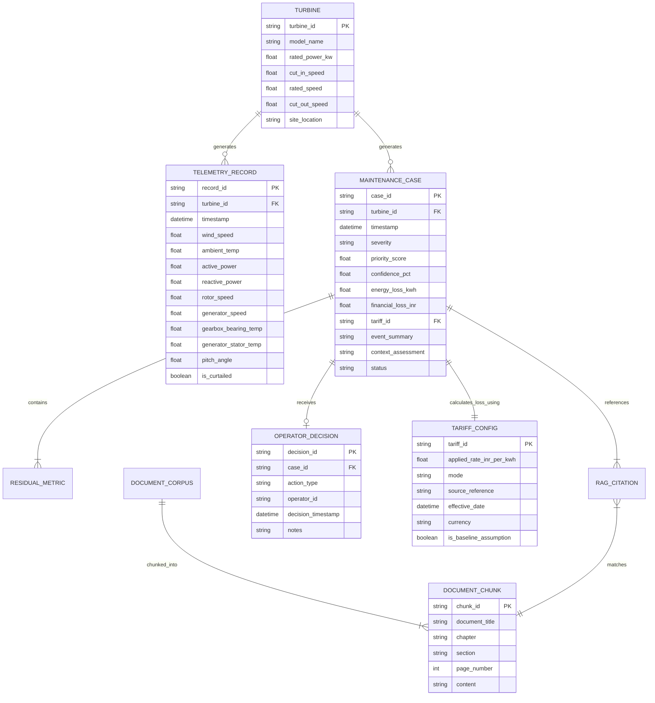

# 10. Data Architecture — WindGuard AI

## 1. Executive Summary

This document specifies the end-to-end data architecture for **WindGuard AI**, covering data sources, ingestion pipelines, schema definitions, validation rules, entity-relationship models, storage structures, multi-mode tariff provenance, and security/privacy governance across the canonical 6-layer system architecture.

---

## 2. Data Sources & Provenance

The WindGuard AI data ecosystem integrates three primary data streams:

```
┌─────────────────────────────────────────────────────────────────────────────┐
│                         DATA SOURCES & PROVENANCE                           │
└─────────────────────────────────────────────────────────────────────────────┘

  1. REAL PUBLIC BENCHMARK SCADA DATA
     ├── Open SCADA datasets (e.g. Kelmarsh / Penmanshiel / La Haute Borne).
     ├── Format: 10-minute average, standard deviation, min, and max.
     └── Licensing: Open Access (ODbL / CC-BY).

  2. REALISTIC PHYSICS-INFORMED SCADA SIMULATOR (BENCHMARK SCENARIOS)
     ├── Simulates 10 multi-MW turbines with first-order thermal inertia dynamics.
     ├── Injects controlled fault scenarios:
     │   - S1: Normal Operation & Weather Transients
     │   - S2: Gearbox High-Speed Bearing Friction Degradation
     │   - S3: Pitch Asymmetry / Aerodynamic Loss
     │   - S4: Grid Curtailment & High-Ambient Summer Heatwave
     │   - S5: Sensor Dropout & Calibration Drift
     └── Explicitly labeled as simulated operational telemetry with transparent assumptions.

  3. UNSTRUCTURED TECHNICAL DOCUMENTATION (RAG CORPUS)
     ├── OEM Maintenance Manuals (IEC 61400 standard formats).
     ├── SCADA Alarm Code Reference Matrices (Codes AL-101 to AL-405).
     └── Regional O&M Standard Operating Procedures (India Wind Farm Protocols).

  4. TARIFF & FINANCIAL LOSS CONFIGURATION
     ├── Multi-mode tariff registry supporting Project PPA, Regulatory Benchmarks, 
     │   Configured Baselines (default: ₹3.20/kWh [ASSUMPTION]), and Scenario Overrides.
     └── Complete provenance metadata tracking on every generated loss estimate.
```

---

## 3. Entity-Relationship Model



---

## 4. Schema Specifications

### 4.1 Telemetry Record Schema (Canonical JSON / Pandas)
```json
{
  "timestamp": "2026-09-20T10:30:00Z",
  "turbine_id": "WTG-07",
  "wind_speed": 8.52,
  "wind_direction": 224.5,
  "ambient_temp": 32.1,
  "active_power": 1420.0,
  "reactive_power": 120.4,
  "rotor_speed": 14.8,
  "generator_speed": 1485.0,
  "gearbox_bearing_temp": 78.4,
  "generator_stator_temp": 68.2,
  "nacelle_temp": 38.5,
  "pitch_angle": 1.2,
  "is_curtailed": false,
  "operating_status": "Running"
}
```
> **Note on Compatibility**: Ingestion pipelines accept legacy CSV column `curtailment_flag` and automatically map it to canonical `is_curtailed`.

### 4.2 Tariff Configuration & Provenance Schema
```json
{
  "tariff_id": "TRF-2026-BASE",
  "applied_rate_inr_per_kwh": 3.20,
  "mode": "CONFIGURED_BASELINE",
  "source_reference": "CERC Benchmark & Industry Baseline Configuration (docs/10_data_architecture.md)",
  "effective_date": "2026-09-20T00:00:00Z",
  "currency": "INR",
  "is_baseline_assumption": true,
  "notes": "Configured baseline assumption for operational demonstration. Can be overridden via POST /api/tariffs."
}
```

### 4.3 Maintenance Case Schema (with Tariff Provenance)
```json
{
  "case_id": "CASE-20260920-001",
  "turbine_id": "WTG-07",
  "timestamp": "2026-09-20T10:30:00Z",
  "subsystem_affected": "DRIVETRAIN_GEARBOX",
  "severity_level": "HIGH",
  "anomaly_score": 0.88,
  "estimated_loss": {
    "duration_hours": 12.0,
    "estimated_energy_loss_kwh": 2640.0,
    "estimated_financial_loss_inr": 8448.0,
    "tariff_provenance": {
      "applied_rate_inr_per_kwh": 3.20,
      "mode": "CONFIGURED_BASELINE",
      "source_reference": "CERC Benchmark & Industry Baseline Configuration",
      "effective_date": "2026-09-20T00:00:00Z",
      "currency": "INR",
      "is_baseline_assumption": true
    }
  },
  "root_cause_hypotheses": [
    "High-speed shaft bearing lubrication starvation (82% probability)",
    "Early inner raceway fatigue spalling (18% probability)"
  ],
  "evidence_table": [
    {
      "parameter": "Gearbox Bearing Temp",
      "observed_value": "78.4 °C",
      "expected_value": "62.1 °C",
      "deviation": "+16.3 °C (+3.2σ)",
      "interpretation": "Severe thermal excursion above hydrodynamic baseline"
    },
    {
      "parameter": "Active Power",
      "observed_value": "1420 kW",
      "expected_value": "1640 kW",
      "deviation": "-220 kW (-2.4σ)",
      "interpretation": "Aerodynamic conversion deficit under 8.5 m/s wind"
    }
  ],
  "oem_citations": [
    {
      "document_title": "OEM 2.X MW Drivetrain O&M Manual",
      "section": "Section 4.2 High-Speed Shaft Bearing Inspection",
      "excerpt": "Bearing temperatures exceeding 75°C under partial load indicate lubrication breakdown or bearing race spalling.",
      "page_number": 114
    }
  ],
  "recommended_action": "Schedule immediate lubrication sample collection; inspect filter differential pressure within 24 hours.",
  "status": "OPEN"
}
```

### 4.4 Document Chunk Schema
```json
{
  "chunk_id": "CHK-OEM-042",
  "document_title": "OEM 2.X MW Turbine Maintenance Manual",
  "chapter": "Chapter 4: Drivetrain and Gearbox Subsystems",
  "section": "Section 4.2: High-Speed Shaft Bearing Inspection",
  "page_number": 114,
  "content": "Elevated bearing temperatures (>75°C) under partial loading typically indicate lubricant degradation, high-speed shaft misalignment, or early roller surface spalling. Technicians must inspect oil filter differential pressure, extract a 100ml lubrication sample for ferrographic particle analysis, and verify shaft axial play using a dial indicator.",
  "tags": ["gearbox", "bearing", "lubrication", "temperature", "AL-104"]
}
```

---

## 5. Data Validation & Quality Rules

To guarantee analytical robustness, all incoming telemetry records and configuration updates pass through deterministic validation filters:

| Sensor / Config Variable | Physical Minimum | Physical Maximum | Plausibility / Rate-of-Change Rule | Action on Violation |
| :--- | :--- | :--- | :--- | :--- |
| `wind_speed` | $0.0\,\text{m/s}$ | $50.0\,\text{m/s}$ | $\Delta v \le 15.0\,\text{m/s}$ per 10 min | Flag as `ANOMALOUS_SENSOR` |
| `active_power` | $-50.0\,\text{kW}$ | $2750.0\,\text{kW}$ | $P \le 1.15 \times P_{\text{rated}}$ | Clamp or flag sensor error |
| `ambient_temp` | $-25.0^\circ\text{C}$ | $55.0^\circ\text{C}$ | $\Delta T \le 10.0^\circ\text{C}$ per 10 min | Reject invalid temperature |
| `gearbox_bearing_temp` | $-10.0^\circ\text{C}$ | $130.0^\circ\text{C}$ | $T_{\text{GB}} \ge T_{\text{ambient}} - 5.0^\circ\text{C}$ | Flag disconnected thermocouple |
| `pitch_angle` | $-5.0^\circ$ | $95.0^\circ$ | Valid physical mechanical limits | Reject record |
| `applied_rate_inr_per_kwh` | ₹$0.01/\text{kWh}$ | ₹$20.00/\text{kWh}$ | Valid commercial range | Reject tariff configuration update |

---

## 6. Data Lifecycle & Storage Strategy

```
[ Ingest 10-min SCADA ] ──► [ In-Memory Telemetry Cache (Sliding 24h Window) ]
                                            │
                                            ▼
                             [ Anomaly Detection & ML Baselines ]
                                            │
                                            ▼
                             [ Maintenance Case Store (JSON/SQLite with File Locking) ]
                                            │
                                            ▼
                             [ Operator HITL Decision Audit Log (Append-Only Permanent) ]
```

1. **Telemetry Cache**: High-speed in-memory buffer holding the latest 144 records (24 hours at 10-min resolution) per turbine for real-time charting.
2. **Case Store**: Persistent storage holding all generated maintenance cases and their evidence tables, protected by atomic file locking (`portalocker` / atomic rename pattern).
3. **Audit Log**: Immutable append-only log recording every operator decision, timestamp, and engineering rationale for compliance auditing.

---

## 7. Data Privacy & Security Governance

1. **Zero External Data Leakage**: No commercial PPA financial rates or proprietary wind farm coordinates are transmitted to unauthorized third-party endpoints.
2. **Anonymization of Turbine Assets**: Multi-OEM fleet datasets are indexed using standard pseudonymized identifiers (`WTG-01` to `WTG-10`).
3. **Audit Trail Integrity**: Operator decision logs are immutable and timestamped with standard ISO-8601 strings.
