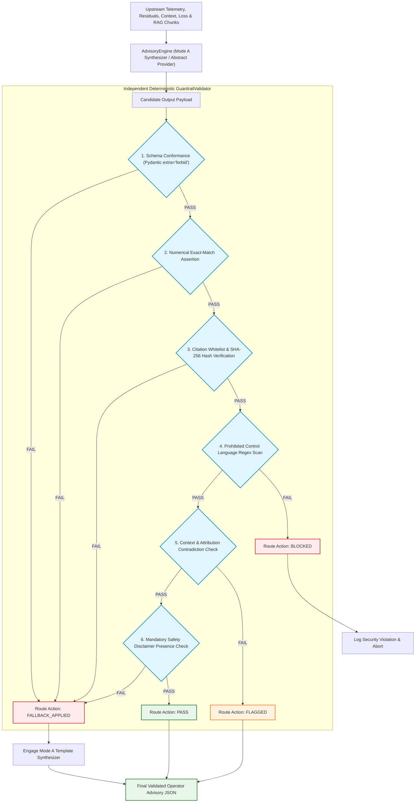

# Phase 5 Implementation Authorization Review & Resolution
## Layer 5: Constrained Evidence Synthesis, Guardrail Validation & Advisory Reasoning Subsystem

---

## 1. Executive Summary & Authorization Context

```
====================================================================================================
               PHASE 5 IMPLEMENTATION AUTHORIZATION RESOLUTION & AUDIT
====================================================================================================
Governance Gate                    : Phase 5 Implementation Authorization Resolution Gate
Scope Baseline Document            : docs/PHASE_5_SCOPE_REVIEW.md (v2.0 — Approved & Frozen)
Final Owner Review Document        : docs/PHASE_5_FINAL_OWNER_REVIEW.md (READY FOR OWNER SIGN-OFF)
Owner Sign-Off Record              : docs/PHASE_5_OWNER_SIGN_OFF.md (PHASE 5 OWNER SIGNED OFF & FROZEN)
Historical Phases (Phases 1–4)     : Verified, Signed Off & Frozen
Codebase State                     : ZERO Phase 5 Production Code / ZERO Tests / ZERO Prompts
Implementation-Neutral Core        : READY FOR EXPLICIT PROJECT OWNER IMPLEMENTATION AUTHORIZATION
Cloud Provider Integration         : NOT AUTHORIZED PENDING OD-P5-01 / OD-P5-02
Owner Policy Decisions (OD-P5-01..06): UNRESOLVED — PRESERVED AS OWNER DECISIONS
Phase 6 Implementation Status      : NOT AUTHORIZED (LOCKED OUT)
Turbine SCADA Actuation            : PERMANENTLY PROHIBITED
====================================================================================================
```

This document establishes the formal **Implementation Authorization Resolution** for **Phase 5 (Layer 5 Constrained Evidence Synthesis, Guardrail Validation & Advisory Reasoning Subsystem)** of **WindGuard AI**.

Following the formal execution of the Phase 5 Owner Sign-Off Gate ([`docs/PHASE_5_OWNER_SIGN_OFF.md`](file:///c:/Users/shriv/OneDrive/Desktop/WindGuardAI/docs/PHASE_5_OWNER_SIGN_OFF.md)), this document resolves all pre-coding governance corrections, formalizes the test baseline and regression comparison framework, defines the architectural boundary between the Implementation-Neutral Core and Cloud Provider Integrations, and establishes the strict governance conditions required before any production code, test suites, or provider adapters may be constructed.

> [!IMPORTANT]
> **GOVERNANCE DIRECTIVE — IMPLEMENTATION LOCK CONTINUES**:
> This review resolves the pre-coding governance requirements. It does **NOT** constitute implementation execution. Zero production code, test code, prompt templates, or cloud model integrations shall be created during this review. Phase 5 implementation remains strictly locked awaiting the Project Owner's explicit Implementation Authorization Order.

---

## 2. Verification of Owner Sign-Off & Frozen Baseline State

### 2.1 Confirmation of Phase 5 Sign-Off Record
The formal Phase 5 Owner Sign-Off record ([`docs/PHASE_5_OWNER_SIGN_OFF.md`](file:///c:/Users/shriv/OneDrive/Desktop/WindGuardAI/docs/PHASE_5_OWNER_SIGN_OFF.md)) was audited and confirmed to record:
- **`PHASE 5 — OWNER SIGNED OFF & FROZEN.`**
- **`Phase 5 Scope: OWNER APPROVED`**
- **`Phase 5 Governance: FROZEN`**
- **`Phase 5 Implementation: NOT YET AUTHORIZED`**
- **`Phase 6: NOT AUTHORIZED`**
- **`SCADA Actuation: PERMANENTLY PROHIBITED`**

### 2.2 Confirmation of Final Owner Review Finding
The pre-sign-off audit record ([`docs/PHASE_5_FINAL_OWNER_REVIEW.md`](file:///c:/Users/shriv/OneDrive/Desktop/WindGuardAI/docs/PHASE_5_FINAL_OWNER_REVIEW.md)) was audited and confirmed to be classified as **`READY FOR OWNER SIGN-OFF`** with **29 PASS / 0 PARTIAL / 0 FAIL / 0 MISSING** findings.

### 2.3 Frozen Historical Baselines & Test Suite Baseline Confirmation

The historical repository state and test baseline across Phases 1–4 are formally recorded as follows:

```
┌──────────────────────────────────────────────────────────────────────────────────────────────────┐
│                             HISTORICAL PHASE TEST BASELINE SUMMARY                               │
├───────────────────┬──────────────┬──────────────┬────────────────────────────────────────────────┤
│ Phase / Scope     │ Tests Passed │ Tests Failed │ Baseline Verification & Sign-Off Status        │
├───────────────────┼──────────────┼──────────────┼────────────────────────────────────────────────┤
│ Phase 1 (SCADA)   │ 49 / 49      │ 0            │ VERIFIED & FROZEN                              │
│ Phase 2 (ML/Res)  │ 78 / 82      │ 4 (Known)    │ OWNER SIGNED OFF & FROZEN (Known limitations)   │
│ Phase 3 (Context) │ 44 / 44      │ 0            │ OWNER SIGNED OFF & FROZEN                      │
│ Phase 4 (RAG)     │ 17 / 17      │ 0            │ OWNER SIGNED OFF & FROZEN (P@3/R@3 resolved)   │
├───────────────────┼──────────────┼──────────────┼────────────────────────────────────────────────┤
│ Total Repository  │ 136 Passed   │ 7 Failed     │ 143 Total Collected Tests in Full Suite        │
└───────────────────┴──────────────┴──────────────┴────────────────────────────────────────────────┘
```

#### Detailed Breakdown of the 7 Pre-Existing Repository Failures:
1. **Four (4) Documented Historical Phase 2 Limitations**:
   - Gearbox Bearing Temperature Regressor RMSE ($4.92^\circ\text{C}$ vs. $3.0^\circ\text{C}$ target).
   - Thermal Single-Record Inference Latency ($5.74\,\text{ms}$ vs. $5.0\,\text{ms}$ target).
   - Generator Bearing Temperature Regressor Test Split $R^2$ ($0.963$ vs. $0.970$ target).
   - Rotor Bearing Temperature Regressor Test Split $R^2$ ($0.957$ vs. $0.970$ target).
   *(These were formally accepted and signed off by the Project Owner in `docs/PHASE_2_FINAL_SIGNOFF_REVIEW.md` and `docs/PHASE_2_OWNER_RESOLUTION.md`)*.
2. **Three (3) Obsolete Historical Phase 1 / Phase 2 Lockout Tests**:
   - Tests expecting `ModuleNotFoundError` or locked modules that were legitimately implemented in subsequent authorized phases (Phases 3 and 4).

#### Regression Protection Mandate:
- **Zero New Regressions Formulation**: Phase 5 implementation must introduce **zero new regressions** relative to the frozen Phase 1–4 baseline.
- **Comparison Methodology**: Verification of Phase 5 shall strictly compare test suite results **BEFORE Phase 5** versus **AFTER Phase 5** across all existing test files.
- **Invariance Rule**: Existing documented Phase 2 limitations and obsolete lockout failures must remain unchanged unless separately authorized by the Project Owner. Zero new test failures are permitted.

---

## 3. Project Owner Decision Register Audit

All six Project Owner Decisions (`OD-P5-01` through `OD-P5-06`) established in the scope baseline remain **`UNRESOLVED — REQUIRES OWNER DECISION`**. 

> [!IMPORTANT]
> **GOVERNANCE DIRECTIVE — OWNER DECISIONS NOT SILENTLY RESOLVED**:
> Any baseline parameter values (such as ₹25,000 loss ceiling, 5000 ms timeout, combined uncertainty schema) are strictly designated as **`INITIAL DESIGN PARAMETER / TEMPORARY DEFAULT`**. They are **NOT** owner-approved or final resolutions. Final owner policy decisions remain reserved for the Project Owner.

```
┌──────────────────────────────────────────────────────────────────────────────────────────────────┐
│                            PROJECT OWNER DECISION AUDIT REGISTER                                 │
└──────────────────────────────────────────────────────────────────────────────────────────────────┘
```

### 1. `OD-P5-01: Primary Advisory Provider Mode`
- **Current Status**: **`UNRESOLVED — REQUIRES OWNER DECISION`**
- **Available Options**:
  - *Option 1*: Mode A (Deterministic Template Engine Only — 100% Offline CPU).
  - *Option 2*: Mode C (Pluggable Cloud LLM as Primary).
  - *Option 3*: Hybrid Architecture (Mode A as default core engine; Mode C pluggable via configuration).
- **Temporary Implementation Default**: Initial design parameter configures Mode A (Deterministic Local Template Synthesizer) as active engine; abstract provider interface allows pluggable adapters.
- **Architectural Impact**: Does **NOT** block the Implementation-Neutral Core. Cloud provider deployment as primary remains blocked pending owner selection.

### 2. `OD-P5-02: Cloud LLM Selection`
- **Current Status**: **`UNRESOLVED — REQUIRES OWNER DECISION`**
- **Available Options**:
  - *Option 1*: IBM Granite (via watsonx.ai SDK / REST API).
  - *Option 2*: OpenAI API (e.g. GPT-4o / GPT-4o-mini).
  - *Option 3*: Anthropic Claude API (e.g. Claude 3.5 Sonnet).
- **Temporary Implementation Default**: `None` (Zero cloud SDK integrations implemented in Implementation-Neutral Core).
- **Architectural Impact**: Concrete cloud SDK adapter implementations are **DEFERRED / NOT AUTHORIZED** until the Project Owner selects a specific provider.

### 3. `OD-P5-03: Guardrail Action Policy on Minor Ambiguity`
- **Current Status**: **`UNRESOLVED — REQUIRES OWNER DECISION`**
- **Available Options**:
  - *Option 1*: Strict Block / Abstain (`BLOCKED` / `ABSTAIN`).
  - *Option 2*: Immediate Fallback (`FALLBACK_APPLIED`).
  - *Option 3*: Flag with Warning (`FLAGGED`).
- **Temporary Implementation Default**: **`INITIAL DESIGN PARAMETER / TEMPORARY DEFAULT`** — Policy-neutral router supports all four action enums (`PASS`, `FALLBACK_APPLIED`, `FLAGGED`, `BLOCKED`). Default baseline routes schema/numerical errors to `FALLBACK_APPLIED` and ambiguous telemetry to `FLAGGED`.
- **Architectural Impact**: Policy remains fully configurable; code does not enforce a rigid unapproved owner policy.

### 4. `OD-P5-04: Mandatory Human Review Loss Ceiling`
- **Current Status**: **`UNRESOLVED — REQUIRES OWNER DECISION`**
- **Available Options**:
  - *Option 1*: ₹10,000 threshold.
  - *Option 2*: ₹25,000 threshold.
  - *Option 3*: ₹50,000 threshold.
- **Temporary Implementation Default**: **`INITIAL DESIGN PARAMETER / TEMPORARY DEFAULT`** (`CRITICAL_REVIEW_LOSS_CEILING_INR = 25000.0` in `backend/config.py`).
- **Architectural Impact**: Configurable constant used for baseline evaluation; subject to final owner tuning before verification sign-off.

### 5. `OD-P5-05: LLM Invocation Timeout Limit`
- **Current Status**: **`UNRESOLVED — REQUIRES OWNER DECISION`**
- **Available Options**:
  - *Option 1*: 3000 ms.
  - *Option 2*: 5000 ms.
  - *Option 3*: 8000 ms.
- **Temporary Implementation Default**: **`INITIAL DESIGN PARAMETER / TEMPORARY DEFAULT`** (`LLM_TIMEOUT_SECONDS = 5.0` in `backend/config.py`).
- **Architectural Impact**: Configurable constant used for fallback timeout interception; subject to final owner tuning.

### 6. `OD-P5-06: Epistemic Uncertainty Representation Semantics`
- **Current Status**: **`UNRESOLVED — REQUIRES OWNER DECISION`**
- **Available Options**:
  - *Option 1*: Qualitative Categorical Rating (`HIGH`, `MODERATE`, `LOW`).
  - *Option 2*: Missing Evidence Checklist.
  - *Option 3*: Combined Qualitative Rating + Missing Evidence Checklist.
- **Temporary Implementation Default**: **`INITIAL DESIGN PARAMETER / TEMPORARY DEFAULT`** — Combined schema model (`HypothesisItem.plausibility` + `HypothesisItem.grounding_evidence`).
- **Architectural Impact**: Enables structured representation of epistemic uncertainty without hardcoding unapproved constraints.

---

## 4. Architectural Boundary: Implementation-Neutral Core vs. Cloud Provider Integration

To ensure strict governance while enabling immediate pre-coding readiness, Phase 5 is partitioned into two distinct architectural tiers:

```
┌──────────────────────────────────────────────────────────────────────────────────────────────────┐
│                               PHASE 5 ARCHITECTURAL TIERS                                        │
├──────────────────────────────────────────────────────────────────────────────────────────────────┤
│ TIER 1: IMPLEMENTATION-NEUTRAL CORE                                                              │
│ Status: READY FOR EXPLICIT PROJECT OWNER IMPLEMENTATION AUTHORIZATION                            │
│                                                                                                  │
│ 1. Pydantic v2 Advisory Data Schemas (backend/llm/schema.py)                                     │
│ 2. Structured Evidence Context Assembly & XML Isolation Pipeline (backend/llm/prompts.py)       │
│ 3. Deterministic Local Template Synthesizer — Mode A (backend/llm/fallback.py)                   │
│ 4. Independent GuardrailValidator Firewall Engine (backend/llm/guardrails.py)                    │
│ 5. Abstract Provider Interface BaseAdvisoryProvider & Local Provider (backend/llm/providers.py) │
│ 6. Four-State Output Coordinator & Audit Snapshot Dispatcher (backend/llm/advisory_engine.py)   │
│ 7. Dedicated Phase 5 Acceptance Test Harness — 20 Scenarios (tests/test_acceptance_phase5.py)    │
├──────────────────────────────────────────────────────────────────────────────────────────────────┤
│ TIER 2: CLOUD PROVIDER INTEGRATION                                                               │
│ Status: NOT AUTHORIZED PENDING OD-P5-01 / OD-P5-02                                                │
│                                                                                                  │
│ 1. Concrete IBM Granite watsonx.ai SDK / REST API Integration Adapter                            │
│ 2. Concrete OpenAI API Integration Adapter                                                       │
│ 3. Concrete Anthropic Claude API Integration Adapter                                             │
│ 4. Live Cloud Provider Network Dispatch or Cloud Default Configuration                           │
└──────────────────────────────────────────────────────────────────────────────────────────────────┘
```

**Architectural Assessment**:
The **Implementation-Neutral Core** provides a complete, 100% offline, air-gapped, zero-cloud-dependency advisory engine that satisfies all functional requirements (FR-009, FR-011, FR-012) and safety constraints (NFR-001, NFR-004). It does not require any cloud provider SDK, external API key, or network access.

---

## 5. Authorized Phase 5 Implementation Scope (When Authorized)

When the Project Owner executes the formal Phase 5 Implementation Authorization Order, implementation shall be strictly bounded to the **Implementation-Neutral Core**:

```
┌──────────────────────────────────────────────────────────────────────────────────────────────────┐
│                       AUTHORIZED PHASE 5 IMPLEMENTATION-NEUTRAL CORE SCOPE                       │
├──────────────────────────────────────────────────────────────────────────────────────────────────┤
│ 1. Pydantic v2 Advisory Data Schemas (OperatorAdvisory, EvidenceItem, CitationItem, etc.)       │
│ 2. Structured Case & Evidence Context Assembly Pipeline                                          │
│ 3. Bounded Prompt Templates & Structural XML Data Isolation Delimiters                           │
│ 4. Independent Deterministic GuardrailValidator Firewall                                         │
│ 5. Numerical Exact-Match Verification Engine (Zero numerical drift assertion)                   │
│ 6. Citation Whitelist & Cryptographic SHA-256 Hash Verification Engine                          │
│ 7. Prohibited Actuation Lexicon Regex Scanner (Zero control verbs assertion)                     │
│ 8. Context & Attribution Contradiction Detection Engine                                          │
│ 9. Deterministic Local Template Synthesizer (Mode A Engine)                                      │
│ 10. Abstract LLM Provider Interface (BaseAdvisoryProvider)                                       │
│ 11. Concrete Local Provider (LocalTemplateProvider)                                              │
│ 12. Four-State Output Dispatcher (Normal, Fallback, Abstention, Blocked)                         │
│ 13. Comprehensive Audit Trail Snapshot Generator                                                 │
│ 14. Dedicated Phase 5 Acceptance Test Suite (20 Scenarios: SCEN-01 to SCEN-20)                   │
│ 15. Phase 5 Verification Report & Documentation (docs/PHASE_5_VERIFICATION.md)                   │
└──────────────────────────────────────────────────────────────────────────────────────────────────┘
```

---

## 6. Strictly Out-of-Scope Capabilities

The following capabilities remain **STRICTLY PROHIBITED AND LOCKED OUT**:

```
┌──────────────────────────────────────────────────────────────────────────────────────────────────┐
│                            STRICTLY PROHIBITED & LOCKED OUT CAPABILITIES                         │
├──────────────────────────────────────────────────────────────────────────────────────────────────┤
│ 1. Frontend Web UI & Operator Studio (HTML, Tailwind CSS, Vanilla JS, Chart.js — Phase 7)       │
│ 2. Phase 6 REST API Endpoints (/api/fleet/*, /api/turbines/*, /api/cases, /api/cases/decision)  │
│ 3. Persistent Database / Case Store ORM Layer (backend/storage/case_store.py — Phase 6)          │
│ 4. Concrete Cloud Provider SDK Integrations (watsonx.ai, OpenAI, Anthropic — Deferred)           │
│ 5. Direct SCADA Write / Actuation Endpoints (PERMANENTLY PROHIBITED)                             │
│ 6. Turbine Control Commands (Pitch, Yaw, Torque, Breaker, Generator Setpoints — PERMANENT)       │
│ 7. Automated Maintenance Dispatch or Autonomous Case Closing                                     │
│ 8. Modification or Refactoring of Frozen Phase 1, Phase 2, Phase 3, or Phase 4 Code              │
│ 9. Modification or Recalculation of Frozen Historical Benchmark Measurements                     │
└──────────────────────────────────────────────────────────────────────────────────────────────────┘
```

---

## 7. File-Level Implementation Boundary

```
====================================================================================================
                        FILE-LEVEL IMPLEMENTATION BOUNDARY SPECIFICATION
====================================================================================================
```

### A. New Files Permitted for Implementation-Neutral Core:
1. `backend/llm/__init__.py`: Package exports for Layer 5 components.
2. `backend/llm/schema.py`: Pydantic v2 schemas (`OperatorAdvisory`, `EvidenceItem`, `CitationItem`, `GuardrailStatusBlock`, etc.).
3. `backend/llm/prompts.py`: Bounded prompt templates and XML context data builders.
4. `backend/llm/guardrails.py`: Independent deterministic `GuardrailValidator` firewall.
5. `backend/llm/fallback.py`: Deterministic high-fidelity template synthesis engine (Mode A).
6. `backend/llm/providers.py`: Provider abstraction (`BaseAdvisoryProvider`, `LocalTemplateProvider`).
7. `backend/llm/advisory_engine.py`: `AdvisoryEngine` coordinator and four-state output dispatcher.
8. `tests/test_advisory_schema.py`: Schema validation, serialization, and immutability unit tests.
9. `tests/test_guardrails.py`: Numerical match, citation whitelist, lexicon scan, and blocking tests.
10. `tests/test_advisory_engine.py`: Provider execution, timeout handling, and fallback tests.
11. `tests/test_acceptance_phase5.py`: Formal 20-scenario acceptance test suite (`SCEN-01` to `SCEN-20`).

### B. Existing Files Permitted to Modify (Configuration & Exports Only):
1. `backend/config.py`: Adding Phase 5 initial design parameter constants (`LLM_TIMEOUT_SECONDS = 5.0`, `CRITICAL_REVIEW_LOSS_CEILING_INR = 25000.0`, `RELEVANCE_SCORE_FLOOR = 0.15`).
2. `backend/__init__.py`: Adding Layer 5 package exports.

### C. Existing Files Strictly Frozen (NO MODIFICATIONS PERMITTED):
- `backend/data/*` (Phase 1 — FROZEN)
- `backend/models/*` (Phase 2 — FROZEN)
- `backend/engine/*` (Phase 3 — FROZEN)
- `backend/rag/*` (Phase 4 — FROZEN)
- `tests/test_acceptance_phase1.py` through `tests/test_acceptance_phase4.py` (FROZEN)
- `tests/test_loader.py`, `test_generator.py`, `test_preprocessor.py`, `test_schema.py` (Phase 1 — FROZEN)
- `tests/test_expected_power.py`, `test_thermal_model.py`, `test_residual_engine.py` (Phase 2 — FROZEN)
- `tests/test_context_engine.py`, `test_reasoner.py`, `test_tariff_registry.py`, `test_loss_calculator.py`, `test_prioritization.py` (Phase 3 — FROZEN)
- `tests/test_chunker.py`, `test_knowledge_base.py` (Phase 4 — FROZEN)

### D. Files and Directories Strictly Prohibited (Phase 6+ Lockout):
- `frontend/*` (STRICTLY PROHIBITED)
- `backend/api/routes.py` (STRICTLY PROHIBITED)
- `backend/storage/case_store.py` (STRICTLY PROHIBITED)
- `backend/llm/watsonx_provider.py`, `openai_provider.py`, `claude_provider.py` (DEFERRED PENDING OD-P5-02)
- Any actuation / control command endpoints (PERMANENTLY PROHIBITED)

---

## 8. Deterministic Authority & Numerical Integrity Boundary

```
┌──────────────────────────────────────────────────────────────────────────────────────────────────┐
│                             UPSTREAM DETERMINISTIC FACT ENFORCEMENT                              │
├──────────────────────────────┬───────────────────────────────────────────────────────────────────┤
│ UPSTREAM FACT                │ IMPLEMENTATION ENFORCEMENT RULE                                   │
├──────────────────────────────┼───────────────────────────────────────────────────────────────────┤
│ SCADA Sensor Telemetry       │ Direct numerical pass-through; zero imputation or modification.   │
│ Expected Power & Temps       │ Direct numerical pass-through from Phase 2 ML regressors.         │
│ Residuals (ΔP, ΔT) & z-Scores│ Direct numerical pass-through from Phase 2 residual engine.       │
│ Context Classification       │ Direct enum pass-through from Phase 3 context engine.             │
│ Subsystem Attribution        │ Direct enum pass-through from Phase 3 reasoner.                   │
│ Energy & Financial Loss      │ Direct numerical pass-through from Phase 3 loss calculator.       │
│ Anomaly Priority Score       │ Direct numerical pass-through from Phase 3 prioritization engine. │
│ Retrieved Technical Chunks   │ Exact chunk IDs, hashes, and locators from Phase 4 RAG engine.    │
└──────────────────────────────┴───────────────────────────────────────────────────────────────────┘
```

### Performance & Constraint Classification:
- **Zero Numerical Drift ($\epsilon \le 0.01$)**: `SYSTEM CONSTRAINT / ACCEPTANCE TARGET` (Measured Result: `NONE — Awaiting Implementation`).
- **Offline CPU Execution**: `SYSTEM CONSTRAINT / ACCEPTANCE TARGET` (Measured Result: `NONE — Awaiting Implementation`).
- **Inference Latency Target ($< 100\,\text{ms}$ Mode A)**: `DESIGN TARGET / ACCEPTANCE CRITERION` (Measured Result: `NONE — Awaiting Implementation`).

---

## 9. Independent Guardrail Architecture & Pipeline



---

## 10. Fallback & Four-State Output Hierarchy

The advisory engine shall dispatch output into exactly one of four formal states:

1. **`NORMAL ADVISORY`**: Candidate text passed all guardrail checks, or Mode A deterministic template synthesis executed with full evidence.
2. **`FALLBACK ADVISORY`**: Provider experienced timeout ($>5.0\,\text{s}$ temporary default), network error, malformed JSON, or guardrail numerical/citation violation; Mode A deterministic template synthesizer populates exact upstream analytical values.
3. **`ABSTENTION`**: Input telemetry contains sensor dropout, or RAG retrieval returned 0 matching chunks ($S_{\text{hybrid}} < 0.15$). The system explicitly articulates data/document deficits and abstains from asserting ungrounded causal claims.
4. **`BLOCKED OUTPUT`**: Prohibited control verbs, actuation commands, or unverified source citations detected. Generation is aborted and a critical safety event is logged.

---

## 11. Acceptance Testing & Verification Framework

The implementation shall be verified against the 20 standardized acceptance test scenarios defined in the signed-off baseline:

| Test ID | Scenario Name | Primary Verification Objective | Performance / System Classification | Target Gate |
| :--- | :--- | :--- | :--- | :---: |
| `SCEN-01` | Healthy Baseline Operation (S1) | Normal status, 0 alarms, 0 ungrounded recommendations. | System Constraint Target | GATE-P5-01 |
| `SCEN-02` | Gearbox Bearing Fault (S2) | High thermal residual explanation, loss & `CHK-GB` citations. | Analytical Consistency Target | GATE-P5-02, 03 |
| `SCEN-03` | Generator Overheating Fault | Stator rise explanation & `CHK-GEN` citations. | Analytical Consistency Target | GATE-P5-02, 03 |
| `SCEN-04` | Pitch Asymmetry Fault (S3) | Aerodynamic deficit & `CHK-PIT` citations. | Analytical Consistency Target | GATE-P5-02, 03 |
| `SCEN-05` | Grid Curtailment Case (S4) | Deemed generation explanation; mechanical alarm suppressed. | Operational Logic Target | GATE-P5-01, 02 |
| `SCEN-06` | Low-Wind Idling Case | Idling status suppression below cut-in ($3.0\,\text{m/s}$). | Operational Logic Target | GATE-P5-01 |
| `SCEN-07` | Sensor Dropout Case (S5) | Sensor dropout diagnostic; teardown advice abstained. | Abstention Safety Target | GATE-P5-07 |
| `SCEN-08` | Insufficient Evidence Case | Diagnostic abstention when RAG returns 0 matching chunks. | Abstention Safety Target | GATE-P5-07 |
| `SCEN-09` | Conflicting Evidence Case | Articulation of conflicting mechanical vs thermal signals. | Conflict Resolution Target | GATE-P5-05 |
| `SCEN-10` | Missing / Empty RAG Result | Telemetry-only advisory generated without unhandled errors. | Robustness Target | GATE-P5-07 |
| `SCEN-11` | Synthetic-Source Citation | Explicit `source_type = "PROJECT_SYNTHETIC"` tagging. | Citation Provenance Target | GATE-P5-04 |
| `SCEN-12` | Unverified Source Rejection | Strict rejection of `UNVERIFIED` source documents. | Citation Firewall Target | GATE-P5-04 |
| `SCEN-13` | Unsupported Claim Injection | Guardrail intercepts ungrounded failure mode. | Hallucination Firewall Target | GATE-P5-05 |
| `SCEN-14` | Prohibited Control Command | Guardrail intercepts imperative actuation verbs. | Actuation Safety Constraint | GATE-P5-06 |
| `SCEN-15` | Malformed JSON Output | Immediate engagement of deterministic fallback synthesizer. | Fallback Recovery Target | GATE-P5-08 |
| `SCEN-16` | Numerical Value Drift | Guardrail catches altered numerical values ($\epsilon > 0.01$). | Numerical Integrity Constraint | GATE-P5-02 |
| `SCEN-17` | Guardrail Action Routing | Verification of `PASS`, `FALLBACK`, `FLAG`, `BLOCK` routing. | Policy Routing Target | GATE-P5-05 |
| `SCEN-18` | Provider Timeout Recovery | Automatic recovery via fallback synthesizer upon timeout. | Latency Firewall Target | GATE-P5-08 |
| `SCEN-19` | Deterministic Fallback Mode | Acceptance Criterion: Offline CPU execution with $<100\,\text{ms}$ latency target. | Acceptance Target (Measured: NONE) | GATE-P5-08, 11 |
| `SCEN-20` | Mandatory Human Escalation | Critical / high-loss cases tagged with mandatory review. | Governance Escalation Target | GATE-P5-09 |

---

## 12. Regression Protection & Implementation Stop Condition

### 12.1 Regression Protection Mandate
- **Full Suite Baseline**: 143 collected tests across repository (136 passed, 7 pre-existing failures: 4 documented Phase 2 limitations + 3 obsolete lockout tests).
- **Regression Invariant**: Phase 5 implementation must introduce **zero new test regressions** relative to this frozen Phase 1–4 baseline.
- **Verification Rule**: Automated regression verification must execute `pytest tests/` before and after Phase 5 implementation. Any newly failing test constitutes an immediate block.
- **Limitation Invariant**: Pre-existing Phase 2 baseline limitations and historical benchmark measurements shall remain unmodified.

### 12.2 Hard Implementation Stop Condition
Upon completion of Phase 5 implementation and verification:
```
═══════════════════════════════════════════════════════════════════════════
                    ABSOLUTE PHASE 5 STOP DIRECTIVE
═══════════════════════════════════════════════════════════════════════════
1. STOP all coding activities immediately upon Phase 5 verification.
2. DO NOT begin Phase 6 (REST API routes, Case Store persistence, UI).
3. DO NOT implement operator web dashboard or frontend components.
4. DO NOT create turbine actuation or control command endpoints.
5. Produce docs/PHASE_5_VERIFICATION.md and await Owner Review.
═══════════════════════════════════════════════════════════════════════════
```

---

## 13. Pre-Coding Authorization Classification

```
====================================================================================================
                        AUTHORIZATION CLASSIFICATION AUDIT
====================================================================================================
```

### Evaluation of Authorization Status:

1. **Scope & Sign-Off Readiness**: The Phase 5 Scope Baseline ([`docs/PHASE_5_SCOPE_REVIEW.md`](file:///c:/Users/shriv/OneDrive/Desktop/WindGuardAI/docs/PHASE_5_SCOPE_REVIEW.md) v2.0) has received formal Project Owner sign-off ([`docs/PHASE_5_OWNER_SIGN_OFF.md`](file:///c:/Users/shriv/OneDrive/Desktop/WindGuardAI/docs/PHASE_5_OWNER_SIGN_OFF.md)).
2. **Architectural Decoupling**: The six Project Owner Decisions (`OD-P5-01` to `OD-P5-06`) are preserved as Owner Decisions. Temporary default parameters are explicitly isolated as initial design parameters.
3. **Tier Partitioning**:
   - **Tier 1 (Implementation-Neutral Core)**: Fully specified, 100% offline, zero cloud dependencies. Classified as **`READY FOR EXPLICIT PROJECT OWNER IMPLEMENTATION AUTHORIZATION`**.
   - **Tier 2 (Cloud Provider Integration)**: Classified as **`NOT AUTHORIZED PENDING OD-P5-01 / OD-P5-02`**.
4. **Safety & Non-Actuation Invariant**: SCADA write lockout and zero-control-command assertions are strictly specified.

---

## 14. Final Governance Declaration

```
====================================================================================================
                        PHASE 5 AUTHORIZATION RESOLUTION CONCLUSION
====================================================================================================

PHASE 5 — OWNER SIGNED OFF & FROZEN.
PHASE 5 — IMPLEMENTATION AUTHORIZATION REVIEW RESOLVED.

IMPLEMENTATION-NEUTRAL CORE:
READY FOR EXPLICIT PROJECT OWNER IMPLEMENTATION AUTHORIZATION.

CLOUD PROVIDER INTEGRATION:
NOT AUTHORIZED PENDING OD-P5-01 / OD-P5-02.

FINAL OWNER POLICY DECISIONS:
OD-P5-01 THROUGH OD-P5-06 REMAIN OWNER DECISIONS.

PHASE 6 — NOT AUTHORIZED.
SCADA ACTUATION — PERMANENTLY PROHIBITED.

====================================================================================================
```

**Audited and Certified**:
*Lead System Architect, Requirements Engineer & Independent Verification Auditor*  
*WindGuard AI Engineering Governance Board*  
*Date: 2026-09-20*
