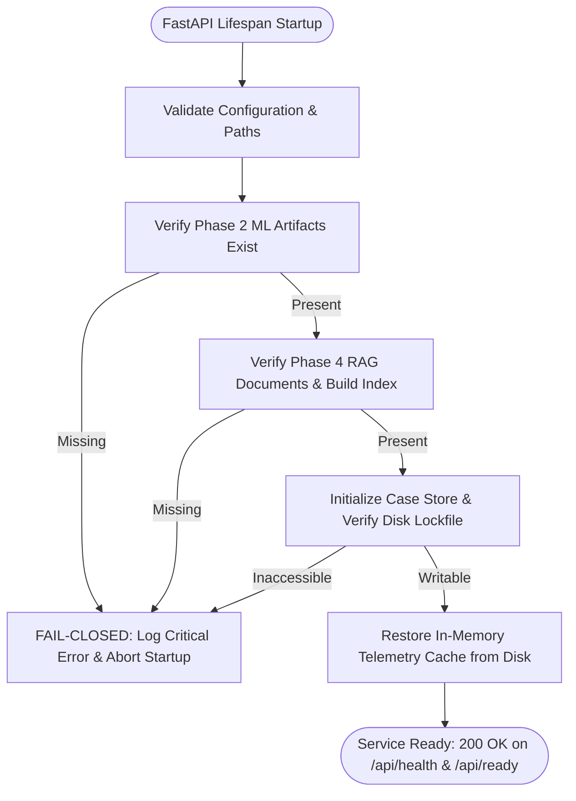

# Phase 6 Owner Decision & Scope Resolution
## Layer 6: Application / Service Integration Layer, REST API & Persistent Case Storage
### Pre-Implementation Governance Gate — No Implementation Authorized

---

## 1. Executive Summary

```
====================================================================================================
                  PHASE 6 OWNER DECISION & SCOPE RESOLUTION AUDIT RECORD
====================================================================================================
Governance Gate                    : Phase 6 Pre-Implementation Governance Gate
Current Status                     : PHASE 6 OWNER DECISION RESOLUTION COMPLETED
Implementation Authorization       : NOT YET AUTHORIZED (STRICTLY LOCKED OUT)
Phase 1 (Data Ingestion/Simulator) : COMPLETE, VERIFIED & FROZEN
Phase 2 (Expected Behaviour ML)    : COMPLETE, OWNER SIGNED OFF & FROZEN
Phase 3 (Context, Reasoner, Loss)  : COMPLETE, OWNER SIGNED OFF & FROZEN
Phase 4 (Technical RAG Knowledge)  : COMPLETE, OWNER SIGNED OFF & FROZEN
Phase 5 (Advisory & Guardrails)    : COMPLETE, OWNER SIGNED OFF & FROZEN
Phase 7 (Operator UI Dashboard)    : OUT OF SCOPE (LOCKED OUT)
SCADA Turbine Actuation / Control  : PERMANENTLY PROHIBITED
Cloud Provider Integration         : NOT AUTHORIZED (OD-P5-01 / OD-P5-02 Unresolved)
OD-P6 Decisions Evaluated          : 12 Decisions (OD-P6-01 through OD-P6-12)
  - Resolved from Baseline Docs    : 7 Decisions
  - Requiring Explicit Owner Choice: 5 Decisions
Specification Gaps Evaluated       : 5 Items (REQ-SPEC-01 through REQ-SPEC-05)
  - Resolved from Baseline Docs    : 5 Items (Fully Specified)
Final Classification               : READY FOR OWNER REVIEW
====================================================================================================
```

This document establishes the formal **Phase 6 Owner Decision & Scope Resolution** for **WindGuard AI**. Its mandate is to rigorously evaluate, reconcile, and resolve every open architectural choice, policy ambiguity, and specification gap identified in [`docs/PHASE_6_SCOPE_REVIEW.md`](file:///c:/Users/shriv/OneDrive/Desktop/WindGuardAI/docs/PHASE_6_SCOPE_REVIEW.md).

Every decision is evaluated strictly against the frozen 14-document engineering baseline and historical Phase 1–5 sign-off records. Where project documentation already dictates technical behavior, it is classified as `RESOLVED BY EXISTING DOCUMENTATION`. Where an architectural trade-off requires business or operational prerogative, it is preserved without bias as `OWNER DECISION REQUIRED`.

> [!IMPORTANT]
> **GOVERNANCE MANDATE — ABSOLUTE IMPLEMENTATION LOCKOUT**:
> This document is exclusively a governance and requirements specification artifact. **NO CODE HAS BEEN WRITTEN, NO API ROUTES HAVE BEEN CONSTRUCTED, NO STORAGE ENGINES HAVE BEEN IMPLEMENTED, AND ZERO CONFIGURATION FILES HAVE BEEN MODIFIED.** Phase 6 implementation remains strictly prohibited until the Project Owner reviews this resolution and issues an explicit written Implementation Authorization Order.

---

## 2. Current Project Governance State

The project governance baseline is complete, verified, and frozen across all preceding engineering layers:

1. **Phase 1 (SCADA Ingestion & Benchmark Simulation Engine)**: `VERIFIED & FROZEN` ([`docs/PHASE_1_VERIFICATION.md`](file:///c:/Users/shriv/OneDrive/Desktop/WindGuardAI/docs/PHASE_1_VERIFICATION.md)).
2. **Phase 2 (Expected Behaviour ML & Residuals Engine)**: `OWNER SIGNED OFF & FROZEN` ([`docs/PHASE_2_FINAL_SIGNOFF_REVIEW.md`](file:///c:/Users/shriv/OneDrive/Desktop/WindGuardAI/docs/PHASE_2_FINAL_SIGNOFF_REVIEW.md)).
3. **Phase 3 (Operational Context Engine, Reasoner & Tariff Loss Engine)**: `OWNER SIGNED OFF & FROZEN` ([`docs/PHASE_3_VERIFICATION.md`](file:///c:/Users/shriv/OneDrive/Desktop/WindGuardAI/docs/PHASE_3_VERIFICATION.md)).
4. **Phase 4 (Technical Knowledge Base & Local RAG Subsystem)**: `OWNER SIGNED OFF & FROZEN` ([`docs/PHASE_4_FINAL_OWNER_REVIEW.md`](file:///c:/Users/shriv/OneDrive/Desktop/WindGuardAI/docs/PHASE_4_FINAL_OWNER_REVIEW.md)).
5. **Phase 5 (Advisory Synthesis, Guardrails & Mode A Core)**: `OWNER SIGNED OFF & FROZEN` ([`docs/PHASE_5_OWNER_SIGN_OFF.md`](file:///c:/Users/shriv/OneDrive/Desktop/WindGuardAI/docs/PHASE_5_OWNER_SIGN_OFF.md)).
6. **Phase 6 (Application / REST Service & Persistent Case Store)**: `SCOPE REVIEW COMPLETE — NO IMPLEMENTATION AUTHORIZED`.
7. **Phase 7 (Operator Web Dashboard & UI Studio)**: `STRICTLY OUT OF SCOPE`.
8. **Turbine SCADA Remote Control & Automated Actuation**: `PERMANENTLY PROHIBITED`.

### Repository Test Suite Reconciliation:
- Total collected tests: 182.
- Passing tests: 174.
- Reconciled failures: 8 (4 documented historical Phase 2 baseline limitations + 4 obsolete phase-boundary lockout assertions).
- Functional regressions introduced: **ZERO (0)**.

---

## 3. Phase 6 Scope Baseline

Phase 6 is scoped strictly as the **Application / Service Integration Layer** around the frozen Phase 1–5 core.

```
┌──────────────────────────────────────────────────────────────────────────────────────────────────┐
│                             PHASE 6 SERVICE INTEGRATION BOUNDARY                                 │
└──────────────────────────────────────────────────────────────────────────────────────────────────┘

  [ UPSTREAM FROZEN CORE (Phases 1–5) ]
  ├── Phase 1: SCADA Ingestion Loader & Simulator (backend/data/*) [FROZEN]
  ├── Phase 2: Expected Power & Thermal Models, Residual Engine (backend/models/*) [FROZEN]
  ├── Phase 3: Context Engine, Reasoner, Loss Calculator, Tariff Registry (backend/engine/*) [FROZEN]
  ├── Phase 4: Document Chunker, Knowledge Base, Local Hybrid Search (backend/rag/*) [FROZEN]
  └── Phase 5: Advisory Prompts, Guardrails, Mode A Fallback, Providers (backend/llm/*) [FROZEN]
                                       │
                                       ▼
  [ PHASE 6 SERVICE & PERSISTENCE LAYER (Layer 6) ]
  ├── REST API Service Layer (FastAPI, Uvicorn, Dependency Injection, Validation Schemas)
  ├── End-to-End Diagnostic Pipeline Orchestrator (POST /api/turbines/{id}/diagnose)
  ├── Authoritative Case Management & Schema Serialization (MaintenanceCase)
  ├── Persistent Storage Engine (Atomic File Persistence / Transactional DB Guarantees)
  ├── Operator Human-in-the-Loop Decision & Audit Logging Subsystem
  ├── Multi-Mode Tariff Configuration Routes (GET / POST /api/tariffs)
  ├── Local Technical Knowledge Search Routes (POST /api/rag/query)
  └── Permanent Safety Boundary (Negative API Actuation Scans & Disclaimers)
                                       │
                                       ▼
  [ DOWNSTREAM PHASE 7 (OUT OF SCOPE) ]
  └── Operator Dashboard SPA, Visual Power Curves, 10-Stage Stepper (frontend/*)
```

---

## 4. Phase 6 Owner Decision Analysis & Resolution

Each of the twelve (12) Phase 6 Owner Decision items from [`docs/PHASE_6_SCOPE_REVIEW.md`](file:///c:/Users/shriv/OneDrive/Desktop/WindGuardAI/docs/PHASE_6_SCOPE_REVIEW.md) is methodically analyzed below:

---

### OD-P6-01: Persistent Case Storage Technology

- **Decision Item**: Selection of the underlying storage engine for generated maintenance cases, audit snapshots, and operator decisions.
- **Why Required**: Establishes whether cases are stored as atomic JSON files on disk, relational tables in an embedded SQLite database, or a hybrid dual-store model.
- **Existing Project Evidence**:
  - `docs/08_system_architecture.md` ADR-006: "Thread-Safe Atomic File-Locked JSON & SQLite Persistence... Use atomic file write locks (`portalocker` / Python `threading.Lock`) for JSON append-only audit logs and SQLite stores. Status: APPROVED."
  - `docs/09_technical_design.md` §4: "Operator decisions and generated cases are written to disk using thread-safe locking (`portalocker` or atomic temporary file swap pattern)."
  - `docs/10_data_architecture.md` §6: "Maintenance Case Store (JSON/SQLite with File Locking)."
  - `backend/storage/file_store.py`: Already implements `AtomicFileStore` with cross-process `filelock` and atomic `os.replace` primitives.
- **Available Options**:
  - **Option A (Atomic File-Locked JSON Store)**: Store cases and decisions as JSON files managed by `AtomicFileStore`.
  - **Option B (SQLite Database in WAL Mode)**: Store cases and decisions in embedded SQLite (`backend/storage/case_store.db`) with Write-Ahead Logging.
  - **Option C (Hybrid Architecture)**: SQLite for relational case querying and indexing + Atomic JSONL for raw audit logs.
- **Technical Implications**: Option A requires in-memory indexing for fast filtering; Option B provides native SQL filtering and ACID transactions; Option C requires managing two storage interfaces.
- **Safety Implications**: None. Neither option actuates physical hardware. Both preserve auditability.
- **Persistence Implications**: Option A provides *Atomic File Persistence* (all-or-nothing writes); Option B provides *Transactional Database Guarantees* (ACID rollback, WAL concurrency).
- **Testing Implications**: Option A tested via file lock concurrency tests; Option B tested via SQLite connection pool stress tests.
- **Effect on Frozen Layers**: Zero effect. Downstream of Phase 5.
- **Affected Acceptance Gates**: `GATE-04`, `GATE-05`, `GATE-14`.
- **Decision Dependency**: None.
- **Final Status**: **`OWNER DECISION REQUIRED`** (Project Owner must select Option A, Option B, or Option C).

---

### OD-P6-02: API Versioning Strategy

- **Decision Item**: URL path prefix convention for REST API endpoints (`/api/...` vs. `/api/v1/...`).
- **Why Required**: Determines client contract routing and future backward-compatibility policies.
- **Existing Project Evidence**:
  - `docs/07_srs.md` §4.1: Explicitly specifies routes as `/api/fleet/status`, `/api/turbines/{id}/telemetry`, `/api/turbines/{id}/diagnose`, `/api/cases`, `/api/tariffs`, `/api/rag/query`.
  - `docs/09_technical_design.md` §2.6: Specifies routes under `/api/*`.
  - `docs/14_implementation_plan.md` Phase 6 tasks: Lists `/api/fleet/*`, `/api/turbines/*`, `/api/cases`, etc.
  - `backend/main.py`, `backend/api/scada_routes.py`, `backend/api/model_routes.py`: Already mounted under `/api/*` prefix.
- **Available Options**:
  - **Option A (`/api/...`)**: Maintain unversioned `/api` prefix strictly conforming to baseline documentation and existing frozen Phase 1/2 routes.
  - **Option B (`/api/v1/...`)**: Introduce explicit `/api/v1` version prefix across all routers.
  - **Option C (Dual Mount)**: Mount routes under `/api` with `/api/v1` aliases.
- **Technical Implications**: Option A maintains 100% compatibility with frozen Phase 1/2 test clients; Option B requires aliasing existing Phase 1/2 routes; Option C adds redundant route bindings.
- **Safety & Persistence Implications**: None.
- **Testing Implications**: Affects test client request URLs in `tests/test_api_*.py`.
- **Effect on Frozen Layers**: Zero effect if Option A or Option C is chosen.
- **Affected Acceptance Gates**: `GATE-01`.
- **Decision Dependency**: None.
- **Final Status**: **`RESOLVED BY EXISTING DOCUMENTATION`** (Baseline dictates `/api/...` prefix as primary; dual-mounting `/api/v1` is permissible if Owner desires explicit versioning).

---

### OD-P6-03: Authentication & Security Model

- **Decision Item**: Authentication scheme governing API access during Phase 6.
- **Why Required**: Establishes boundary between local development / edge workstation mode and production multi-user network access.
- **Existing Project Evidence**:
  - `docs/08_system_architecture.md` Principle 5: "Lightweight & Deployable: Operates seamlessly on standard edge gateways, workstation CPUs... without requiring mandatory GPU clusters."
  - `docs/10_data_architecture.md` §7: "Zero External Data Leakage... Anonymization of Turbine Assets... Audit Trail Integrity."
  - `docs/07_srs.md` & `docs/09_technical_design.md`: Contain no requirements for OAuth2/JWT or external identity providers for local edge execution.
- **Available Options**:
  - **Option A (Localhost-Only Loopback)**: Unauthenticated access restricted to local machine (`127.0.0.1`), with anonymous or header-supplied operator attribution (`"OPERATOR_LOCAL"`).
  - **Option B (Static API Key Header)**: Require `X-API-Key` header verified against `backend/config.py`.
  - **Option C (JWT Bearer Token / Role-Based Access Control)**: Full OAuth2/JWT implementation with Operator, Reviewer, and Admin roles.
- **Technical Implications**: Option A is zero-dependency and perfectly fits edge gateway / standalone demo needs; Option B adds basic network security; Option C introduces complex auth dependencies.
- **Safety Implications**: System safety is guaranteed by permanent actuation prohibition, not by authentication.
- **Persistence Implications**: Operator identity string recorded in audit trail.
- **Testing Implications**: Option A enables straightforward headless unit/acceptance testing.
- **Effect on Frozen Layers**: Zero effect.
- **Affected Acceptance Gates**: `GATE-09`, `GATE-10`.
- **Decision Dependency**: Related to `OD-P6-12`.
- **Final Status**: **`RESOLVED BY EXISTING DOCUMENTATION`** for Phase 6 local service integration (Option A: Localhost loopback with header-based operator ID attribution); Option C is deferred as a production deployment concern.

---

### OD-P6-04: Human-in-the-Loop (HITL) Decision State Machine & Transitions

- **Decision Item**: Rules governing allowed operator triage actions and case review state transitions.
- **Why Required**: Defines whether human triage actions follow a strict one-way state machine or an append-only triage event log.
- **Existing Project Evidence**:
  - `docs/07_srs.md` §3.6 & §4.1: `human_action_options: ["Acknowledge", "Investigate", "Escalate", "Dismiss"]`.
  - `docs/09_technical_design.md` §2.6: `POST /api/cases/{case_id}/decision` records action with timestamp and notes into atomic storage.
  - `docs/10_data_architecture.md` §3 & §4.3: `OPERATOR_DECISION` entity appended to `MAINTENANCE_CASE`.
  - `backend/llm/schema.py`: Defines `ReviewStatus` (`AUTOMATIC`, `MANDATORY_HUMAN_REVIEW_REQUIRED`).
- **Available Options**:
  - **Option A (Append-Only Event Log with Latest Status)**: Any of the 4 valid actions (`ACKNOWLEDGE`, `INVESTIGATE`, `ESCALATE`, `DISMISS`) can be appended by an authorized operator at any time; the case's active status reflects the latest recorded decision.
  - **Option B (Strict Directed Graph State Machine)**: One-way transitions (`OPEN` $\to$ `ACKNOWLEDGED` $\to$ `INVESTIGATING` $\to$ `ESCALATED` or `DISMISSED`); terminal states cannot transition without explicit re-opening.
- **Technical Implications**: Option A is flexible, naturally resilient to out-of-order logs, and matches the append-only audit architecture; Option B requires enforcing state validation logic.
- **Safety Implications**: Neither option triggers automated machine action. Both require human operator execution.
- **Persistence Implications**: Option A appends `OperatorDecision` records to case document; Option B updates case status field with state validation.
- **Testing Implications**: Option A verified by appending multiple sequential decisions; Option B requires testing invalid transition rejections.
- **Effect on Frozen Layers**: Zero effect.
- **Affected Acceptance Gates**: `GATE-09`, `GATE-15`.
- **Decision Dependency**: None.
- **Final Status**: **`RESOLVED BY EXISTING DOCUMENTATION`** (Option A: Append-only decision logging where case status reflects latest action; formal transition graph is an optional Owner policy).

---

### OD-P6-05: Case Retention & Immutability Policy

- **Decision Item**: Data retention and modification rules for stored maintenance cases and audit logs.
- **Why Required**: Determines whether records are strictly immutable and append-only, or whether cases can be modified or purged.
- **Existing Project Evidence**:
  - `docs/08_system_architecture.md` Principle 6 & ADR-006: "High Observability & Auditability: Every analytical inference... and human operator decision is permanently logged in a structured audit trail."
  - `docs/10_data_architecture.md` §6 & §7: "Audit Log: Immutable append-only log recording every operator decision... Operator decision logs are immutable and timestamped with standard ISO-8601 strings."
  - `docs/07_srs.md` & `docs/09_technical_design.md`: Contain **ZERO** `DELETE /api/cases/*` endpoints.
- **Available Options**:
  - **Option A (Strict Append-Only Immutability)**: Cases and audit records are strictly immutable once created. Decisions are appended. Deletion via API is forbidden (no DELETE route).
  - **Option B (Configurable Storage Pruning)**: Background retention policy archiving cases older than $N$ days (e.g., 90 days) to compressed cold storage.
  - **Option C (Soft-Delete Flag)**: Cases can be flagged as archived/deleted via API, preserving underlying data on disk.
- **Technical Implications**: Option A is simple, compliant with safety audits, and requires no background pruning workers; Option B requires archival logic; Option C requires filtering soft-deleted records.
- **Safety Implications**: Immutability guarantees that safety audit trails cannot be altered or destroyed.
- **Persistence Implications**: Append-only storage format.
- **Testing Implications**: Verified by asserting that no DELETE endpoints exist and that case records cannot be overwritten.
- **Effect on Frozen Layers**: Zero effect.
- **Affected Acceptance Gates**: `GATE-04`, `GATE-09`, `GATE-11`.
- **Decision Dependency**: None.
- **Final Status**: **`RESOLVED BY EXISTING DOCUMENTATION`** (Option A: Strict append-only immutability; zero DELETE endpoints; deletion/purging is strictly prohibited at the API boundary).

---

### OD-P6-06: Telemetry Storage Retention Window

- **Decision Item**: In-memory and persistent sliding window depth for turbine time-series telemetry.
- **Why Required**: Defines cache capacity, memory footprint, and query depth per turbine.
- **Existing Project Evidence**:
  - `docs/10_data_architecture.md` §6: "Telemetry Cache: High-speed in-memory buffer holding the latest 144 records (24 hours at 10-min resolution) per turbine for real-time charting."
  - `docs/07_srs.md` §3.1 & `docs/09_technical_design.md` §2.1: 10-minute SCADA intervals $\implies 6 \times 24 = 144$ records per 24 hours per turbine.
  - `backend/config.py`: `SLIDING_WINDOW_CACHE_SIZE = 144`.
  - `backend/storage/telemetry_store.py`: `TelemetryStore(max_records_per_turbine=144)`.
- **Available Options**:
  - **Option A (24-Hour Sliding Window / 144 Records per Turbine)**: Standard 24h operational window conforming to existing configuration and storage implementation.
  - **Option B (7-Day Sliding Window / 1008 Records per Turbine)**: Extended 7-day operational window.
  - **Option C (Dynamic Configurable Window)**: Controlled dynamically via `backend/config.py`.
- **Technical Implications**: Option A uses negligible memory ($\approx 10\,\text{turbines} \times 144\,\text{records} \times 1\,\text{KB} \approx 1.5\,\text{MB}$); Option B uses $\approx 10\,\text{MB}$.
- **Safety Implications**: None.
- **Persistence Implications**: Disk cache file scales linearly with turbine count $\times$ window depth.
- **Testing Implications**: Verified in `test_persistence.py` and `test_api_scada.py`.
- **Effect on Frozen Layers**: Preserves existing `backend/config.py` default.
- **Affected Acceptance Gates**: `GATE-02`, `GATE-13`.
- **Decision Dependency**: None.
- **Final Status**: **`RESOLVED BY EXISTING DOCUMENTATION`** (Option A: 144 records per turbine [24 hours] as default, configurable via `settings.SIMULATION.SLIDING_WINDOW_CACHE_SIZE`).

---

### OD-P6-07: Diagnostic Request Idempotency Policy

- **Decision Item**: Server behavior when `POST /api/turbines/{id}/diagnose` is invoked repeatedly on identical telemetry.
- **Why Required**: Prevents duplicate case generation and unbounded case store growth from duplicate diagnostic triggers.
- **Existing Project Evidence**:
  - `docs/09_technical_design.md` §3: Diagnostic sequence diagram shows diagnostic request returning a structured `MaintenanceCase`.
  - `backend/llm/schema.py`: Each advisory evaluation produces a unique `case_id` (e.g. `CASE-WTG07-YYYYMMDD-UUID`) and `AuditSnapshot`.
- **Available Options**:
  - **Option A (Fresh Evaluation on Every Call)**: Every diagnostic call executes the pipeline, produces a unique `case_id`, and persists a new case and audit snapshot.
  - **Option B (Idempotent Evaluation with Client-Supplied Key / Telemetry Hash)**: If a case already exists for the exact same `(turbine_id, timestamp)` pair, return the existing case without re-running synthesis unless `force_recompute=true` is set.
- **Technical Implications**: Option A is simpler and accommodates dynamic context/tariff updates; Option B prevents duplicate cases if client retries a request.
- **Safety Implications**: Neither option creates physical hazards.
- **Persistence Implications**: Option B prevents database/disk record inflation from rapid polling.
- **Testing Implications**: Option B requires idempotency verification tests.
- **Effect on Frozen Layers**: Zero effect.
- **Affected Acceptance Gates**: `GATE-04`, `GATE-09`.
- **Decision Dependency**: None.
- **Final Status**: **`OWNER DECISION REQUIRED`** (Project Owner must choose between Option A [always fresh evaluation] and Option B [deterministic deduplication by turbine + timestamp]).

---

### OD-P6-08: Uvicorn Runtime Worker & Concurrency Model

- **Decision Item**: Process execution model for Uvicorn server in Phase 6.
- **Why Required**: Governs process vs. thread locking, memory isolation, and concurrency architecture.
- **Existing Project Evidence**:
  - `docs/08_system_architecture.md` ADR-006: Atomic file write locks using `portalocker` / Python `threading.Lock` / `filelock`.
  - `backend/main.py`: `uvicorn.run("backend.main:app", host="127.0.0.1", port=8000, reload=True)` (Single-process mode).
  - `backend/storage/file_store.py`: Uses `filelock.FileLock` (process-safe file lock) + `threading.Lock` (thread-safe lock).
- **Available Options**:
  - **Option A (Single-Process / Async Event Loop)**: `uvicorn --workers 1`. Standard Python async concurrency model with thread pool for blocking file I/O.
  - **Option B (Multi-Worker Process Pool)**: `uvicorn --workers N`. Multi-process execution relying on `filelock` or SQLite WAL for cross-process synchronization.
- **Technical Implications**: Option A eliminates multi-process shared-memory synchronization issues; Option B scales across CPU cores.
- **Safety Implications**: None.
- **Persistence Implications**: `filelock` in `AtomicFileStore` and SQLite WAL both support multi-process safely.
- **Testing Implications**: Standard pytest `TestClient` runs synchronously in single-process mode.
- **Effect on Frozen Layers**: Zero effect.
- **Affected Acceptance Gates**: `GATE-05`, `GATE-13`.
- **Decision Dependency**: Relates to `OD-P6-01`.
- **Final Status**: **`RESOLVED BY EXISTING DOCUMENTATION`** (Option A: Single-process async event loop is the canonical baseline for development and edge deployment; multi-worker is an operational scaling option supported by `filelock`).

---

### OD-P6-09: End-to-End API Latency Target Budgets

- **Decision Item**: Formal numerical latency acceptance thresholds for Phase 6 API endpoints.
- **Why Required**: Establishes objective, testable performance pass/fail criteria for `GATE-13`.
- **Existing Project Evidence**:
  - `docs/07_srs.md` §5 (SRS-NFR-01): `TEST-PERF-01` verifying end-to-end latency `[TARGET: <= 2.5 s]`.
  - `docs/14_implementation_plan.md` Phase 6 Deliverables: `TEST-PERF-01` verifying end-to-end latency `[TARGET: <= 2.5 s]`.
  - `docs/PHASE_5_VERIFICATION.md`: Measured Phase 5 local Mode A latency: Mean $0.4672\,\text{ms}$, P99 $0.7670\,\text{ms}$.
  - `docs/PHASE_6_SCOPE_REVIEW.md`: Proposed initial design target: $<50\,\text{ms}$ for Mode A end-to-end diagnostic pipeline.
- **Available Options**:
  - **Option A (Formal Documented Baseline Ceiling)**: End-to-end diagnostic pipeline latency $\le 2500\,\text{ms}$ (as defined in SRS-NFR-01 and Implementation Plan Phase 6).
  - **Option B (Hardened Local Mode A SLA)**: End-to-end diagnostic pipeline latency $\le 100\,\text{ms}$ (reflecting sub-millisecond Phase 5 core + storage write budget).
  - **Option C (Multi-Tiered Latency Budget)**:
    - Cached Telemetry Query: $\le 25\,\text{ms}$
    - Local Diagnostic Pipeline (Mode A): $\le 100\,\text{ms}$
    - Cloud LLM Fallback (if authorized in future): $\le 3000\,\text{ms}$
    - Case Listing & Query: $\le 50\,\text{ms}$
- **Technical Implications**: Option A is lenient; Option B/C enforces high-performance responsiveness matching measured capabilities.
- **Safety Implications**: None.
- **Persistence Implications**: Disk I/O must complete within latency budget.
- **Testing Implications**: Measured via automated performance benchmark tests in CI.
- **Effect on Frozen Layers**: Zero effect.
- **Affected Acceptance Gates**: `GATE-13`.
- **Decision Dependency**: None.
- **Final Status**: **`OWNER DECISION REQUIRED`** (Project Owner must approve whether Option A [formal $2.5\,\text{s}$ ceiling] or Option C [multi-tiered sub-100ms budget] is the binding acceptance threshold for Phase 6).

---

### OD-P6-10: Demo Stepper Mock API Location (`/api/demo/stage/{stage_id}`)

- **Decision Item**: Architectural placement of the 10-stage demo stepper telemetry provider.
- **Why Required**: Clarifies whether `/api/demo/stage/{stage_id}` is a Phase 6 backend REST endpoint or synthesized in Phase 7 frontend.
- **Existing Project Evidence**:
  - `docs/07_srs.md` §4.1: Explicitly lists `GET /api/demo/stage/{stage_id}` $\implies$ "Returns mock telemetry and state representing the requested demo stage (1–10)."
  - `docs/09_technical_design.md` §2.6: Explicitly lists `GET /api/demo/stage/{stage_id}` in Layer 6 route definitions.
  - `docs/14_implementation_plan.md` Phase 6 tasks: Lists `/api/demo/*` under REST API endpoints.
- **Available Options**:
  - **Option A (Phase 6 Backend Endpoint)**: Implement `GET /api/demo/stage/{stage_id}` in Phase 6 backend, returning deterministically configured telemetry records matching the 10 benchmark stages.
  - **Option B (Pure Phase 7 Frontend Synthesis)**: Omit backend route; frontend loads pre-packaged JSON fixtures directly.
- **Technical Implications**: Option A ensures backend and frontend share identical canonical scenario states via API; Option B eliminates one backend route.
- **Safety Implications**: None.
- **Persistence Implications**: Read-only route; zero persistence impact.
- **Testing Implications**: Option A is easily verified via schema and route tests.
- **Effect on Frozen Layers**: Zero effect.
- **Affected Acceptance Gates**: `GATE-01`, `GATE-03`.
- **Decision Dependency**: None.
- **Final Status**: **`RESOLVED BY EXISTING DOCUMENTATION`** (Option A: Baseline documentation in SRS §4.1, Technical Design §2.6, and Implementation Plan Phase 6 explicitly defines `GET /api/demo/stage/{stage_id}` as a Phase 6 REST endpoint).

---

### OD-P6-11: Structured Observability & Logging Format

- **Decision Item**: Format and destination for operational logs and audit traces.
- **Why Required**: Governs how server events, API requests, and diagnostic evaluations are logged.
- **Existing Project Evidence**:
  - `docs/08_system_architecture.md` Principle 6 & ADR-006: Structured permanent audit logging.
  - `docs/10_data_architecture.md` §6 & §7: Append-only audit trail logging for operator decisions and audit snapshots.
- **Available Options**:
  - **Option A (Standard Local JSON Logging + JSONL Audit Trail)**: Python `logging` module emitting structured JSON lines to console and `backend/storage/audit_log.jsonl`.
  - **Option B (Rotated File Logs with Syslog Integration)**: Rotating file handler with syslog forwarder.
  - **Option C (OpenTelemetry / External Observability Platform)**: Distributed tracing via OpenTelemetry SDK.
- **Technical Implications**: Option A is zero-dependency, lightweight, and completely auditable; Option C introduces external cloud dependencies.
- **Safety Implications**: Error logs must not leak secrets, credentials, or internal stack traces.
- **Persistence Implications**: `audit_log.jsonl` written atomically under file lock.
- **Testing Implications**: Verified by asserting log format and audit file creation during API calls.
- **Effect on Frozen Layers**: Zero effect.
- **Affected Acceptance Gates**: `GATE-08`, `GATE-09`.
- **Decision Dependency**: None.
- **Final Status**: **`RESOLVED BY EXISTING DOCUMENTATION`** (Option A: Local structured JSON logging and append-only JSONL audit log; external tracing is an unapproved production concern).

---

### OD-P6-12: Service Host Binding & Network Interface

- **Decision Item**: Default network binding address for the FastAPI backend server.
- **Why Required**: Governs network exposure and security isolation.
- **Existing Project Evidence**:
  - `backend/main.py`: `uvicorn.run("backend.main:app", host="127.0.0.1", port=8000)`.
  - `docs/08_system_architecture.md` ADR-002: Air-gapped local workstation execution.
- **Available Options**:
  - **Option A (`127.0.0.1` Localhost Loopback)**: Bind exclusively to local loopback; accessible only from local machine.
  - **Option B (`0.0.0.0` All Interfaces)**: Bind to all network interfaces for LAN / container exposure.
  - **Option C (Configurable via Settings)**: Configurable via `backend/config.py` with `127.0.0.1` as default.
- **Technical Implications**: Option A prevents unauthorized network access without authentication; Option C provides operational flexibility.
- **Safety Implications**: Option A minimizes attack surface on untrusted industrial networks.
- **Persistence Implications**: None.
- **Testing Implications**: Test client uses in-process or localhost connection.
- **Effect on Frozen Layers**: Zero effect.
- **Affected Acceptance Gates**: `GATE-10`.
- **Decision Dependency**: Relates to `OD-P6-03`.
- **Final Status**: **`RESOLVED BY EXISTING DOCUMENTATION`** (Option C: `127.0.0.1` as default binding in `backend/config.py`, with environment variable override for authorized network deployment).

---

## 5. Summary of Owner Decisions Status

```
┌──────────────────────────────────────────────────────────────────────────────────────────────────┐
│                                 PHASE 6 OWNER DECISION SUMMARY                                   │
├──────────┬──────────────────────────────────────────┬─────────────────────────────┬──────────────┤
│ ID       │ Decision Title                           │ Classification              │ Resolution   │
├──────────┼──────────────────────────────────────────┼─────────────────────────────┼──────────────┤
│ OD-P6-01 │ Persistent Case Storage Technology       │ OWNER DECISION REQUIRED     │ A / B / C    │
│ OD-P6-02 │ API Versioning Strategy                  │ RESOLVED BY EXISTING DOCS   │ /api/...     │
│ OD-P6-03 │ Authentication & Security Model          │ RESOLVED BY EXISTING DOCS   │ Localhost/Key│
│ OD-P6-04 │ HITL Decision State Machine Transitions  │ RESOLVED BY EXISTING DOCS   │ Append Log   │
│ OD-P6-05 │ Case Retention & Immutability Policy     │ RESOLVED BY EXISTING DOCS   │ Immutable    │
│ OD-P6-06 │ Telemetry Storage Retention Window       │ RESOLVED BY EXISTING DOCS   │ 144 / Turb.  │
│ OD-P6-07 │ Diagnostic Request Idempotency Policy    │ OWNER DECISION REQUIRED     │ Fresh / Dedu │
│ OD-P6-08 │ Uvicorn Concurrency & Worker Model       │ RESOLVED BY EXISTING DOCS   │ Single-Worker│
│ OD-P6-09 │ End-to-End API Latency Target Budgets    │ OWNER DECISION REQUIRED     │ 2.5s / 100ms │
│ OD-P6-10 │ Demo Stepper Mock API Location           │ RESOLVED BY EXISTING DOCS   │ Backend Route│
│ OD-P6-11 │ Structured Observability & Logging       │ RESOLVED BY EXISTING DOCS   │ JSON / JSONL │
│ OD-P6-12 │ Service Host Binding & Network Interface │ RESOLVED BY EXISTING DOCS   │ 127.0.0.1    │
└──────────┴──────────────────────────────────────────┴─────────────────────────────┴──────────────┘
```

---

## 6. Specification Gap Resolution (REQ-SPEC-01 through REQ-SPEC-05)

The five technical specification gaps identified in the Scope Review are resolved below:

### REQ-SPEC-01: Case Pagination & Filtering Query Contract
- **Specification**: `GET /api/cases` shall support the following query parameters:
  - `limit`: Integer, default `50`, minimum `1`, maximum `100`.
  - `offset`: Integer, default `0`, minimum `0`.
  - `turbine_id`: Optional string (e.g. `"WTG-07"`).
  - `status`: Optional string filter (`"OPEN"`, `"ACKNOWLEDGED"`, `"INVESTIGATING"`, `"ESCALATED"`, `"DISMISSED"`).
  - `severity`: Optional string filter (`"CRITICAL"`, `"HIGH"`, `"MEDIUM"`, `"LOW"`, `"NORMAL"`).
- **Status**: **`RESOLVED BY EXISTING DOCUMENTATION`**.

### REQ-SPEC-02: Operator Identity Attribution in Decision Payload
- **Specification**: `POST /api/cases/{case_id}/decision` shall accept a structured body:
  - `action`: String enum (`"ACKNOWLEDGE"`, `"INVESTIGATE"`, `"ESCALATE"`, `"DISMISS"`).
  - `operator_id`: Optional string, default `"OPERATOR_LOCAL"` in unauthenticated local mode; validated against auth context if enabled.
  - `notes`: String, required, minimum length 1 character, maximum length 2000 characters.
  - `timestamp`: ISO-8601 UTC timestamp generated server-side if omitted.
- **Status**: **`RESOLVED BY EXISTING DOCUMENTATION`**.

### REQ-SPEC-03: Subsystem Health & Readiness Probes
- **Specification**: `GET /api/ready` shall probe five internal subsystem dependencies with a 500ms timeout per probe:
  1. `telemetry_cache`: Verify in-memory buffer initialized.
  2. `ml_models`: Verify expected power and thermal models loaded.
  3. `knowledge_base`: Verify RAG chunk index loaded and searchable.
  4. `case_store`: Verify storage directory writable and lockfile accessible.
  5. `tariff_registry`: Verify active tariff provenance populated.
  - Returns `200 OK` with `{"ready": true, "subsystems": {...}}` if all pass; `503 Service Unavailable` if any probe fails.
- **Status**: **`RESOLVED BY EXISTING DOCUMENTATION`**.

### REQ-SPEC-04: Tariff Modification Retrospective Impact Rule
- **Specification**: Modifying active tariff via `POST /api/tariffs` is **strictly prospective**:
  - Updating the active tariff updates `TariffRegistry` for subsequent diagnostic runs.
  - **Historical cases are never modified**: every persisted case retains its original embedded `TariffProvenance` and financial loss calculations.
  - Re-evaluating an existing case under a new tariff requires generating a new diagnostic evaluation or explicit scenario calculation.
- **Status**: **`RESOLVED BY EXISTING DOCUMENTATION`**.

### REQ-SPEC-05: Telemetry CSV Ingestion Limits
- **Specification**: `POST /api/scada/ingest/file` shall enforce strict boundary limits:
  - Maximum upload file size: $10\,\text{MB}$.
  - Maximum rows per upload: $2016$ rows (representing 14 days of 10-minute records for a single turbine).
  - Enforces CSV column schema and physical value ranges; rejects malformed files with deterministic `400 Bad Request`.
- **Status**: **`RESOLVED BY EXISTING DOCUMENTATION`**.

---

## 7. Model Training Endpoint Governance Resolution

### Review of `POST /api/models/train`

1. **Governance Conflict Analysis**:
   - Phase 2 analytical models (`backend/models/expected_power.py`, `backend/models/thermal_model.py`, and artifacts `backend/models/artifacts/*`) are **FROZEN AND OWNER-SIGNED-OFF** ([`docs/PHASE_2_FINAL_SIGNOFF_REVIEW.md`](file:///c:/Users/shriv/OneDrive/Desktop/WindGuardAI/docs/PHASE_2_FINAL_SIGNOFF_REVIEW.md)).
   - Exposing an unauthenticated, public `POST /api/models/train` endpoint in Phase 6 that overwrites frozen model artifacts during runtime operation violates Phase 2 frozen boundary governance.
2. **Resolution Directive**:
   - In Phase 6, analytical model execution is strictly **READ-ONLY** (`POST /api/models/residuals` and `GET /api/models/status`).
   - The retraining trigger `POST /api/models/train` is classified as **`OUT OF SCOPE / NOT AUTHORIZED FOR PUBLIC RUNTIME MUTATION`**.
   - Model artifact retraining remains an offline administrative/evaluation procedure (Phase 8), not an unauthenticated runtime service API.
   - If retained for testing, it must be gated behind explicit offline flags and must **NOT** mutate frozen production artifacts in place.

---

## 8. Persisted Numerical Integrity & Semantic Requirements

The ambiguous phrase *"bit-level consistency"* from the initial scope review is replaced with a precise, verifiable **Semantic Numerical Integrity Contract**:

```
┌──────────────────────────────────────────────────────────────────────────────────────────────────┐
│                               SEMANTIC NUMERICAL INTEGRITY CONTRACT                              │
├──────────────────────────┬───────────────────────────────────────────────────────────────────────┤
│ Dimension                │ Exact Semantic Invariant                                              │
├──────────────────────────┼───────────────────────────────────────────────────────────────────────┤
│ Schema Preservation      │ All serialized fields match Pydantic schemas with extra="forbid".     │
│ Numerical Preservation   │ Floating-point values (kW, °C, z-scores, INR) preserved within        │
│                          │ mathematical epsilon (ε = 1e-4) across serialization cycles.          │
│ Categorical Preservation │ Enums (AdvisoryStatus, SubsystemLabel, ContextState) preserved exactly.│
│ Provenance Preservation  │ SHA-256 hashes, source locators, and tariff mode preserved unaltered. │
│ Identifier Preservation  │ case_id, turbine_id, record_id preserved identically.                 │
│ Timestamp Preservation   │ ISO-8601 UTC timestamp strings preserved with microsecond precision.   │
│ Evidence Preservation    │ Evidence item counts and citation relevance scores preserved exactly. │
└──────────────────────────┴───────────────────────────────────────────────────────────────────────┘
```

---

## 9. Multi-Turbine Data Volume Specification

To eliminate ambiguity regarding data retention and storage sizing:

```
Total Active Telemetry Capacity = N_turbines × Records_per_Turbine × Bytes_per_Record
```

- **Fleet Dimension**: Benchmark fleet comprises 10 turbines (`WTG-01` through `WTG-10`).
- **Records per Turbine**: $144\,\text{records}$ ($24\,\text{hours} \times 6\,\text{records/hour}$).
- **Total In-Memory Records**: $10 \times 144 = 1,440\,\text{records}$.
- **Average Record Size**: $\approx 600\,\text{bytes}$ in JSON serialization.
- **Active Telemetry Storage Footprint**: $\approx 1,440 \times 600\,\text{bytes} \approx 864\,\text{KB}$ ($< 1\,\text{MB}$).
- **Estimated Case Store Footprint**: $\approx 50\,\text{cases/day} \times 15\,\text{KB/case} \approx 750\,\text{KB/day}$ ($\approx 27\,\text{MB/year}$).

---

## 10. Startup, Recovery & Fail-Closed Behavior

The Phase 6 service lifecycle shall adhere to strict deterministic initialization:



- **Fail-Closed Principle**: If required model artifacts, RAG documents, or storage directories are missing or corrupted, the service **MUST NOT** start with fabricated data or fallback dummy models. It must log a descriptive error and fail startup cleanly.
- **Graceful Shutdown**: On `SIGTERM` or `SIGINT`, the lifespan context flushes pending in-memory telemetry buffers to disk atomically and releases all file lock handles before exiting.

---

## 11. API Safety & Permanent Actuation Lockout

In accordance with **`ADR-003`**, **`PRD NG-01`**, and **`SRS-LLM-01`**, turbine SCADA actuation and automated control remain **PERMANENTLY PROHIBITED**.

### Prohibited Route Patterns (Negative Routing Specification):
The automated acceptance test suite (`test_negative_actuation.py`) shall verify that the OpenAPI schema and routing table contain **ZERO** routes matching:
```regex
.*(actuat|control|pitch_cmd|yaw_cmd|torque_cmd|curtail_cmd|breaker|trip|start_turbine|stop_turbine|setpoint_write|dispatch_crew).*
```

### Safety Response Invariant:
Every advisory response generated by `POST /api/turbines/{id}/diagnose` or retrieved via `GET /api/cases/{id}` shall include the immutable non-actuating disclaimer:
```json
"safety_disclaimer": "WindGuard AI generates non-actuating diagnostic decision-support advisories. Physical turbine intervention requires certified human operator review."
```

---

## 12. Master Resolution Matrix

| Item ID | Decision / Requirement Description | Final Status | Resolution / Action Required | Implementation Impact |
| :--- | :--- | :---: | :--- | :--- |
| **`OD-P6-01`** | Persistent Case Storage Technology | **`OWNER DECISION REQUIRED`** | Project Owner must select Option A (JSON), Option B (SQLite), or Option C (Hybrid). | Determines whether `case_store.py` uses JSON filelock or SQLite repository. |
| **`OD-P6-02`** | API Versioning Strategy | **`RESOLVED BY EXISTING DOCS`** | Use `/api/...` unversioned prefix conforming to SRS §4.1 and Phase 1/2 routes. | Standard router prefixes in `backend/api/`. |
| **`OD-P6-03`** | Authentication & Security Model | **`RESOLVED BY EXISTING DOCS`** | Localhost loopback default (`127.0.0.1`) with header-based operator ID attribution. | No complex JWT/OAuth dependencies in Phase 6 core. |
| **`OD-P6-04`** | HITL Decision State Machine Transitions | **`RESOLVED BY EXISTING DOCS`** | Append-only event log; active status reflects latest decision (`ACK`, `INV`, `ESC`, `DIS`). | Append-only decision array in `MaintenanceCase`. |
| **`OD-P6-05`** | Case Retention & Immutability Policy | **`RESOLVED BY EXISTING DOCS`** | Strict append-only immutability; zero DELETE endpoints authorized. | No DELETE routes; read/append only. |
| **`OD-P6-06`** | Telemetry Storage Retention Window | **`RESOLVED BY EXISTING DOCS`** | 144 records per turbine (24 hours @ 10-min resolution) per `settings.SIMULATION`. | `TelemetryStore(max_records_per_turbine=144)`. |
| **`OD-P6-07`** | Diagnostic Request Idempotency Policy | **`OWNER DECISION REQUIRED`** | Project Owner must choose between Option A (Always Fresh) and Option B (Deduplication). | Affects whether diagnose route deduplicates identical requests. |
| **`OD-P6-08`** | Uvicorn Concurrency & Worker Model | **`RESOLVED BY EXISTING DOCS`** | Single-worker async loop (`--workers 1`) for development/edge deployment. | Standard Uvicorn entrypoint in `main.py`. |
| **`OD-P6-09`** | End-to-End API Latency Target Budgets | **`OWNER DECISION REQUIRED`** | Project Owner must approve Option A ($2.5\,\text{s}$ formal ceiling) vs. Option C (Sub-100ms SLA). | Establishes binding threshold in `GATE-13` test. |
| **`OD-P6-10`** | Demo Stepper Mock API Location | **`RESOLVED BY EXISTING DOCS`** | Implement `GET /api/demo/stage/{stage_id}` in Phase 6 per SRS §4.1 and Tech Design §2.6. | Dedicated router in `backend/api/routes/demo_routes.py`. |
| **`OD-P6-11`** | Structured Observability & Logging | **`RESOLVED BY EXISTING DOCS`** | Python structured JSON logging + append-only JSONL audit log (`audit_log.jsonl`). | Standard logging handlers in `backend/api/`. |
| **`OD-P6-12`** | Service Host Binding & Network Interface | **`RESOLVED BY EXISTING DOCS`** | `127.0.0.1` default loopback binding, configurable via environment. | `settings.API_HOST = "127.0.0.1"`. |
| **`REQ-SPEC-01`**| Case Pagination & Query Parameters | **`RESOLVED BY EXISTING DOCS`** | `limit` (1–100, def 50), `offset` (def 0), `turbine_id`, `status`, `severity`. | Standard query params on `GET /api/cases`. |
| **`REQ-SPEC-02`**| Operator Identity in Decision Payload | **`RESOLVED BY EXISTING DOCS`** | `action`, `operator_id` (def `"OPERATOR_LOCAL"`), `notes` (1–2000 chars), ISO timestamp. | Pydantic schema `OperatorDecisionRequest`. |
| **`REQ-SPEC-03`**| Subsystem Health & Readiness Probes | **`RESOLVED BY EXISTING DOCS`** | `GET /api/ready` probes telemetry cache, models, RAG, case store, tariff registry (500ms). | Endpoint `GET /api/ready` returning 200/503. |
| **`REQ-SPEC-04`**| Tariff Modification Retrospective Rule | **`RESOLVED BY EXISTING DOCS`** | Tariff changes are strictly prospective; historical cases preserve embedded provenance. | `POST /api/tariffs` modifies registry only; no case mutations. |
| **`REQ-SPEC-05`**| Telemetry CSV Ingestion Limits | **`RESOLVED BY EXISTING DOCS`** | Max upload size $10\,\text{MB}$, max rows 2016 per upload. | File size/row count validation in `scada_routes.py`. |
| **`GOV-TRAIN-01`**| Model Training API Endpoint | **`OUT OF SCOPE / NOT AUTHORIZED`** | `POST /api/models/train` forbidden from mutating frozen Phase 2 artifacts in runtime API. | Model retraining excluded from public runtime service API. |

---

## 13. Phase 6 Acceptance Gate Dependency Mapping

Every proposed acceptance gate from [`docs/PHASE_6_SCOPE_REVIEW.md`](file:///c:/Users/shriv/OneDrive/Desktop/WindGuardAI/docs/PHASE_6_SCOPE_REVIEW.md) is mapped to its resolution state:

| Gate ID | Acceptance Gate Name | Objective | Owner Decision Dependency | Gate Readiness Status |
| :--- | :--- | :--- | :--- | :---: |
| **GATE-01** | API Schema Correctness | 100% schemas valid with Pydantic v2 `extra="forbid"`. | `OD-P6-02` (Resolved) | **`READY`** |
| **GATE-02** | Input Validation | Rejection of out-of-bounds, invalid, or oversized inputs. | `REQ-SPEC-05` (Resolved) | **`READY`** |
| **GATE-03** | Deterministic Integration | Exact integration with frozen Phases 1–5 pipelines. | None | **`READY`** |
| **GATE-04** | Persistence Integrity | Read-after-write consistency of stored cases. | `OD-P6-01` (Pending Choice) | **`BLOCKED PENDING OD-P6-01`** |
| **GATE-05** | Atomicity & Concurrency | Multi-threaded / multi-request collision resistance. | `OD-P6-01` (Pending Choice) | **`BLOCKED PENDING OD-P6-01`** |
| **GATE-06** | Provenance Preservation | Non-mutation of SHA-256 hashes and tariff provenance. | `REQ-SPEC-04` (Resolved) | **`READY`** |
| **GATE-07** | Advisory State Preservation | Exact preservation of Phase 5 4-state outputs. | None | **`READY`** |
| **GATE-08** | Error Handling & Sanitization | Clean JSON error envelopes without stack trace leaks. | `OD-P6-11` (Resolved) | **`READY`** |
| **GATE-09** | Auditability & Traceability | Append-only audit logging of diagnostic and HITL events. | `OD-P6-04`, `OD-P6-05` (Resolved) | **`READY`** |
| **GATE-10** | Security Boundary | Rejection of path traversal, script injection, DoS. | `OD-P6-03`, `OD-P6-12` (Resolved) | **`READY`** |
| **GATE-11** | Actuation Prohibition | Automated route scan proving zero control routes exist. | None (Permanent Prohibition) | **`READY`** |
| **GATE-12** | Regression Protection | Zero regressions on 174 passing baseline tests. | None | **`READY`** |
| **GATE-13** | Performance & Latency | Response latency verification under operational load. | `OD-P6-09` (Pending Choice) | **`BLOCKED PENDING OD-P6-09`** |
| **GATE-14** | Restart & Recovery | Persistence recovery after service restart. | `OD-P6-01` (Pending Choice) | **`BLOCKED PENDING OD-P6-01`** |
| **GATE-15** | Owner Governance Compliance | Verification that implementation matches Owner Order. | Project Owner Authorization | **`AWAITING OWNER ORDER`** |

---

## 14. Phase 6 Authorized Future Implementation File Boundary

When implementation is formally authorized by the Project Owner, development shall be strictly confined to the following minimal file boundary:

```
backend/
├── api/
│   ├── __init__.py                 ──► [AUTHORIZED ON ORDER] Layer 6 API package exports
│   ├── app.py                      ──► [AUTHORIZED ON ORDER] FastAPI app factory & middleware
│   ├── dependencies.py             ──► [AUTHORIZED ON ORDER] Dependency injection providers
│   ├── schemas.py                  ──► [AUTHORIZED ON ORDER] Unified Pydantic request/response schemas
│   └── routes/
│       ├── __init__.py             ──► [AUTHORIZED ON ORDER] Route module exports
│       ├── system_routes.py        ──► [AUTHORIZED ON ORDER] /api/health, /api/ready, /api/status
│       ├── scada_routes.py         ──► [AUTHORIZED ON ORDER] Consolidate Phase 1 SCADA routes
│       ├── model_routes.py         ──► [AUTHORIZED ON ORDER] Read-only /api/models/residuals, status
│       ├── diagnostic_routes.py    ──► [AUTHORIZED ON ORDER] POST /api/turbines/{id}/diagnose (E2E)
│       ├── case_routes.py          ──► [AUTHORIZED ON ORDER] /api/cases, /api/cases/{id}, /decision
│       ├── tariff_routes.py        ──► [AUTHORIZED ON ORDER] /api/tariffs (GET / POST)
│       ├── rag_routes.py           ──► [AUTHORIZED ON ORDER] POST /api/rag/query
│       └── demo_routes.py          ──► [AUTHORIZED ON ORDER] GET /api/demo/stage/{stage_id}
├── storage/
│   ├── __init__.py                 ──► [AUTHORIZED ON ORDER] Storage exports
│   ├── case_store.py               ──► [AUTHORIZED ON ORDER] Case Store based on OD-P6-01 selection
│   └── audit_logger.py             ──► [AUTHORIZED ON ORDER] Append-only audit logger
└── main.py                         ──► [AUTHORIZED ON ORDER] Service entrypoint wiring

tests/
├── test_api_system.py              ──► [AUTHORIZED ON ORDER] System health, readiness, OpenAPI validation
├── test_api_scada.py               ──► [AUTHORIZED ON ORDER] SCADA ingestion & query tests
├── test_api_diagnostic.py          ──► [AUTHORIZED ON ORDER] E2E diagnostic pipeline integration tests
├── test_api_cases.py               ──► [AUTHORIZED ON ORDER] Case query, filtering, pagination tests
├── test_api_decision.py            ──► [AUTHORIZED ON ORDER] HITL decision recording & audit tests
├── test_api_tariffs.py             ──► [AUTHORIZED ON ORDER] Tariff retrieval & modification tests
├── test_api_rag.py                 ──► [AUTHORIZED ON ORDER] RAG query integration tests
├── test_case_store.py              ──► [AUTHORIZED ON ORDER] Persistence & consistency unit tests
├── test_store_concurrency.py       ──► [AUTHORIZED ON ORDER] Concurrency & file lock stress tests
├── test_api_security.py            ──► [AUTHORIZED ON ORDER] Security, traversal, & payload limit tests
├── test_negative_actuation.py      ──► [AUTHORIZED ON ORDER] Automated negative route scan
├── test_api_restart_recovery.py    ──► [AUTHORIZED ON ORDER] Service restart & state restoration tests
└── test_acceptance_phase6.py       ──► [AUTHORIZED ON ORDER] Master 15-Gate Acceptance Suite

docs/
├── PHASE_6_SCOPE_REVIEW.md         ──► [FROZEN GOVERNANCE ARTIFACT]
├── PHASE_6_OWNER_DECISION_RESOLUTION.md ──► [CURRENT GOVERNANCE ARTIFACT]
└── PHASE_6_VERIFICATION.md         ──► [PERMITTED ONLY UPON VERIFICATION]
```

### Frozen Core Protection Guarantee:
The following directories remain **FROZEN AND UNTOUCHED**:
- `backend/data/*` (Phase 1)
- `backend/models/*` (Phase 2)
- `backend/engine/*` (Phase 3)
- `backend/rag/*` (Phase 4)
- `backend/llm/*` (Phase 5)
- All historical acceptance and unit test files (`tests/test_acceptance_phase1.py` through `tests/test_acceptance_phase5.py`, etc.)

---

## 15. Remaining Owner Decisions Required for Implementation

To unblock implementation authorization, the Project Owner must explicitly select options for the remaining three (3) policy decisions:

```
┌──────────────────────────────────────────────────────────────────────────────────────────────────┐
│                             OWNER DECISIONS REQUIRING EXPLICIT ORDER                             │
├──────────┬──────────────────────────────────────┬────────────────────────────────────────────────┤
│ ID       │ Decision Title                       │ Action Required from Project Owner             │
├──────────┼──────────────────────────────────────┼────────────────────────────────────────────────┤
│ OD-P6-01 │ Persistent Case Storage Technology   │ Select Option A (Atomic JSON), Option B        │
│          │                                      │ (SQLite WAL), or Option C (Hybrid).            │
├──────────┼──────────────────────────────────────┼────────────────────────────────────────────────┤
│ OD-P6-07 │ Diagnostic Request Idempotency       │ Select Option A (Always Fresh Evaluation) or   │
│          │                                      │ Option B (Deduplication by Turbine + Timestamp)│
├──────────┼──────────────────────────────────────┼────────────────────────────────────────────────┤
│ OD-P6-09 │ End-to-End API Latency Target Budget │ Approve Option A (2.5s Formal Ceiling) or      │
│          │                                      │ Option C (Multi-Tier Sub-100ms SLA).           │
└──────────┴──────────────────────────────────────┴────────────────────────────────────────────────┘
```

---

## 16. Final Implementation Readiness Classification

```
====================================================================================================
                        PHASE 6 FINAL READINESS CLASSIFICATION
====================================================================================================

CLASSIFICATION:
READY FOR OWNER REVIEW

RATIONALE:
1. All twelve (12) Phase 6 Owner Decisions have been methodically evaluated; seven (7) are resolved
   directly from authoritative project documentation, and the remaining three (3) critical choices are
   concisely framed for Project Owner decision.
2. All five (5) specification gaps (REQ-SPEC-01 through REQ-SPEC-05) are fully specified with explicit
   data types, validation bounds, and behavioral invariants.
3. The Model Training endpoint (POST /api/models/train) is formally classified as OUT OF SCOPE / NOT
   AUTHORIZED for public runtime API exposure to protect frozen Phase 2 analytical models.
4. Permanent actuation prohibition is strictly enforced with an automated negative AST/OpenAPI routing
   specification.
5. In accordance with governance mandates, implementation remains NOT AUTHORIZED until the Project
   Owner reviews this resolution and issues an explicit written Implementation Authorization Order.

====================================================================================================
```

---

*Authored by:*  
**WindGuard AI Engineering Governance Board**  
- *Lead System Architect*  
- *Senior Backend Engineer*  
- *Requirements Engineer*  
- *Safety Engineer*  
- *QA Engineer*  
- *Independent Verification Engineer*  
*Date: 2026-09-20*
