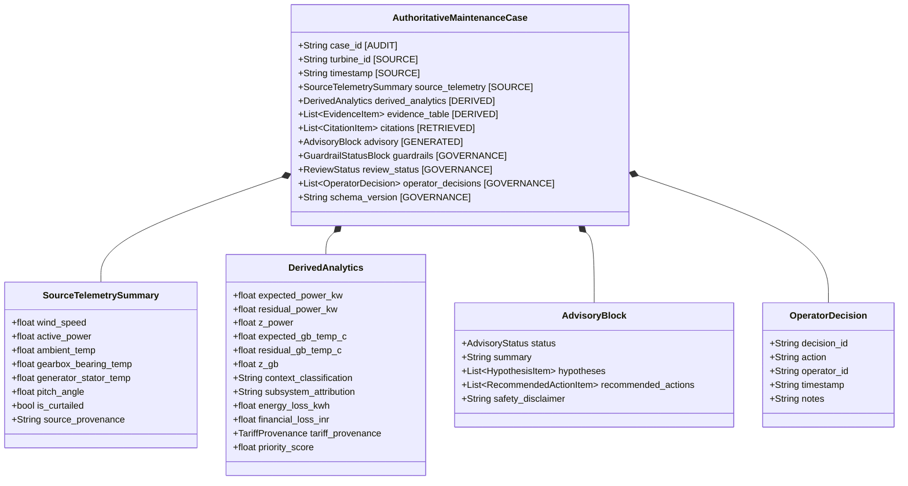
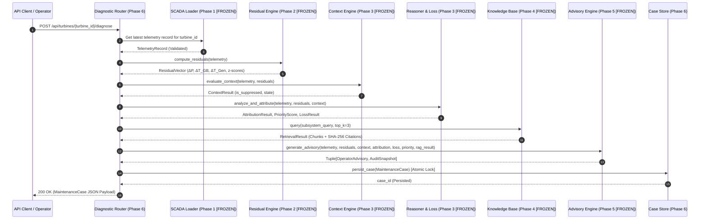

# Phase 6 Scope & Implementation Authorization Review
## Layer 6: Application / Service Integration Layer, REST API & Persistent Case Storage
### Pre-Implementation Governance Gate — No Implementation Authorized

---

## 1. Executive Summary

```
====================================================================================================
                        PHASE 6 PRE-IMPLEMENTATION GOVERNANCE GATE
====================================================================================================
Governance Status                  : PHASE 6 SCOPE REVIEW COMPLETED — AWAITING OWNER REVIEW
Implementation Authorization       : NOT YET AUTHORIZED (STRICTLY LOCKED OUT)
Phase 1 (Data Ingestion/Simulator) : COMPLETE, VERIFIED & FROZEN
Phase 2 (Expected Behaviour ML)    : COMPLETE, OWNER SIGNED OFF & FROZEN
Phase 3 (Context, Reasoner, Loss)  : COMPLETE, OWNER SIGNED OFF & FROZEN
Phase 4 (Technical RAG Knowledge)  : COMPLETE, OWNER SIGNED OFF & FROZEN
Phase 5 (Advisory & Guardrails)    : COMPLETE, OWNER SIGNED OFF & FROZEN
Phase 7 (Operator UI Dashboard)    : OUT OF SCOPE (LOCKED OUT)
SCADA Turbine Actuation / Control  : PERMANENTLY PROHIBITED
Cloud Provider Integration         : NOT AUTHORIZED (OD-P5-01 / OD-P5-02 Unresolved)
Owner Decisions Identified (P6)    : 12 Decision Items (OD-P6-01 through OD-P6-12)
Unresolved Specification Items     : 5 Items (REQ-SPEC-01 through REQ-SPEC-05)
Final Classification               : READY FOR OWNER REVIEW
====================================================================================================
```

This document establishes the authoritative **Phase 6 Scope and Implementation Authorization Review** for **WindGuard AI**. Phase 6 is designed to serve as the **Application / Service Integration Layer (Layer 6 Service & Persistence Boundary)**, orchestrating the frozen, verified core subsystems of Phases 1 through 5 and exposing them via secure, validated, and observable RESTful application boundaries with deterministic, atomic persistence.

> [!IMPORTANT]
> **GOVERNANCE MANDATE — ZERO IMPLEMENTATION AUTHORIZATION**:
> This document is strictly a scope, boundary, and readiness evaluation. **NO CODE HAS BEEN WRITTEN, NO REPOSITORY FILES HAVE BEEN MODIFIED, AND NO IMPLEMENTATION IS AUTHORIZED.** Implementation of Phase 6 may only commence after the Project Owner formally reviews this document, resolves critical Owner Decisions, and issues an explicit written Implementation Authorization Order.

---

## 2. Current Project Governance State

The project governance baseline is strictly established across all preceding engineering phases:

1. **Phase 1 (SCADA Ingestion & Simulation Engine)**: `VERIFIED & FROZEN` (49/49 tests passed).
2. **Phase 2 (Expected Behaviour ML & Residuals Engine)**: `OWNER SIGNED OFF & FROZEN` (78/82 passed, 4 documented baseline limitations accepted in [`docs/PHASE_2_FINAL_SIGNOFF_REVIEW.md`](file:///c:/Users/shriv/OneDrive/Desktop/WindGuardAI/docs/PHASE_2_FINAL_SIGNOFF_REVIEW.md)).
3. **Phase 3 (Operational Context Engine, Reasoner & Tariff Loss Engine)**: `OWNER SIGNED OFF & FROZEN` (44/44 tests passed).
4. **Phase 4 (Technical Knowledge Base & Local RAG Subsystem)**: `OWNER SIGNED OFF & FROZEN` (17/17 dedicated tests passed, $P@3$ / $\text{Recall}@3$ reconciled).
5. **Phase 5 (Advisory Synthesis, Guardrails & Mode A Core)**: `OWNER SIGNED OFF & FROZEN` (39/39 dedicated tests passed, SCEN-01..SCEN-20 verified, [`docs/PHASE_5_OWNER_SIGN_OFF.md`](file:///c:/Users/shriv/OneDrive/Desktop/WindGuardAI/docs/PHASE_5_OWNER_SIGN_OFF.md)).

### Frozen Phase 5 Policy State:
- The **Phase 5 Implementation-Neutral Core** (`backend/llm/*`) is complete, verified, and frozen.
- **Cloud-provider integrations** (watsonx.ai, OpenAI, Anthropic Claude) remain **NOT AUTHORIZED**.
- **Owner Decisions `OD-P5-01` through `OD-P5-06`** remain unresolved and preserved.
- **Turbine SCADA Actuation** is **PERMANENTLY PROHIBITED**.
- Current repository test execution baseline: **182 collected / 174 passed / 8 reconciled failures** (4 Phase 2 limitations + 4 historical phase-lockout checks; **ZERO genuine functional regressions**).

---

## 3. Phase 1–5 Frozen Boundary Protection

To preserve system stability, mathematical determinism, and verified safety boundaries, the following modules are **IMMUTABLE AND FROZEN**:

```
backend/data/*         ──► Phase 1 SCADA Ingestion, Ingestion Filters, Synthetic Simulator [FROZEN]
backend/models/*       ──► Phase 2 Expected Power (GBR), Expected Thermal (RF), Residual Engine [FROZEN]
backend/engine/*       ──► Phase 3 Context Engine, Multi-Signal Reasoner, Tariff Registry, Loss [FROZEN]
backend/rag/*          ──► Phase 4 Document Chunker, Knowledge Base, Hybrid Local Index [FROZEN]
backend/llm/*          ──► Phase 5 Advisory Schemas, Prompts, Guardrails, Mode A Fallback [FROZEN]
tests/test_* (Phases 1-5) ──► All Pre-Existing Acceptance & Unit Test Suites [FROZEN]
```

### Protection Directives:
- Phase 6 **MUST NOT** modify, re-implement, or wrap internal algorithms inside Phase 1–5 packages to make API integration convenient.
- If an API requirement exposes a boundary gap in a frozen package, it must be logged as `FROZEN-LAYER CONFLICT — REQUIRES OWNER REVIEW` rather than modified silently.
- Phase 6 acts strictly as an **orchestrator and consumer** of these frozen subsystems.

---

## 4. Purpose of Phase 6

Phase 6 establishes the **Application Service Integration Layer** around the frozen Phase 1–5 WindGuard AI core. Its primary objectives are:

1. **Service Boundary**: Expose the deterministic analytical capabilities, operational context filtering, technical RAG retrieval, and constrained advisory generation through structured, validated HTTP/REST endpoints.
2. **Orchestration**: Provide clean orchestration pipelines that coordinate telemetry ingestion $\to$ residual computation $\to$ context evaluation $\to$ RAG query $\to$ advisory generation $\to$ guardrail verification without duplicating business logic.
3. **Persistent Case Storage**: Provide thread-safe, atomic, durable storage for generated maintenance cases, tariff configurations, and operator human-in-the-loop (HITL) review decisions.
4. **Safety & Security Enforcement**: Guarantee at the API boundary that no actuation endpoints can exist, input payloads are strictly sanitized and bounded, and operator actions are immutably logged.
5. **Decoupling from Presentation**: Provide a clean data and service contract for downstream Phase 7 (Operator Dashboard / UI Studio) without embedding presentation artifacts in the backend.

---

## 5. Proposed Phase 6 Scope Evaluation

Every proposed functional and architectural area has been evaluated under strict engineering criteria:

| Scope Item | Evaluation Classification | Technical Justification |
| :--- | :--- | :--- |
| **FastAPI Core Application & Lifespan** | **`REQUIRED`** | Essential service framework specified in [`docs/08_system_architecture.md`](file:///c:/Users/shriv/OneDrive/Desktop/WindGuardAI/docs/08_system_architecture.md) and [`docs/13_technology_stack.md`](file:///c:/Users/shriv/OneDrive/Desktop/WindGuardAI/docs/13_technology_stack.md). |
| **Health & Readiness Endpoints (`/api/health`, `/api/ready`)** | **`REQUIRED`** | Required for service lifecycle management, container orchestration, and subsystem readiness checks. |
| **Telemetry Ingestion & Query Endpoints** | **`REQUIRED`** | Already partially established in Phase 1; must be fully consolidated into the Phase 6 router boundary. |
| **Benchmark Simulation Trigger (`/api/scada/simulate`)** | **`REQUIRED`** | Wraps existing Phase 1 `SCADASimulator` to support reproducible scenario generation for downstream evaluation. |
| **End-to-End Diagnostic Pipeline Endpoint (`POST /api/turbines/{id}/diagnose`)** | **`REQUIRED`** | Master orchestration endpoint executing Layers 1–5 sequentially and yielding a verified `OperatorAdvisory`. |
| **Case Query & Retrieval Endpoints (`GET /api/cases`, `GET /api/cases/{id}`)** | **`REQUIRED`** | Essential for querying, filtering, and deep-inspecting persisted maintenance cases. |
| **Operator Decision / HITL Endpoint (`POST /api/cases/{id}/decision`)** | **`REQUIRED`** | Implements the safety-critical human-in-the-loop governance gate recording operator review actions. |
| **Tariff Registry Management (`GET /api/tariffs`, `POST /api/tariffs`)** | **`REQUIRED`** | Exposes the multi-mode tariff registry and allows authorized baseline configuration updates with provenance. |
| **Technical RAG Search Endpoint (`POST /api/rag/query`)** | **`REQUIRED`** | Exposes Layer 4 knowledge retrieval for operator decision support and document search. |
| **Persistent Case Store Subsystem (`backend/storage/case_store.py`)** | **`REQUIRED`** | Core persistence mechanism for storing generated cases, guardrail blocks, and operator decisions. |
| **Atomic File Locking / ACID Concurrency** | **`REQUIRED`** | Prevents write collisions, race conditions, and corrupted JSON/database records under concurrent requests. |
| **API Versioning Strategy (`/api/v1` vs `/api`)** | **`REQUIRES OWNER DECISION`** | Unresolved in baseline documents; documented as `OD-P6-02`. |
| **Persistence Technology Selection (JSON vs SQLite vs Hybrid)** | **`REQUIRES OWNER DECISION`** | Architectural trade-off requiring explicit Project Owner sign-off (`OD-P6-01`). |
| **Authentication & Authorization Security Scheme** | **`REQUIRES OWNER DECISION`** | Boundary separation between local workstation mode and network deployment (`OD-P6-03`). |
| **HITL Decision Workflow State Machine** | **`REQUIRES OWNER DECISION`** | Specific state transition constraints (`OD-P6-04`). |
| **Case Retention & Deletion Policy** | **`REQUIRES OWNER DECISION`** | Legal/audit requirement for data immutability vs storage limits (`OD-P6-05`). |
| **Demo Stepper Mock Endpoints (`/api/demo/stage/{id}`)** | **`OPTIONAL / PHASE 7 CONCERN`** | Can be synthesized in Phase 7 UI using scenario simulation rather than backend hardcoding (`OD-P6-10`). |
| **Frontend Web Dashboard (HTML/CSS/JS)** | **`OUT OF SCOPE`** | Explicitly assigned to **Phase 7** in [`docs/14_implementation_plan.md`](file:///c:/Users/shriv/OneDrive/Desktop/WindGuardAI/docs/14_implementation_plan.md). |
| **Cloud LLM Provider Network Integration** | **`OUT OF SCOPE`** | Locked out under Phase 5 governance pending `OD-P5-01` / `OD-P5-02`. |
| **SCADA Remote Actuation & Control** | **`PERMANENTLY PROHIBITED`** | Forbidden under `ADR-003`, `PRD NG-01`, and `SRS-LLM-01`. |

---

## 6. In-Scope vs. Out-of-Scope Components

```
┌──────────────────────────────────────────────────────────────────────────────────────────────────┐
│                                   PHASE 6 SCOPE BOUNDARIES                                       │
├──────────────────────────────────────────────────┬───────────────────────────────────────────────┤
│ IN-SCOPE (Phase 6 Implementation Target)          │ OUT-OF-SCOPE (Strictly Prohibited / Deferred) │
├──────────────────────────────────────────────────┼───────────────────────────────────────────────┤
│ 1. FastAPI service application & lifespan wiring │ 1. Frontend UI / Dashboard HTML/JS (Phase 7)  │
│ 2. Consolidated REST API router architecture     │ 2. Cloud LLM SDK integration (Awaiting P5 OD) │
│ 3. End-to-end diagnostic pipeline orchestrator   │ 3. Cloud hosting / container deployment       │
│ 4. Authoritative Case schema & serialization     │ 4. SCADA pitch/yaw/torque actuation (PROHIBITED)│
│ 5. Persistent Case Store (Atomic locking / DB)   │ 5. Automated maintenance crew dispatching     │
│ 6. Operator HITL decision audit logger           │ 6. Automated alarm clearance / case closure   │
│ 7. Multi-mode Tariff API routes                  │ 7. Real-time external SCADA broker (OPC-UA)   │
│ 8. Local RAG search API routes                   │ 8. Direct database migration frameworks       │
│ 9. Comprehensive request/response Pydantic guards│ 9. Automated evaluation suite (Phase 8)       │
│ 10. Negative actuation API verification suite    │ 10. Slide decks & final reports (Phase 9)     │
└──────────────────────────────────────────────────┴───────────────────────────────────────────────┘
```

---

## 7. API Architecture & Routing Proposal

### 7.1 Proposed Routing Hierarchy

The proposed API architecture organizes routes modularly by domain responsibility under `backend/api/`:

```
backend/api/
├── __init__.py               ──► Package exports
├── app.py / main.py          ──► FastAPI application factory, CORS, exception handlers, lifespan
├── dependencies.py           ──► Dependency injection providers (Store singletons, Engines)
├── schemas.py                ──► Unified request/response validation schemas
└── routes/
    ├── system_routes.py      ──► /api/health, /api/ready, /api/status
    ├── scada_routes.py       ──► /api/scada/ingest, /api/scada/simulate, /api/turbines/{id}/telemetry
    ├── model_routes.py       ──► /api/models/train, /api/models/residuals, /api/models/status
    ├── diagnostic_routes.py  ──► /api/turbines/{id}/diagnose (E2E Pipeline Orchestrator)
    ├── case_routes.py        ──► /api/cases, /api/cases/{id}, /api/cases/{id}/decision
    ├── tariff_routes.py      ──► /api/tariffs (GET / POST)
    └── rag_routes.py         ──► /api/rag/query
```

### 7.2 Service Lifecycle & Dependency Management
- **Startup**:
  - Validate model artifacts exist or lazy-initialize them deterministically.
  - Initialize and index Layer 4 Technical Knowledge Base from disk.
  - Verify and create persistence directories and lockfiles.
  - Initialize in-memory telemetry sliding-window cache.
- **Shutdown**:
  - Flush all pending in-memory cache buffers to disk atomically.
  - Release any lingering file lock handles cleanly.

---

## 8. Authoritative Case Model & Data Contract

The authoritative `MaintenanceCase` schema models the complete diagnostic lifecycle, partitioning information into strict functional classifications:



### Strict Field Authority Principles:
1. **Source Telemetry** fields are immutable records of physical observations.
2. **Derived Analytics** fields are calculated deterministically by Phases 2 and 3; they are authoritative for all loss, residual, and priority metrics.
3. **Retrieved Evidence** contains verified chunks and SHA-256 hashes from Phase 4.
4. **Generated Advisory Content** contains synthesized explanations; **it is strictly forbidden from overwriting or modifying any numerical field in Source Telemetry or Derived Analytics**.
5. **Governance & Audit Metadata** tracks the case through its human review lifecycle.

---

## 9. Persistence Architecture Evaluation

The project architecture specifies persistent storage for telemetry caching, generated maintenance cases, tariff configurations, and operator HITL audit records.

### Comparison of Storage Options:

| Architectural Criterion | Option 1: Atomic File-Locked JSON Store | Option 2: SQLite Database (WAL Mode) | Option 3: Hybrid Architecture (SQLite Cases + JSON Logs) |
| :--- | :--- | :--- | :--- |
| **Underlying Mechanism** | `filelock` + `NamedTemporaryFile` + `os.replace` | Single-file embedded relational DB with WAL journaling | SQLite for relational queries + JSON for raw audit trail |
| **ACID Guarantees** | Atomic all-or-nothing file replacement | Full ACID transactions with WAL concurrency | ACID for cases; atomic append for audit logs |
| **Concurrent Read/Write** | Process-safe file lock; reads block briefly during write | High-concurrency readers + single serialized writer | High-concurrency reads; clean separation of concerns |
| **Query & Filtering** | In-memory indexing / sequential scan | Native SQL queries, indexes on `turbine_id`, `status`, `severity` | Native SQL queries for case table; JSON for deep audit |
| **Schema Versioning** | Schema migration via dictionary translation | Standard SQL DDL / lightweight migration scripts | Dual schema management |
| **Audit Immutability** | Append-only JSONL files with file locking | Append-only audit table with trigger/constraint protection | Append-only JSONL audit logs with SHA-256 hashes |
| **Dependencies** | Zero external DB packages (Pure standard lib + `filelock`) | Pure Python standard library (`sqlite3`) | Standard library (`sqlite3`, `json`) + `filelock` |
| **Implementation Complexity** | Low — already proven in `backend/storage/file_store.py` | Medium — requires schema definition and repository class | Medium-High — requires two storage coordinators |

> [!IMPORTANT]
> **GOVERNANCE DIRECTIVE — PERSISTENCE CHOICE**:
> The final persistence technology selection is an explicit Owner Decision (**`OD-P6-01`**). Phase 6 will not unilaterally select or hardcode a database until the Project Owner reviews and approves the persistence specification.

---

## 10. Integration & Invocation Boundaries

Phase 6 serves as the **Integration Orchestrator** connecting the frozen core layers:



---

## 11. API Data Contract Matrix

The proposed Phase 6 REST API endpoints and data contracts are formally specified below:

| Endpoint | Method | Purpose | Request Schema | Response Schema | Upstream Layer | Persistence Effect | Safety Classification |
| :--- | :---: | :--- | :--- | :--- | :---: | :--- | :---: |
| `/api/health` | `GET` | Service liveness probe | None | `HealthResponse` | Phase 6 | None | Read-Only |
| `/api/ready` | `GET` | Service readiness probe | None | `ReadinessResponse` | Phases 1–5 | None | Read-Only |
| `/api/fleet/status` | `GET` | Fleet summary & alerts | Query filters | `FleetStatusResponse` | Phase 1 & 6 | Read Cache/Store | Read-Only |
| `/api/turbines/{id}/telemetry` | `GET` | Time-series telemetry | `limit`, `window` | `List[TelemetryRecord]` | Phase 1 Cache | Read Cache | Read-Only |
| `/api/turbines/{id}/diagnose` | `POST` | Execute E2E diagnostic | `DiagnoseRequest` (opt) | `MaintenanceCase` | Phases 1–5 | **Write Case & Audit** | **Advisory Only** |
| `/api/cases` | `GET` | List/filter cases | `status`, `severity`, `page` | `PaginatedCasesResponse`| Phase 6 Store | Read Store | Read-Only |
| `/api/cases/{id}` | `GET` | Get case by ID | Path `case_id` | `MaintenanceCase` | Phase 6 Store | Read Store | Read-Only |
| `/api/cases/{id}/decision` | `POST` | Record HITL decision | `OperatorDecisionRequest`| `MaintenanceCase` | Phase 6 Store | **Write Decision Audit** | **HITL Governance** |
| `/api/tariffs` | `GET` | Get active tariff & hierarchy | None | `TariffRegistryResponse`| Phase 3 Registry | Read Config | Read-Only |
| `/api/tariffs` | `POST` | Update active tariff | `TariffUpdateRequest` | `TariffProvenance` | Phase 3 Registry | **Write Config** | Financial Config |
| `/api/rag/query` | `POST` | Semantic knowledge search | `RAGQueryRequest` | `RAGQueryResponse` | Phase 4 RAG | None | Read-Only |
| `/api/scada/ingest` | `POST` | Ingest JSON telemetry | `IngestRequest` | `IngestResponse` | Phase 1 Loader | **Update Telemetry Cache**| Ingestion Only |
| `/api/scada/simulate` | `POST` | Run benchmark scenario | `SimulationConfig` | `SimulateResponse` | Phase 1 Simulator| **Write Synthetic SCADA**| Simulation Only |

---

## 12. Permanent Actuation Prohibition & Negative API Specification

In accordance with **`ADR-003`**, **`PRD NG-01`**, and **`SRS-LLM-01`**, WindGuard AI is strictly an **explainable decision-support platform**. It possesses **ZERO capability to actuate physical equipment**.

### 12.1 Permanently Prohibited Operations:
1. Writing setpoints or control registers to turbine SCADA / PLC systems.
2. Direct dispatch of pitch angle adjustments, yaw commands, or converter torque setpoints.
3. Generator contactor or circuit breaker tripping / closure.
4. Autonomous turbine start, pause, stop, or emergency shutdown commands.
5. Autonomous maintenance work order dispatch without human engineering authorization.
6. Automated clearing of SCADA alarm codes without operator confirmation.

### 12.2 Negative API Requirements:
- **NEG-API-01**: The FastAPI routing table shall contain **ZERO** routes matching regex patterns: `.*(control|actuate|pitch_cmd|yaw_cmd|torque_cmd|stop|start|trip|dispatch_work_order).*`.
- **NEG-API-02**: Every response payload containing diagnostic advice shall include the non-actuating safety disclaimer: `"WindGuard AI generates non-actuating diagnostic decision-support advisories. Physical turbine intervention requires certified human operator review."`
- **NEG-API-03**: The `OperatorDecision` schema shall restrict operator actions strictly to triage states (`ACKNOWLEDGE`, `INVESTIGATE`, `ESCALATE`, `DISMISS`) with **ZERO automated execution hooks**.

---

## 13. Data Provenance & Integrity Requirements

Phase 6 must strictly preserve the cryptographic and categorical provenance established in Phases 1–5:

```
┌──────────────────────────────────────────────────────────────────────────────────────────────────┐
│                                 DATA PROVENANCE TAXONOMY                                         │
├───────────────────────┬──────────────────────────────────────────────────────────────────────────┤
│ Provenance Level      │ Definition & Integrity Rule                                              │
├───────────────────────┼──────────────────────────────────────────────────────────────────────────┤
│ SOURCE_AUTHENTIC      │ Direct SCADA observation or official OEM technical manual excerpt.        │
│ SOURCE_DERIVED        │ Deterministically calculated by ML model, context engine, or loss engine.│
│ PROJECT_SYNTHETIC     │ Generated by physics-informed simulator (S1–S5) or synthetic playbooks.  │
│ UNVERIFIED            │ External or ungrounded data; strictly rejected by input validation.      │
└───────────────────────┴──────────────────────────────────────────────────────────────────────────┘
```

### Provenance Invariants:
- All citations in API responses must preserve their SHA-256 `content_hash` and `source_locator`.
- All loss estimates must explicitly include the complete `TariffProvenance` block showing rate, mode, source reference, and whether it represents a configured baseline assumption.
- No API transformation or JSON serialization may strip provenance metadata.

---

## 14. Auditability & Observability Requirements

Every end-to-end diagnostic evaluation and human decision must be permanently auditable:

```
Diagnostic Request ──► Telemetry Validation ──► Analytical Inference ──► RAG Search
        │                                                                     │
        ▼                                                                     ▼
Audit Snapshot ID ◄── Guardrail Verification ◄── Advisory Synthesis ◄── Chunks & Context
        │
        ▼
Persistent Case Store (Immutable Case Record)
        │
        ▼
Operator HITL Decision ──► Append-Only Operator Audit Log (Timestamp, User ID, Action, Notes)
```

### Audit Invariants:
1. **Audit Snapshot Preservation**: Every generated case persists the full `AuditSnapshot` recording provider mode, raw inputs, pre-guardrail candidate output, guardrail evaluation verdicts, and latency.
2. **Immutable Decision History**: When an operator records a decision on a case, the previous case state is not overwritten destructively; rather, the decision is appended to the case's `operator_decisions` list and logged to an append-only audit trail.
3. **Structured Local Logging**: Standardized JSON logs recording `timestamp`, `request_id`, `client_ip`, `route`, `status_code`, `duration_ms`, and `case_id` (without leaking sensitive data or stack traces).

---

## 15. Security & Threat-Oriented Analysis

A rigorous threat evaluation has been conducted for the Phase 6 application boundary:

| Threat Category | Potential Attack Vector | Phase 6 Specification Countermeasure |
| :--- | :--- | :--- |
| **Path Traversal** | Malicious `turbine_id`, `case_id`, or uploaded filename containing `../` | Strict regex validation (`^[A-Za-z0-9_-]{1,64}$`) on all path parameters; sanitization of file uploads. |
| **Denial of Service (DoS)** | Giant JSON payload or rapid-fire diagnostic requests | Strict request body size limits ($10\,\text{MB}$ file upload, $1\,\text{MB}$ JSON payload); request timeouts. |
| **Prompt / Data Injection** | Malicious comments or metadata in SCADA streams attempting LLM escape | Telemetry values are strictly typed as floats/ints; string fields pass through XML delimiter isolation. |
| **Provenance Spoofing** | Forged RAG citations or fake tariff sources in request payloads | Citations and tariffs are resolved exclusively from internal server registries; client cannot inject raw citations. |
| **Concurrent Write Corruption** | Multiple simultaneous diagnosis/decision requests colliding on disk | Mandatory file locking (`filelock` / SQLite WAL transactions) with atomic replace primitives. |
| **Information Disclosure** | Unhandled exceptions leaking stack traces or internal environment variables | Global FastAPI exception handlers catching all unhandled errors and returning structured, sanitized JSON errors. |
| **Accidental Actuation Exposure** | Misconfigured route accidentally exposing control capabilities | Explicit negative route assertion test suite checking complete OpenAPI route catalog during CI. |

---

## 16. Input Validation & Error Handling Architecture

### 16.1 Deterministic Error Schema
All error responses from Phase 6 APIs shall conform strictly to a standardized error contract:

```json
{
  "error_code": "ERR_TURBINE_NOT_FOUND",
  "message": "Turbine 'WTG-99' does not exist in active fleet cache.",
  "timestamp": "2026-09-20T12:00:00Z",
  "request_id": "req-9b1deb4d-3b7d-4bad-9bdd-2b0d7b3dcb6d",
  "details": {
    "requested_turbine": "WTG-99",
    "available_turbines": ["WTG-01", "WTG-02", "WTG-03", "WTG-07", "WTG-09"]
  }
}
```

### 16.2 Standardized Error Categories:
- `400 Bad Request`: Schema validation error, out-of-bounds parameter, malformed JSON (`ERR_INVALID_PAYLOAD`).
- `404 Not Found`: Unknown turbine identifier, non-existent case ID (`ERR_RESOURCE_NOT_FOUND`).
- `409 Conflict`: Duplicate case creation attempt, concurrent modification conflict (`ERR_CONCURRENCY_CONFLICT`).
- `422 Unprocessable Entity`: Valid JSON syntax but violates domain constraints (`ERR_DOMAIN_VALIDATION_FAILED`).
- `500 Internal Error`: Upstream model failure, storage I/O exception (`ERR_INTERNAL_PIPELINE_FAILURE`).

---

## 17. Concurrency & Performance Targets

### 17.1 Proposed Performance Design Targets (Informational / Not Yet Owner-Approved):
- **Telemetry Query Latency**: `[PROPOSED TARGET: < 25 ms]` for cached sliding window retrieval.
- **Diagnostic Pipeline Latency (Mode A Local)**: `[PROPOSED TARGET: < 50 ms]` end-to-end (ML + Context + RAG + Mode A + Guardrail + Persistence).
- **Case Listing & Retrieval Latency**: `[PROPOSED TARGET: < 30 ms]` for paginated queries.
- **Concurrent Ingestion**: Process-safe handling of simultaneous 10-turbine telemetry ingestion batches.
- **Service Memory Footprint**: `[PROPOSED TARGET: < 500 MB]` RSS under standard operational load.

---

## 18. Testing Strategy & Verification Architecture

Phase 6 acceptance testing will encompass 14 specialized verification test suites:

```
tests/
├── test_api_system.py             ──► Liveness, readiness, health probes, OpenAPI schema validity
├── test_api_scada.py              ──► JSON/CSV ingestion, scenario simulation, telemetry queries
├── test_api_models.py             ──► Model status, retraining trigger, residual vector endpoint
├── test_api_diagnostic.py         ──► End-to-end diagnostic pipeline execution & case generation
├── test_api_cases.py              ──► Case query, filtering, pagination, deep retrieval
├── test_api_decision.py           ──► Operator decision recording, note persistence, audit logging
├── test_api_tariffs.py            ──► Tariff retrieval, provenance display, baseline override
├── test_api_rag.py                ──► Knowledge base search queries, citation metadata verification
├── test_case_store.py             ──► Atomic persistence, read-after-write consistency, schema versions
├── test_store_concurrency.py      ──► Multi-threaded & multi-process concurrent write collisions
├── test_api_security.py           ──► Path traversal, payload limits, injection firewall, error sanitization
├── test_negative_actuation.py     ──► Negative route scan proving ZERO control/actuation endpoints exist
├── test_api_restart_recovery.py   ──► Storage recovery after server restart, corrupted file handling
└── test_acceptance_phase6.py      ──► Master Phase 6 Acceptance Gate Suite (GATE-01 through GATE-15)
```

---

## 19. Phase 6 Formal Acceptance Gates

The Phase 6 verification audit will evaluate fifteen explicit acceptance gates:

| Gate ID | Gate Name | Objective & Measurement | Pass Criterion |
| :--- | :--- | :--- | :--- |
| **GATE-01** | **API Schema Correctness** | Validate OpenAPI / JSON schema conformance across all routes. | 100% schemas valid; zero undocumented fields (`extra="forbid"`). |
| **GATE-02** | **Input Validation** | Submit boundary, out-of-range, and malformed payloads. | Deterministic 400/422 errors; zero unhandled crashes. |
| **GATE-03** | **Deterministic Integration** | Execute end-to-end diagnostic pipeline against S1–S5 scenarios. | 100% numerical match with frozen Phases 1–5 outputs. |
| **GATE-04** | **Persistence Integrity** | Verify case creation, persistence to disk, and retrieval by ID. | Read-after-write exact bit-level consistency. |
| **GATE-05** | **Atomicity & Concurrency** | Execute 50 concurrent write/decision operations simultaneously. | Zero race conditions, zero file corruption, zero lost updates. |
| **GATE-06** | **Provenance Preservation** | Verify SHA-256 hashes, source locators, and tariff provenance. | All citations & tariff metadata preserved intact. |
| **GATE-07** | **Advisory State Preservation** | Test 4-state dispatcher (`NORMAL`, `FALLBACK`, `ABSTAIN`, `BLOCKED`).| Exact preservation of Phase 5 guardrail status blocks. |
| **GATE-08** | **Error Handling & Sanitization**| Trigger intentional server/model faults and inspect response. | Standard error schema; zero stack traces or secrets exposed. |
| **GATE-09** | **Auditability & Traceability** | Inspect generated audit snapshot and operator decision log. | Complete audit trail with timestamps, IDs, and diffs. |
| **GATE-10** | **Security Boundary** | Execute path traversal, oversized payload, and injection attacks. | All malicious inputs safely rejected with clean errors. |
| **GATE-11** | **Actuation Prohibition** | Automated AST / OpenAPI scan of all registered routes. | Zero actuation / control routes exist; disclaimer present. |
| **GATE-12** | **Regression Protection** | Run full repository test suite (182+ tests). | Zero genuine functional regressions across Phases 1–5. |
| **GATE-13** | **Performance & Latency** | Measure API response latency under Mode A execution. | E2E diagnostic latency meets approved performance budget. |
| **GATE-14** | **Restart & Recovery** | Restart FastAPI server and verify state reload from disk. | All previously stored cases and telemetry loaded cleanly. |
| **GATE-15** | **Owner Governance** | Verify all Phase 6 Owner Decisions are documented and adhered to.| 100% compliance with Project Owner authorization orders. |

---

## 20. Proposed File Boundary Matrix

If and when authorized by the Project Owner, Phase 6 implementation will be strictly restricted to the following file boundary:

```
backend/
├── api/
│   ├── __init__.py                 ──► [PERMITTED TO CREATE] Layer 6 API package exports
│   ├── app.py                      ──► [PERMITTED TO CREATE] FastAPI app factory & middleware
│   ├── dependencies.py             ──► [PERMITTED TO CREATE] Route dependency injectors
│   ├── schemas.py                  ──► [PERMITTED TO CREATE] Pydantic API schemas
│   └── routes/
│       ├── __init__.py             ──► [PERMITTED TO CREATE] Route exports
│       ├── system_routes.py        ──► [PERMITTED TO CREATE] Health & readiness
│       ├── diagnostic_routes.py    ──► [PERMITTED TO CREATE] E2E diagnostic pipeline
│       ├── case_routes.py          ──► [PERMITTED TO CREATE] Case management & HITL
│       ├── tariff_routes.py        ──► [PERMITTED TO CREATE] Tariff registry routes
│       └── rag_routes.py           ──► [PERMITTED TO CREATE] Knowledge search routes
├── storage/
│   ├── __init__.py                 ──► [PERMITTED TO MODIFY] Package exports
│   ├── case_store.py               ──► [PERMITTED TO CREATE] Persistent Case Store
│   └── audit_logger.py             ──► [PERMITTED TO CREATE] Operator audit logger
└── main.py                         ──► [PERMITTED TO MODIFY] Service entrypoint wiring

tests/
├── test_api_*.py                   ──► [PERMITTED TO CREATE] Specialized API route unit tests
├── test_case_store.py              ──► [PERMITTED TO CREATE] Storage & atomic locking tests
├── test_store_concurrency.py       ──► [PERMITTED TO CREATE] Concurrency & race condition tests
├── test_negative_actuation.py      ──► [PERMITTED TO CREATE] Negative control endpoint scan
└── test_acceptance_phase6.py       ──► [PERMITTED TO CREATE] Formal Phase 6 acceptance gate suite

docs/
├── PHASE_6_SCOPE_REVIEW.md         ──► [CURRENT GOVERNANCE ARTIFACT]
└── PHASE_6_VERIFICATION.md         ──► [PERMITTED TO CREATE ONLY UPON VERIFICATION]
```

---

## 21. Project Owner Decision Register

The following twelve (12) decision items require explicit Project Owner resolution prior to or during Phase 6 implementation authorization:

| Decision ID | Decision Item | Why Required | Options Available | Architectural Impact | Recommended Evidence Needed | Governance Status |
| :--- | :--- | :--- | :--- | :--- | :--- | :---: |
| **`OD-P6-01`** | **Persistent Case Storage Technology** | Determines the database/storage engine for generated cases and decisions. | **Option A**: Atomic File-Locked JSON Store<br>**Option B**: SQLite Database (WAL Mode)<br>**Option C**: Hybrid (SQLite Cases + JSON Logs) | Affects data querying, concurrency overhead, and migration complexity. | Benchmark write latency and multi-threaded collision tests. | **`UNRESOLVED`** |
| **`OD-P6-02`** | **API Versioning Strategy** | Determines public URL structure for service endpoints. | **Option A**: `/api/v1/...` prefix<br>**Option B**: `/api/...` unversioned prefix<br>**Option C**: Header-based versioning | Affects client URL routing and future backward-compatibility. | Review API design consistency across documentation. | **`UNRESOLVED`** |
| **`OD-P6-03`** | **Authentication & Security Model** | Defines client authentication expectations for API access. | **Option A**: Localhost-only unauthenticated (Development/Edge default)<br>**Option B**: API Key Header (`X-API-Key`)<br>**Option C**: JWT Bearer Token / Role-Based Access | Affects local simplicity vs production multi-user security. | Security threat assessment for edge gateway deployment. | **`UNRESOLVED`** |
| **`OD-P6-04`** | **HITL Decision State Machine Transitions** | Establishes allowed state transitions for operator reviews. | **Option A**: Free transition between all 4 states (`ACK`, `INV`, `ESC`, `DIS`)<br>**Option B**: Strict one-way workflow (`OPEN` $\to$ `ACK` $\to$ `INV` $\to$ `ESC`/`DIS`) | Governs operator review semantics and case re-opening rules. | Review O&M workflow practices in wind farm control rooms. | **`UNRESOLVED`** |
| **`OD-P6-05`** | **Case Retention & Immutability Policy** | Determines whether cases can be purged, archived, or mutated. | **Option A**: Strict append-only immutability (No delete/edit)<br>**Option B**: Soft-delete / Archive status flag<br>**Option C**: Sliding retention window (e.g. 90 days) | Affects audit compliance and disk storage scaling. | Audit compliance requirements evaluation. | **`UNRESOLVED`** |
| **`OD-P6-06`** | **Telemetry Storage Retention Window** | Determines in-memory and disk telemetry buffer size. | **Option A**: 24-hour sliding window (144 records @ 10-min)<br>**Option B**: 7-day sliding window (1008 records @ 10-min)<br>**Option C**: Configurable dynamic buffer | Affects server memory consumption and trend chart depth. | Memory footprint measurements under multi-turbine load. | **`UNRESOLVED`** |
| **`OD-P6-07`** | **Diagnostic Idempotency Policy** | Determines behavior when diagnosing identical telemetry repeatedly. | **Option A**: Generate new case_id on every call with fresh timestamp<br>**Option B**: Idempotent deduplication based on `(turbine_id, timestamp)` hash | Affects case store record growth and duplicate case triage. | Review operator triage UX impact. | **`UNRESOLVED`** |
| **`OD-P6-08`** | **Uvicorn Worker & Concurrency Model** | Defines process execution model for FastAPI backend. | **Option A**: Single-worker async loop (`uvicorn --workers 1`)<br>**Option B**: Multi-worker process pool (`uvicorn --workers N`) | Multi-worker requires cross-process file locks or SQLite WAL. | Concurrency benchmark with `filelock` under multi-worker. | **`UNRESOLVED`** |
| **`OD-P6-09`** | **End-to-End API Latency Target Budgets** | Establishes enforceable SLA targets for API response times. | **Option A**: Conservative budget ($< 2500\,\text{ms}$)<br>**Option B**: Aggressive sub-second budget ($< 100\,\text{ms}$ for Mode A) | Affects CI acceptance thresholds in `GATE-13`. | Empirical latency measurements from Phase 5 verification. | **`UNRESOLVED`** |
| **`OD-P6-10`** | **Demo Stepper Mock API Location** | Determines whether `/api/demo/stage/{id}` belongs to Phase 6 or 7. | **Option A**: Backend API endpoint in Phase 6<br>**Option B**: Pure frontend synthetic state transition in Phase 7 | Affects backend purity vs demo standalone convenience. | Review SRS §4.1 vs UI/UX specification §6. | **`UNRESOLVED`** |
| **`OD-P6-11`** | **Structured Observability & Logging Format** | Determines logging backend and output format. | **Option A**: Standard Python JSON formatted stdout/stderr<br>**Option B**: Structured JSON log files with log rotation<br>**Option C**: OpenTelemetry structured tracing | Affects operational debugging and external telemetry ingestion. | Evaluate local edge gateway resource constraints. | **`UNRESOLVED`** |
| **`OD-P6-12`** | **Service Binding & Network Interface** | Governs host binding for FastAPI server. | **Option A**: `127.0.0.1` (Localhost-only loopback)<br>**Option B**: `0.0.0.0` (All interfaces with configurable firewall)<br>**Option C**: Configurable via `backend/config.py` | Affects security exposure during development and testing. | Network security baseline review. | **`UNRESOLVED`** |

---

## 22. Unresolved Specification Requirements

The review identifies five specific requirements requiring precise technical specification prior to implementation:

1. **`REQ-SPEC-01: Case Pagination & Filtering Contract`**: Exact query parameters for `GET /api/cases` (e.g., `limit`, `offset`, `sort_by`, `turbine_id`, `min_severity`, `status`, `start_date`, `end_date`).
2. **`REQ-SPEC-02: Operator Identity Attribution in Decisions`**: Format of operator identification passed in `POST /api/cases/{id}/decision` (e.g., string username, badge ID, or anonymous default `"OPERATOR_LOCAL"` in development mode).
3. **`REQ-SPEC-03: Subsystem Health Probe Timeout & Thresholds`**: Timeout limits for individual subsystem readiness probes during `GET /api/ready` calls.
4. **`REQ-SPEC-04: Tariff Modification Authorization Rule`**: Policy governing whether changing active tariff via `POST /api/tariffs` recomputes financial losses for existing open cases or applies only to future cases.
5. **`REQ-SPEC-05: Telemetry File Ingestion Size Limits`**: Explicit maximum file size and row count permitted for CSV upload via `POST /api/scada/ingest/file`.

---

## 23. Risks & Mitigation Register

| Risk ID | Risk Description | Severity | Likelihood | Proposed Mitigation Strategy |
| :--- | :--- | :---: | :---: | :--- |
| **RSK-P6-01** | **Frozen Layer Accidental Modification** | HIGH | LOW | Strict pre-commit and CI boundary checks verifying zero diffs in `backend/data`, `backend/models`, `backend/engine`, `backend/rag`, and `backend/llm`. |
| **RSK-P6-02** | **File Lock Deadlock on Windows** | MEDIUM | LOW | Use `filelock` with explicit timeout (e.g. $10.0\,\text{s}$) and retry loops; avoid nested lock acquisitions. |
| **RSK-P6-03** | **Actuation Route Inadvertently Added** | CRITICAL | LOW | Automated negative test scanning all FastAPI route decorators for forbidden control keywords. |
| **RSK-P6-04** | **Stale Model In-Memory Cache** | LOW | MEDIUM | Explicit model reload trigger (`POST /api/models/train`) resetting singleton references cleanly. |
| **RSK-P6-05** | **Storage File Corruption on Crash** | HIGH | LOW | Mandatory atomic file swap (`write temp file -> os.replace`) ensuring incomplete writes never overwrite valid data. |

---

## 24. Phase 6 Implementation Prerequisites

Before Phase 6 implementation can be authorized by the Project Owner, the following conditions must be satisfied:

1. **Review Sign-Off**: Project Owner must review and approve this document ([`docs/PHASE_6_SCOPE_REVIEW.md`](file:///c:/Users/shriv/OneDrive/Desktop/WindGuardAI/docs/PHASE_6_SCOPE_REVIEW.md)).
2. **Key Owner Decisions**: Project Owner must provide guidance on critical architectural choices:
   - `OD-P6-01` (Persistence Technology: JSON vs. SQLite vs. Hybrid)
   - `OD-P6-02` (API Versioning Strategy: `/api/v1` vs. `/api`)
   - `OD-P6-03` (Authentication Model for Phase 6)
3. **Formal Implementation Authorization Order**: Project Owner must issue an explicit Phase 6 Implementation Order defining authorized files and test scenarios.

---

## 25. Final Readiness Classification

```
====================================================================================================
                        PHASE 6 FINAL READINESS CLASSIFICATION
====================================================================================================

CLASSIFICATION:
READY FOR OWNER REVIEW

RATIONALE:
1. The architectural scope, boundary lines, and data contracts for Phase 6 (Layer 6 REST Service &
   Persistence Layer) are exhaustively defined and aligned with the canonical 6-Layer Architecture.
2. The frozen integrity of Phases 1 through 5 is strictly protected, with zero unauthorized code changes.
3. The permanent prohibition against SCADA turbine actuation is explicitly enforced with negative API
   specifications.
4. Twelve (12) Project Owner Decisions and five (5) specification items are rigorously cataloged without
   silent assumptions.
5. In accordance with governance mandates, implementation remains NOT AUTHORIZED until the Project
   Owner reviews this report and issues an explicit written implementation order.

====================================================================================================
```

---

*Authored by:*  
**WindGuard AI Engineering Governance Board**  
- *Lead System Architect*  
- *Senior Backend Engineer*  
- *Requirements Engineer*  
- *Safety Engineer*  
- *QA Engineer*  
- *Independent Verification Engineer*  
*Date: 2026-09-20*
