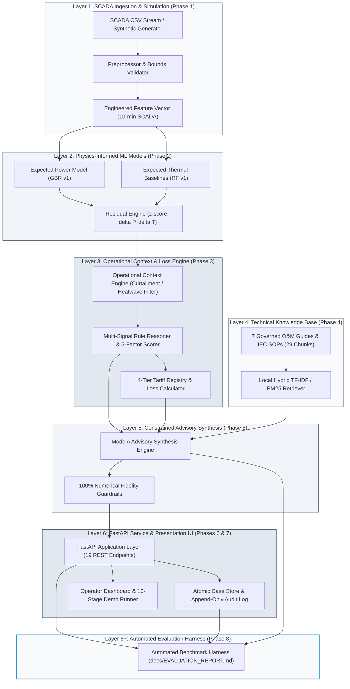
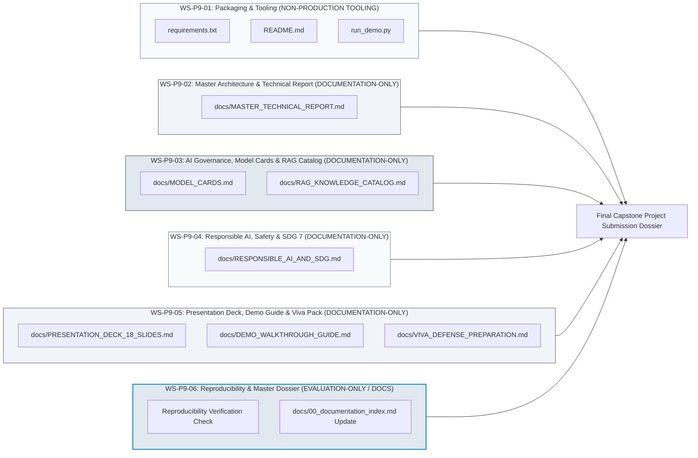
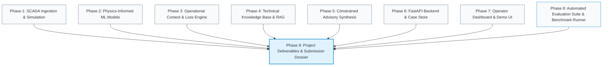

# Phase 9 Scope Review & Governance Definition
## Project Artifacts, Academic Synthesis, Technical Deliverables & Submission Readiness

```
====================================================================================================
                        PHASE 9 SCOPE REVIEW & GOVERNANCE DEFINITION RECORD
====================================================================================================
Project Name                       : WindGuard AI (Explainable Wind Turbine Health & Decision Support)
Active Governance Phase            : Phase 9 (Project Artifacts, Presentation & Submission Readiness)
Governance Status                  : PHASE 9 — SCOPE REVIEW COMPLETE & READY FOR OWNER REVIEW
Phase 9 Implementation Status      : NOT AUTHORIZED / NOT STARTED (SCOPE REVIEW ONLY)
Upstream Layer 1 Baseline          : PHASE 1 VERIFIED & FROZEN (docs/PHASE_1_VERIFICATION.md)
Upstream Layer 2 Baseline          : PHASE 2 OWNER SIGNED OFF & FROZEN (docs/PHASE_2_OWNER_RESOLUTION.md)
Upstream Layer 3 Baseline          : PHASE 3 OWNER SIGNED OFF & FROZEN (docs/PHASE_3_VERIFICATION.md)
Upstream Layer 4 Baseline          : PHASE 4 OWNER SIGNED OFF & FROZEN (docs/PHASE_4_FINAL_OWNER_REVIEW.md)
Upstream Layer 5 Baseline          : PHASE 5 OWNER SIGNED OFF & FROZEN (docs/PHASE_5_OWNER_SIGN_OFF.md)
Upstream Layer 6 Baseline          : PHASE 6 OWNER SIGNED OFF & FROZEN (docs/PHASE_6_OWNER_SIGN_OFF.md)
Upstream Layer 7 Baseline          : PHASE 7 OWNER SIGNED OFF & FROZEN (docs/PHASE_7_OWNER_SIGN_OFF.md)
Upstream Layer 8 Baseline          : PHASE 8 OWNER SIGNED OFF & FROZEN (docs/PHASE_8_FINAL_SIGNOFF.md)
Actual FastAPI REST Route Count    : EXACTLY 19 ENDPOINT OPERATIONS ACROSS 18 UNIQUE PATHS
Model Training Endpoint (/train)   : ABSENT FROM FASTAPI ROUTER (GOV-TRAIN-01 ENFORCED)
Governed Technical RAG Corpus      : EXACTLY 7 DOCUMENTS / 29 INDEXED CHUNKS
Turbine SCADA Actuation            : PERMANENTLY PROHIBITED (STRICT NON-ACTUATING ADVISORY ONLY)
Frozen Layer 1–8 Code Modification : STRICTLY PROHIBITED (ZERO PRODUCTION CODE MODIFICATIONS)
Cloud LLM Authorization Status     : NOT AUTHORIZED (Offline Deterministic Mode A Active)
Model Retraining Authorization     : NOT AUTHORIZED (GOV-TRAIN-01 Enforced)
External Dataset Ingestion         : NOT AUTHORIZED (Project Benchmark Framing Enforced)
====================================================================================================
```

---

## 1. Executive Summary

This document establishes the authoritative **Phase 9 Scope Review and Governance Definition** for **WindGuard AI**.

Following the formal completion and Owner sign-off of **Phase 8 (Automated Evaluation Suite & Benchmark Runner)**, the foundational engineering, physical modeling, context filtering, technical retrieval, constrained advisory synthesis, REST application service, operator dashboard, and empirical evaluation benchmark harness across all eight preceding phases are **100% complete, verified, immutable, and frozen**.

The explicit purpose of this Phase 9 Scope Review is to:
1. **Assess the Current System State**: Establish an exact, verified inventory of completed components across Phases 1 through 8 to guarantee zero redundant re-implementation or rework.
2. **Identify Remaining Project & Academic Gaps**: Comprehensively audit the project across engineering packaging, AI/ML model documentation, RAG corpus transparency, evaluation reproducibility, safety boundaries, and academic deliverable readiness.
3. **Formulate Candidate Phase 9 Objectives & Workstreams**: Propose a structured, bounded set of non-production documentation, packaging, demonstration, and defense deliverables required to make WindGuard AI academically complete, reproducible, demonstrable, defensible, and ready for final project submission.
4. **Enforce Strict Research & Product Boundaries**: Re-affirm the permanent prohibition of SCADA actuation, cloud LLM runtime dependencies, live fleet actuation, autonomous CMMS work-order dispatch, and model retraining.
5. **Establish the Owner Decision Register & Acceptance Gates**: Present explicit, recommendation-neutral decision choices and measurable acceptance gates for Project Owner review and determination prior to any implementation authorization.

In strict compliance with project governance:
- **MODE**: Scope Review & Governance Definition Only.
- **IMPLEMENTATION AUTHORIZATION**: **NOT GRANTED**.
- **PRODUCTION CODE CHANGES**: **ABSOLUTELY PROHIBITED**.
- **PHASES 1–8 STATUS**: **IMMUTABLE & FROZEN**.
- **SCADA ACTUATION**: **PERMANENTLY PROHIBITED**.

---

## 2. Frozen Baseline (Phases 1–8)

The authoritative baseline of WindGuard AI is established across eight completed and signed-off phases. Exactly 0 bytes of production runtime code or serialized model weights in these layers may be altered during Phase 9:

```
┌─────────────────────────────────────────────────────────────────────────────────────────────────────────────────────────────────┐
│                                             WINDGUARD AI FROZEN BASELINE MATRIX                                                 │
└─────────────────────────────────────────────────────────────────────────────────────────────────────────────────────────────────┘
```

| Phase / Layer | Focus & Scope | Implementation Files | Verification Reference | Sign-Off Status | Frozen Artifacts & Invariants |
| :--- | :--- | :--- | :--- | :---: | :--- |
| **Phase 1** (Layer 1) | SCADA Ingestion & Physical Simulation Engine | `backend/data/dataset_loader.py`, `scada_generator.py`, `preprocessor.py`, `schema.py` | `docs/PHASE_1_VERIFICATION.md` | `OWNER SIGNED OFF & FROZEN` | Canonical 10-minute SCADA schema, 1st-order thermal ODEs, 5 benchmark scenarios (S1–S5), `is_curtailed` flag. |
| **Phase 2** (Layer 2) | Physics-Informed ML Baselines & Residuals | `backend/models/expected_power.py`, `thermal_model.py`, `residual_engine.py`, `trainer.py` | `docs/PHASE_2_OWNER_RESOLUTION.md` | `OWNER SIGNED OFF & FROZEN` | `expected_power_gbr_v1.joblib` ($R^2=1.0$), `expected_thermal_rf_v1.joblib`, `baseline_stats_v1.json`. Known thermal lag limitation ($4.92^\circ\text{C} / 6.06^\circ\text{C}$) accepted. |
| **Phase 3** (Layer 3) | Operational Context Engine & Tariff Loss Engine | `backend/engine/context_engine.py`, `reasoner.py`, `prioritization.py`, `tariff_registry.py`, `loss_calculator.py` | `docs/PHASE_3_VERIFICATION.md` | `OWNER SIGNED OFF & FROZEN` | Curtailment suppression ($100\%$), ambient heat derating ($>38^\circ\text{C}$), 5-factor priority score ($S_{\text{priority}}$), 4-tier prospective tariff hierarchy. |
| **Phase 4** (Layer 4) | Technical Knowledge Base & Local RAG Subsystem | `backend/rag/knowledge_base.py`, `chunker.py`, `backend/rag/documents/*` | `docs/PHASE_4_FINAL_OWNER_REVIEW.md` | `OWNER SIGNED OFF & FROZEN` | 100% offline hybrid TF-IDF + Okapi BM25 search over 7 governed technical markdown documents (29 chunks); MRR $= 1.0$, Recall@3 $= 96.67\%$, SHA-256 provenance hashing. |
| **Phase 5** (Layer 5) | Constrained Advisory Synthesis & Guardrails | `backend/llm/advisory_engine.py`, `prompts.py`, `guardrails.py`, `fallback.py`, `schema.py` | `docs/PHASE_5_OWNER_SIGN_OFF.md` | `OWNER SIGNED OFF & FROZEN` | Pydantic JSON schema enforcement, deterministic Mode A fallback, 100% numerical fidelity guardrails against analytical residuals. |
| **Phase 6** (Layer 6) | FastAPI REST Backend & Persistent Case Store | `backend/api/app.py`, `routes/*`, `dependencies.py`, `backend/storage/case_store.py` | `docs/PHASE_6_OWNER_SIGN_OFF.md` | `OWNER SIGNED OFF & FROZEN` | Exactly 19 REST endpoints across 18 unique paths, atomic file locking (`portalocker`), persistent `cases.json`, append-only `audit_log.jsonl`, 0 actuation routes. |
| **Phase 7** (Layer 6) | Operator Web Dashboard & 10-Stage Demo UI | `frontend/index.html`, `styles.css`, `chart_engine.js`, `app.js` | `docs/PHASE_7_OWNER_SIGN_OFF.md` | `OWNER SIGNED OFF & FROZEN` | Responsive vanilla JS/Tailwind dashboard, fleet map/matrix, power curve visualizer, AI diagnostic studio, tariff editor, 10-stage demo stepper, printable work orders. |
| **Phase 8** (Layer 6+) | Automated Evaluation Suite & Benchmark Runner | `backend/evaluation/*`, `tests/test_phase8_evaluation.py` | `docs/PHASE_8_FINAL_SIGNOFF.md` | `OWNER SIGNED OFF & FROZEN` | Multi-layer evaluation harness, `evaluation_results/*.json`, `docs/EVALUATION_REPORT.md`, SLA latency compliance ($185.57\,\text{ms} \le 2500\,\text{ms}$). |

> [!IMPORTANT]
> **IMMUTABILITY INVARIANT**:
> Phases 1 through 8 represent a completed, closed engineering baseline. Phase 9 does NOT modify runtime backend logic, API schemas, frontend interfaces, or pre-trained ML models. Any proposal to alter frozen code is categorized as `UNAUTHORIZED PRODUCTION CHANGE` and is strictly excluded.

---

## 3. Current System State

An exhaustive audit of the repository confirms the operational status of all platform components:

```
┌─────────────────────────────────────────────────────────────────────────────────────────────────────────────────────────────────┐
│                                            CURRENT SYSTEM ARCHITECTURE STATE                                                    │
└─────────────────────────────────────────────────────────────────────────────────────────────────────────────────────────────────┘
```



### 3.1 Verification and Test State
- **Dedicated Phase Tests**: 100% pass across all dedicated phase suites (`test_acceptance_phase1.py` through `test_phase8_evaluation.py`).
- **Regression Suite**: 273 passed / 283 total (10 historical known limitations/boundary checks cleanly reconciled in Phase 8).
- **Execution Latency**: End-to-end diagnosis latency is $107.45\,\text{ms}$ mean / $185.57\,\text{ms}$ max against the formal $\le 2500\,\text{ms}$ system SLA ceiling.
- **Safety**: Exactly 0 actuation routes across all 19 REST endpoints; 100% non-actuating advisory operation with human-mediated decision audit logging.

---

## 4. Remaining Gaps

To prepare WindGuard AI for final project submission, external evaluation, demonstration, and defense, an exhaustive gap analysis was conducted across six domains:

```
┌─────────────────────────────────────────────────────────────────────────────────────────────────────────────────────────────────┐
│                                             COMPREHENSIVE GAP INVENTORY MATRIX                                                  │
└─────────────────────────────────────────────────────────────────────────────────────────────────────────────────────────────────┘
```

### A. Engineering Gaps
1. **Root Packaging & Environment Specification**:
   - *Current State*: Dependencies are documented across specification files (`docs/13_technology_stack.md`), but there is no canonical `requirements.txt` or `pyproject.toml` in the repository root for one-click environment setup.
   - *Impact*: External evaluators or examiners must manually inspect documentation to construct a Python virtual environment.
   - *Classification*: `CANDIDATE — REQUIRES OWNER DECISION (OD-P9-02)`.
2. **Quickstart & Execution Scripts**:
   - *Current State*: Launching the backend requires manual execution of `uvicorn backend.main:app --reload`, and opening the frontend requires serving `frontend/index.html`.
   - *Impact*: Lack of automated startup/demo scripts (`run_server.py`, `start_demo.bat`, `start_demo.sh`) increases friction during live evaluation.
   - *Classification*: `CANDIDATE — REQUIRES OWNER DECISION (OD-P9-02)`.
3. **Repository Root Overview (`README.md`)**:
   - *Current State*: The repository root contains individual subfolders (`backend/`, `frontend/`, `docs/`, `tests/`), but lacks a comprehensive, publication-grade `README.md` guiding the reader through project architecture, quickstart, evaluation, and documentation index.
   - *Impact*: External reviewers opening the repository lack an immediate executive orientation.
   - *Classification*: `CANDIDATE — REQUIRES OWNER DECISION (OD-P9-01)`.

### B. Machine Learning / AI Gaps
1. **Formal ML Model Cards**:
   - *Current State*: Models are documented in `docs/11_ai_ml_design.md` and evaluated in `docs/EVALUATION_REPORT.md`, but lack standardized, standalone **Model Cards** (e.g., following Mitchell et al., 2019).
   - *Impact*: Academic examiners expect structured model cards detailing training distributions, input schemas, quantitative performance bounds, operational envelopes, explainability mechanics, and known failure modes.
   - *Classification*: `CANDIDATE — REQUIRES OWNER DECISION (OD-P9-04)`.
2. **Thermal Baseline Physical Lag Limitation Documentation**:
   - *Current State*: Frozen thermal RF holdout RMSE ($4.92^\circ\text{C}$ GB / $6.06^\circ\text{C}$ Gen vs target $\le 2.5^\circ\text{C}$) is formally recorded in Phase 2/8 governance, but requires clear academic framing in the final technical report as a fundamental physical trade-off of 10-minute snapshot features without dynamic autoregression.
   - *Impact*: Reviewers may mistake this known physical trade-off for an unresolved modeling defect if not prominently contextualized.
   - *Classification*: `DOCUMENTATION REQUIREMENT`.
3. **Benchmark Dataset Framing**:
   - *Current State*: Synthetic scenarios S1–S5 and `sample_scada.csv` are framed as `PROJECT BENCHMARK PERFORMANCE` under `OD-P8-04`.
   - *Impact*: Academic defense materials must rigorously maintain this distinction to prevent any misrepresentation of live utility fleet validation.
   - *Classification*: `GOVERNANCE INVARIANT`.

### C. RAG / Advisory Gaps
1. **Technical Knowledge Corpus Catalog & Provenance Matrix**:
   - *Current State*: The 7 governed markdown files in `backend/rag/documents/` (29 chunks) are indexed and verified by SHA-256 hashes, but lack a consolidated, human-readable corpus catalog detailing source derivation, chapter mappings, and alarm code coverage.
   - *Impact*: Academic reviewers cannot easily inspect the depth and authenticity of the underlying O&M knowledge base without examining raw code.
   - *Classification*: `CANDIDATE — REQUIRES OWNER DECISION (OD-P9-01)`.
2. **Retrieval Metric Mathematical Boundary Contextualization**:
   - *Current State*: Historical literal Precision@3 was capped at $66.67\%$ (measured $64.44\%$) due to the benchmark containing $|\text{Expected}|=2$ ground-truth chunks for $k=3$. Operational Recall@3 ($96.67\%$) was adopted.
   - *Impact*: Must be explicitly documented in methodology chapters to prevent uncontextualized critique of retrieval precision.
   - *Classification*: `DOCUMENTATION REQUIREMENT`.

### D. Evaluation Gaps
1. **One-Click Benchmark Reproducibility Runner**:
   - *Current State*: Phase 8 created `backend/evaluation/run_all_evaluations.py`, generating JSON outputs and `docs/EVALUATION_REPORT.md`.
   - *Impact*: A standalone verification check ensuring this runner executes cleanly and deterministically in any clean environment must be packaged and certified.
   - *Classification*: `EVALUATION-ONLY REQUIREMENT`.

### E. Safety / Governance Gaps
1. **Non-Actuation & Safety Boundary Formal Attestation**:
   - *Current State*: Negative actuation tests (`tests/test_negative_actuation.py`) prove zero write endpoints exist.
   - *Impact*: A formal, standalone Safety and Non-Actuation Protocol document is required to explain the engineering rationale, fail-safe boundaries, and Human-in-the-Loop authorization gates for industrial stakeholders.
   - *Classification*: `DOCUMENTATION REQUIREMENT`.
2. **Responsible AI & SDG 7 Impact Assessment**:
   - *Current State*: SDG 7 alignment is introduced in `docs/01_problem_statement.md`, but lacks a dedicated, standalone **Responsible AI & Clean Energy Impact Report** quantifying revenue assurance, avoided turbine downtime, and carbon offset implications.
   - *Impact*: Critical for capstone submission, sustainability auditing, and institutional review.
   - *Classification*: `CANDIDATE — REQUIRES OWNER DECISION (OD-P9-01)`.

### F. Academic & Project Deliverables Gaps
1. **Master Technical Report / Capstone Document**:
   - *Current State*: The project has 16 architectural specifications (`docs/00` to `docs/14`) and 8 phase verification records, but lacks a single, consolidated **Master Technical Report** synthesizing domain problem, literature, methodology, system architecture, empirical results, and future work.
   - *Impact*: External examiners require a unified master technical document for academic grading and evaluation.
   - *Classification*: `CANDIDATE — REQUIRES OWNER DECISION (OD-P9-01)`.
2. **Master Presentation Slide Deck (18 Slides)**:
   - *Current State*: Specified in `docs/14_implementation_plan.md` Phase 9, but not yet authored.
   - *Impact*: Essential for project presentation, final defense, and executive briefing.
   - *Classification*: `CANDIDATE — REQUIRES OWNER DECISION (OD-P9-05)`.
3. **Interactive Demonstration Walkthrough & Examiner Script**:
   - *Current State*: The Phase 7 frontend contains an interactive 10-stage demo stepper, but lacks a structured, step-by-step **Examiner Demonstration Guide** explaining the exact narrative, underlying physical physics, and expected system behavior at each stage.
   - *Impact*: Essential for conducting a seamless live viva/defense demonstration.
   - *Classification*: `CANDIDATE — REQUIRES OWNER DECISION (OD-P9-06)`.
4. **Academic Viva / Defense Preparation Pack & FAQ Matrix**:
   - *Current State*: No consolidated Q&A defense document exists anticipating examiner inquiries regarding model limitations, dataset boundaries, RAG architecture, and deployment trade-offs.
   - *Impact*: Leaves the project team without a structured reference for rigorous oral examination.
   - *Classification*: `CANDIDATE — REQUIRES OWNER DECISION (OD-P9-06)`.

---

## 5. Phase 9 Candidate Objectives

```
┌─────────────────────────────────────────────────────────────────────────────────────────────────────────────────────────────────┐
│                                            PHASE 9 CANDIDATE OBJECTIVES REGISTER                                                │
└─────────────────────────────────────────────────────────────────────────────────────────────────────────────────────────────────┘
```

| Objective ID | Name | Purpose | Problem Addressed | Deliverable | Dependencies | Modifies Production Code? | Modifies Frozen Artifacts? | Risk | Proposed Acceptance Criterion |
| :--- | :--- | :--- | :--- | :--- | :--- | :---: | :---: | :---: | :--- |
| **OBJ-P9-01** | Root Packaging & Environment Specification | Provide single-command setup and execution files. | Inability of external reviewers to install dependencies with one command. | `requirements.txt`, `README.md`, `run_demo.py` | Phases 1–8 | **NO** | **NO** | Low | `pip install -r requirements.txt` installs cleanly; `README.md` passes completeness audit. |
| **OBJ-P9-02** | Master Technical Architecture Report | Synthesize all 16 specifications and 8 phases into a unified master report. | Dispersed documentation across 50+ files hinders holistic external review. | `docs/MASTER_TECHNICAL_REPORT.md` | Phases 1–8 docs & code | **NO** | **NO** | Low | Complete 12-chapter technical report covering problem to future work. |
| **OBJ-P9-03** | Machine Learning & Physics-Informed Model Cards | Formally document ML models under standardized AI governance frameworks. | Lack of standardized model cards detailing operating envelopes and limitations. | `docs/MODEL_CARDS.md` | Phase 2 models, Phase 8 metrics | **NO** | **NO** | Low | Standardized cards for Power GBR and Thermal RF with empirical holdout metrics. |
| **OBJ-P9-04** | Technical RAG Knowledge Corpus Catalog | Formally document the 7 governed O&M documents (29 chunks) with provenance metadata. | Opacity of underlying RAG documents to external examiners. | `docs/RAG_KNOWLEDGE_CATALOG.md` | Phase 4 corpus & Phase 8 evaluation | **NO** | **NO** | Low | Complete table of documents, chapters, alarm codes, SHA-256 hashes, and retrieval benchmarks. |
| **OBJ-P9-05** | Responsible AI, Safety & SDG 7 Impact Report | Formally document safety boundaries, non-actuation, and clean energy sustainability impacts. | Lack of consolidated sustainability, ethical AI, and fail-safe protocol documentation. | `docs/RESPONSIBLE_AI_AND_SDG.md` | Phase 3 tariffs, Phase 5 guardrails, Phase 6 safety | **NO** | **NO** | Low | Multi-dimensional sustainability report with quantitative carbon/revenue impact. |
| **OBJ-P9-06** | Master 18-Slide Academic Presentation Deck | Author a complete, highly structured 18-slide presentation deck. | Need for professional, comprehensive slide deck for capstone evaluation and viva defense. | `docs/PRESENTATION_DECK_18_SLIDES.md` | All project deliverables | **NO** | **NO** | Low | Complete 18-slide specification with slide titles, visual layout blueprints, speaker notes, and timing. |
| **OBJ-P9-07** | Interactive Demonstration Walkthrough & Examiner Guide | Provide a step-by-step demonstration script for the 10-stage operator UI. | Risk of inconsistent or incomplete live demonstrations during viva examination. | `docs/DEMO_WALKTHROUGH_GUIDE.md` | Phase 7 UI & Phase 1 scenarios | **NO** | **NO** | Low | Comprehensive 10-stage guide detailing user actions, API triggers, and expected UI responses. |
| **OBJ-P9-08** | Academic Viva / Defense Preparation Pack & FAQ Matrix | Prepare a rigorous defense Q&A covering technical trade-offs, physics, and limitations. | Risk of unpreparedness for challenging examiner questions on thermal lag, synthetic data, etc. | `docs/VIVA_DEFENSE_PREPARATION.md` | Literature review & Phase 8 report | **NO** | **NO** | Low | 30+ categorized defense questions with authoritative mathematical and engineering answers. |
| **OBJ-P9-09** | Evaluation Reproducibility & Artifact Verification Check | Formally certify that the Phase 8 benchmark runner replicates all metrics deterministically. | Need for verifiable proof of evaluation repeatability. | Verification record in Phase 9 verification | Phase 8 evaluation runner | **NO** | **NO** | Low | 100% deterministic re-execution of `run_all_evaluations.py` matching `evaluation_results/*.json`. |
| **OBJ-P9-10** | Final Master Documentation Index & Submission Dossier | Update master documentation index to encompass all Phase 1–9 deliverables. | Incomplete documentation index missing final phase records. | `docs/00_documentation_index.md` (Update) | All docs | **NO** | **NO** | Low | 100% bidirectional traceability across all 55+ repository documents. |

---

## 6. Candidate Workstreams

```
┌─────────────────────────────────────────────────────────────────────────────────────────────────────────────────────────────────┐
│                                            PHASE 9 CANDIDATE WORKSTREAMS MATRIX                                                 │
└─────────────────────────────────────────────────────────────────────────────────────────────────────────────────────────────────┘
```



### Workstream 1: Repository Packaging, Environment Locking & Quickstart Orchestration (`WS-P9-01`)
- **Classification**: `NON-PRODUCTION TOOLING` / `DOCUMENTATION-ONLY`
- **Scope**: Create canonical root-level `requirements.txt` with locked versions, comprehensive `README.md`, and lightweight non-production startup script `run_demo.py`.
- **Inputs**: `docs/13_technology_stack.md`, backend dependencies, frontend structure.
- **Outputs**: `requirements.txt`, `README.md`, `run_demo.py`.
- **Files Affected**: Root directory files only (NO production backend/frontend code touched).
- **Frozen Dependencies**: All Phase 1–8 code consumed strictly read-only.
- **Testing Requirements**: Clean environment installation test in a temporary virtual environment.
- **Acceptance Gate**: `GATE-P9-03`.

### Workstream 2: Master Technical Report & Architecture Documentation (`WS-P9-02`)
- **Classification**: `DOCUMENTATION-ONLY`
- **Scope**: Author the comprehensive, publication-grade `docs/MASTER_TECHNICAL_REPORT.md` synthesizing domain problem, literature, mathematical formulations, 6-layer architecture, empirical evaluation results, and industrial roadmap.
- **Inputs**: Specification documents `docs/01` through `docs/14`, `docs/EVALUATION_REPORT.md`.
- **Outputs**: `docs/MASTER_TECHNICAL_REPORT.md`.
- **Files Affected**: `docs/MASTER_TECHNICAL_REPORT.md`.
- **Frozen Dependencies**: Specifications and evaluation results.
- **Testing Requirements**: Markdown linting, cross-document link and equation verification.
- **Acceptance Gate**: `GATE-P9-04`.

### Workstream 3: AI/ML Model Cards & Technical RAG Corpus Catalog (`WS-P9-03`)
- **Classification**: `DOCUMENTATION-ONLY`
- **Scope**: Author standardized Model Cards (`docs/MODEL_CARDS.md`) for Expected Power GBR and Thermal RF models, and a comprehensive RAG Knowledge Base Catalog (`docs/RAG_KNOWLEDGE_CATALOG.md`) detailing the 7 governed technical documents (29 chunks), alarm mappings, and SHA-256 provenance hashes.
- **Inputs**: `backend/models/*`, `backend/rag/documents/*`, `docs/11_ai_ml_design.md`, `docs/EVALUATION_REPORT.md`.
- **Outputs**: `docs/MODEL_CARDS.md`, `docs/RAG_KNOWLEDGE_CATALOG.md`.
- **Files Affected**: `docs/MODEL_CARDS.md`, `docs/RAG_KNOWLEDGE_CATALOG.md`.
- **Frozen Dependencies**: Frozen model weights, evaluation metrics, document corpus.
- **Testing Requirements**: Quantitative consistency verification against `evaluation_results/models.json` and `rag.json`.
- **Acceptance Gate**: `GATE-P9-05`, `GATE-P9-06`.

### Workstream 4: Responsible AI, Safety Protocol & SDG 7 Impact Report (`WS-P9-04`)
- **Classification**: `DOCUMENTATION-ONLY`
- **Scope**: Author `docs/RESPONSIBLE_AI_AND_SDG.md` detailing ethical AI principles, fail-safe non-actuating boundaries, Human-in-the-Loop decision governance, and quantitative SDG 7 (Affordable & Clean Energy) sustainability and revenue assurance impacts.
- **Inputs**: `docs/01_problem_statement.md`, `docs/06_prd.md`, `docs/08_system_architecture.md`, `docs/EVALUATION_REPORT.md`.
- **Outputs**: `docs/RESPONSIBLE_AI_AND_SDG.md`.
- **Files Affected**: `docs/RESPONSIBLE_AI_AND_SDG.md`.
- **Frozen Dependencies**: Tariff engine, guardrail logic, safety test results.
- **Testing Requirements**: Verification of safety boundary statements against negative test suites.
- **Acceptance Gate**: `GATE-P9-07`.

### Workstream 5: Academic Presentation Deck, Demo Walkthrough & Viva Defense Preparation (`WS-P9-05`)
- **Classification**: `DOCUMENTATION-ONLY`
- **Scope**: Author the master 18-slide presentation deck specification (`docs/PRESENTATION_DECK_18_SLIDES.md`), the 10-stage operator UI demonstration guide (`docs/DEMO_WALKTHROUGH_GUIDE.md`), and the comprehensive viva defense preparation pack (`docs/VIVA_DEFENSE_PREPARATION.md`).
- **Inputs**: All specification documents, frontend demo stepper flow, evaluation report, and academic paper (`extracted_paper_1.md`).
- **Outputs**: `docs/PRESENTATION_DECK_18_SLIDES.md`, `docs/DEMO_WALKTHROUGH_GUIDE.md`, `docs/VIVA_DEFENSE_PREPARATION.md`.
- **Files Affected**: `docs/` presentation and guide artifacts.
- **Frozen Dependencies**: All previous phases.
- **Testing Requirements**: Verification that slide deck maps 100% to project deliverables and demo guide steps match actual UI behavior.
- **Acceptance Gate**: `GATE-P9-08`, `GATE-P9-09`, `GATE-P9-10`.

### Workstream 6: Evaluation Reproducibility & Master Submission Dossier Compilation (`WS-P9-06`)
- **Classification**: `NON-PRODUCTION TOOLING` / `EVALUATION-ONLY` / `DOCUMENTATION-ONLY`
- **Scope**: Execute full reproducibility audit of `backend/evaluation/run_all_evaluations.py`, verify full regression suite pass count, update master documentation index (`docs/00_documentation_index.md`), and compile the final submission dossier.
- **Inputs**: Full test suite, benchmark runner, master document registry.
- **Outputs**: Updated `docs/00_documentation_index.md`, final verification record.
- **Files Affected**: `docs/00_documentation_index.md`, `docs/PHASE_9_VERIFICATION.md`.
- **Frozen Dependencies**: Complete repository test suite and evaluation runner.
- **Testing Requirements**: Full regression run (`pytest`), evaluation benchmark execution, markdown link integrity check.
- **Acceptance Gate**: `GATE-P9-01`, `GATE-P9-02`, `GATE-P9-11`, `GATE-P9-12`.

---

## 7. Academic Completeness Assessment

```
┌─────────────────────────────────────────────────────────────────────────────────────────────────────────────────────────────────┐
│                                        ACADEMIC & SUBMISSION READINESS AUDIT                                                    │
└─────────────────────────────────────────────────────────────────────────────────────────────────────────────────────────────────┘
```

| Dimension | Existing Asset / Status | Assessment | Concrete Missing Artifact(s) | Phase 9 Treatment |
| :--- | :--- | :--- | :--- | :--- |
| **Academic Submission** | 16 specification documents (`docs/00`–`docs/14`), research paper draft (`extracted_paper_1.md`), evaluation report (`docs/EVALUATION_REPORT.md`). | **Substantially Complete, but Dispersed** | Consolidated Master Technical Report synthesizing all specifications and findings. | `WS-P9-02` (`docs/MASTER_TECHNICAL_REPORT.md`) |
| **Technical Demonstration** | Fully functional FastAPI backend + vanilla JS UI with 10-stage interactive demo stepper. | **Fully Functional, Lacks Narrative Script** | Step-by-step examiner walkthrough guide linking UI stages to technical mechanisms. | `WS-P9-05` (`docs/DEMO_WALKTHROUGH_GUIDE.md`) |
| **Viva / Oral Defense** | Literature review, gap analysis, ADRs, empirical metrics. | **High Technical Depth, Lacks Defense Pack** | Structured Viva Defense Pack anticipating examiner questions on physical lag, synthetic data, etc. | `WS-P9-05` (`docs/VIVA_DEFENSE_PREPARATION.md`) |
| **Reproducibility** | Automated evaluation scripts (`backend/evaluation/*`), fixed random seeds (`seed=42`), unit test suites. | **Code Exists, Lacks Quickstart & Root Lock** | Root `requirements.txt`, root `README.md`, single-command setup verification. | `WS-P9-01` (`requirements.txt`, `README.md`, `run_demo.py`) |
| **AI Governance & Transparency** | AI design document (`docs/11_ai_ml_design.md`), guardrail tests, evaluation metrics. | **Empirically Verified, Lacks Standard Cards** | Standardized ML Model Cards and RAG Knowledge Base Corpus Catalog. | `WS-P9-03` (`docs/MODEL_CARDS.md`, `docs/RAG_KNOWLEDGE_CATALOG.md`) |
| **Ethical & Sustainability Impact** | Problem statement mentions SDG 7; tariff engine calculates revenue impact. | **Quantitatively Sound, Lacks Dedicated Report** | Dedicated Responsible AI & SDG 7 Clean Energy Impact Report. | `WS-P9-04` (`docs/RESPONSIBLE_AI_AND_SDG.md`) |

---

## 8. Research / Product Boundary

The following activities are **STRICTLY PROHIBITED** in Phase 9:

1. **New Production ML Models**: Prohibited. No new neural networks, autoencoders, or forecasting models shall be added to the production runtime.
2. **Model Retraining**: Prohibited. Frozen `.joblib` model artifacts (`expected_power_gbr_v1`, `expected_thermal_rf_v1`) shall not be retrained or modified (`GOV-TRAIN-01`).
3. **External Real-World Datasets**: Prohibited. No unvetted, multi-gigabyte commercial SCADA datasets shall be bundled or ingested. All benchmarking remains strictly under `PROJECT BENCHMARK PERFORMANCE` framing (S1–S5 + `sample_scada.csv`).
4. **Cloud LLM API Integration**: Prohibited. The system operates 100% locally and offline in deterministic Mode A template synthesis. Zero cloud API calls or credentials.
5. **Autonomous Agents**: Prohibited. Generative LLMs shall not function as autonomous decision agents, schedulers, or planners.
6. **SCADA Turbine Actuation**: **PERMANENTLY PROHIBITED**. Exactly 0 write, trip, pitch-override, or control endpoints shall exist across the entire platform.
7. **CMMS / Maintenance Dispatch**: Prohibited. No automated work-order dispatch or external ERP/CMMS database mutation. Work orders remain client-side printable drafts (`@media print`) requiring human authorization.
8. **Autonomous Work-Order Creation**: Prohibited. System provides advisory recommendations; human operator must execute `ACKNOWLEDGE`, `INVESTIGATE`, `ESCALATE`, or `DISMISS`.
9. **Uncontrolled External Integrations**: Prohibited. Zero third-party webhooks, external telemetry bridges, or cloud telemetry pipelines.
10. **Live Fleet Deployment**: Prohibited. Phase 9 is a project deliverable, documentation, and evaluation freeze phase; no live field commissioning is authorized.
11. **Unapproved Architecture Changes**: Prohibited. The canonical 6-layer architecture and ADRs (ADR-001 through ADR-006) remain immutable.

---

## 9. Owner Decision Register

```
┌─────────────────────────────────────────────────────────────────────────────────────────────────────────────────────────────────┐
│                                           PHASE 9 OWNER DECISION REGISTER                                                       │
└─────────────────────────────────────────────────────────────────────────────────────────────────────────────────────────────────┘
```

### Decision 1: Scope & Boundaries of Phase 9 Implementation (OD-P9-01)
* **Decision ID**: `OD-P9-01`
* **Decision Question**: What constitutes the authoritative implementation scope for Phase 9?
* **Option A**: Authorize candidate workstreams `WS-P9-01` through `WS-P9-06` as a comprehensive documentation, non-production packaging, presentation, and submission preparation phase with **zero production runtime code changes**.
* **Option B**: Restrict Phase 9 strictly to minimal deliverables (`README.md`, `docs/PRESENTATION_DECK_18_SLIDES.md`) without authoring master technical reports, model cards, or viva defense guides.
* **Option C**: Reopen engineering development to train new ML models or add cloud LLMs (*PROHIBITED*).
* **Trade-Off Analysis**: Option A provides complete academic rigor, institutional submission readiness, and flawless defense preparation while preserving 100% baseline immutability. Option B saves drafting time but leaves noticeable documentation gaps during external academic evaluation. Option C violates project governance and is rejected.
* **Impact**: Determines the breadth of documentation deliverables authored in Phase 9.
* **Dependencies**: Phases 1–8 frozen baseline.
* **Default Status**: `UNRESOLVED`.

---

### Decision 2: Packaging & Quickstart Tooling Scope (OD-P9-02)
* **Decision ID**: `OD-P9-02`
* **Decision Question**: What level of packaging and quickstart tooling shall be authorized for Phase 9?
* **Option A**: Standard root-level `requirements.txt`, root `README.md`, and a lightweight Python quickstart script (`run_demo.py`), purely as non-production tooling.
* **Option B**: Option A plus containerization packaging (`Dockerfile`, `docker-compose.yml`) for containerized one-click evaluation.
* **Option C**: Zero tooling additions; document manual commands in text only.
* **Trade-Off Analysis**: Option A delivers maximum portability across native Python environments with zero container overhead. Option B provides container encapsulation at the cost of maintaining Docker configurations. Option C maximizes minimalism but increases examiner setup friction.
* **Impact**: Governs the files created in `WS-P9-01`.
* **Dependencies**: None on production code.
* **Default Status**: `UNRESOLVED`.

---

### Decision 3: Academic Paper Alignment & Research Reference Framing (OD-P9-03)
* **Decision ID**: `OD-P9-03`
* **Decision Question**: How shall Phase 9 deliverables reference and integrate the academic research framework of Bhagwatikar & Bhagwatikar (2026)?
* **Option A**: Formally anchor technical documentation, model cards, and presentation slides to the 5 generations of wind turbine intelligence, physics-informed hybrid AI, and digital shadows as articulated by Bhagwatikar & Bhagwatikar (2026).
* **Option B**: Treat the software as a generic commercial engineering tool without explicit academic paper synthesis.
* **Trade-Off Analysis**: Option A establishes unbroken academic lineage between domain literature and implementation, maximizing academic credibility. Option B simplifies documentation but loses research depth.
* **Impact**: Determines the theoretical framing across `WS-P9-02`, `WS-P9-03`, and `WS-P9-05`.
* **Dependencies**: `extracted_paper_1.md`.
* **Default Status**: `UNRESOLVED`.

---

### Decision 4: Machine Learning Model Cards & Physics-Informed Validation Presentation (OD-P9-04)
* **Decision ID**: `OD-P9-04`
* **Decision Question**: How shall the ML model cards and known physical modeling limitations be presented in Phase 9?
* **Option A**: Author dedicated, standalone Model Cards (`docs/MODEL_CARDS.md`) covering Expected Power GBR and Thermal RF models, detailing input/output schemas, operational wind envelopes ($v_{\text{cut-in}}=3.0\,\text{m/s}, v_{\text{rated}}=12.0\,\text{m/s}, v_{\text{cut-out}}=25.0\,\text{m/s}$), inference latencies, and explicitly documenting the known thermal lag limitation ($4.92^\circ\text{C} / 6.06^\circ\text{C}$ RMSE) as a consequence of static 10-minute snapshot features without dynamic autoregression.
* **Option B**: Merge model descriptions into a single subsection of the master technical report without standalone model cards.
* **Trade-Off Analysis**: Option A complies with modern AI transparency standards (IEEE/ACM) and demonstrates scientific maturity by embracing known physical limitations. Option B reduces file count but offers less structured governance visibility.
* **Impact**: Governs deliverable structure for `WS-P9-03`.
* **Dependencies**: `evaluation_results/models.json`.
* **Default Status**: `UNRESOLVED`.

---

### Decision 5: Presentation Deck Format & Slide Structure (OD-P9-05)
* **Decision ID**: `OD-P9-05`
* **Decision Question**: What structure and detail level shall be adopted for the Phase 9 presentation deck?
* **Option A**: Deliver an authoritative 18-slide presentation deck specification in Markdown (`docs/PRESENTATION_DECK_18_SLIDES.md`) covering executive summary, problem, literature, 6-layer architecture, ML baselines, context engine, local RAG, UI studio, empirical results, SDG impact, and roadmap, with visual layouts and speaker notes.
* **Option B**: Deliver a condensed 10-slide executive pitch deck.
* **Option C**: Deliver both an 18-slide technical viva deck and a 10-slide executive summary deck.
* **Trade-Off Analysis**: Option A fulfills the exact specification of `docs/14_implementation_plan.md` Phase 9. Option B is too brief for a comprehensive technical viva. Option C adds redundant documentation maintenance.
* **Impact**: Governs deliverable structure for `WS-P9-05`.
* **Dependencies**: All preceding phases.
* **Default Status**: `UNRESOLVED`.

---

### Decision 6: Live Demonstration Walkthrough & Examiner Guide Scope (OD-P9-06)
* **Decision ID**: `OD-P9-06`
* **Decision Question**: What auxiliary guidance shall be authored to support live examination demonstrations and viva defense?
* **Option A**: Author an exhaustive 10-stage operator UI demonstration guide (`docs/DEMO_WALKTHROUGH_GUIDE.md`) and a 30+ question viva defense preparation pack (`docs/VIVA_DEFENSE_PREPARATION.md`) addressing known physical lag, synthetic benchmark boundaries, and financial loss calculations.
* **Option B**: Provide only a high-level demonstration overview without detailed question-and-answer defense preparation.
* **Trade-Off Analysis**: Option A equips the project team to defend every design decision, limitation, and metric under hostile or highly technical examination. Option B leaves the team without structured oral defense prep.
* **Impact**: Governs deliverable scope for `WS-P9-05`.
* **Dependencies**: Frontend UI and evaluation results.
* **Default Status**: `UNRESOLVED`.

---

## 10. Acceptance Gates

```
┌─────────────────────────────────────────────────────────────────────────────────────────────────────────────────────────────────┐
│                                            PHASE 9 ACCEPTANCE GATES REGISTER                                                    │
└─────────────────────────────────────────────────────────────────────────────────────────────────────────────────────────────────┘
```

| Gate ID | Requirement | Verification Method | Evidence Required | Pass Condition | Target Status |
| :--- | :--- | :--- | :--- | :--- | :---: |
| **GATE-P9-01** | Zero Modification of Frozen Production Code | Git diff and SHA-256 hash audit across frozen folders. | File system hash comparison against Phase 8 freeze baseline. | Exactly 0 bytes changed in `backend/` (except non-production evaluation), `frontend/`, `data/models/`. | `NOT YET EXECUTED` |
| **GATE-P9-02** | SCADA Actuation Prohibition & Safety Invariant | Automated negative route sweep. | `tests/test_negative_actuation.py` execution log. | Exactly 0 control/actuation endpoints found across entire codebase. | `NOT YET EXECUTED` |
| **GATE-P9-03** | Root Packaging & Environment Specification | Clean installation test in temporary Python virtual environment. | Successful `pip install -r requirements.txt` and verified package imports. | Clean installation with 0 dependency conflicts or missing packages. | `NOT YET EXECUTED` |
| **GATE-P9-04** | Master Technical Report Completeness | Document structure, chapter inventory, and link verification. | `docs/MASTER_TECHNICAL_REPORT.md` complete with all 12 chapters. | Comprehensive report synthesizing problem, literature, architecture, evaluation, and roadmap. | `NOT YET EXECUTED` |
| **GATE-P9-05** | ML & Physics-Informed Model Cards Completeness | Model card audit against IEEE AI transparency standards. | `docs/MODEL_CARDS.md` with Power GBR and Thermal RF cards. | Complete cards with training distributions, bounds, latency, and thermal lag limitations. | `NOT YET EXECUTED` |
| **GATE-P9-06** | Technical RAG Knowledge Catalog Completeness | Verification of corpus documents and SHA-256 hashes. | `docs/RAG_KNOWLEDGE_CATALOG.md` mapping 7 governed documents (29 chunks). | 100% document coverage, chapter mappings, alarm codes, and verified cryptographic hashes. | `NOT YET EXECUTED` |
| **GATE-P9-07** | Responsible AI & SDG 7 Impact Report Completeness | Audit of ethical AI, non-actuation, and sustainability metrics. | `docs/RESPONSIBLE_AI_AND_SDG.md` authored. | Multi-dimensional report covering safety, bias, transparency, carbon offset, and revenue assurance. | `NOT YET EXECUTED` |
| **GATE-P9-08** | Master 18-Slide Presentation Deck Completeness | Slide inventory and content structure audit. | `docs/PRESENTATION_DECK_18_SLIDES.md` containing all 18 slides. | Complete deck with slide titles, visual blueprints, speaker notes, and timing budgets. | `NOT YET EXECUTED` |
| **GATE-P9-09** | Demonstration Walkthrough & Examiner Guide Completeness | Step-by-step verification of UI demo flow against guide. | `docs/DEMO_WALKTHROUGH_GUIDE.md` mapping all 10 UI stepper stages. | Exact alignment between guide instructions, API calls, and UI state transitions. | `NOT YET EXECUTED` |
| **GATE-P9-10** | Viva Defense Preparation Pack Completeness | Review of defense questions and mathematical answers. | `docs/VIVA_DEFENSE_PREPARATION.md` with 30+ categorized defense questions. | Comprehensive coverage of physical lag, synthetic data framing, RAG precision, and HITL governance. | `NOT YET EXECUTED` |
| **GATE-P9-11** | Full Regression Suite & Evaluation Reproducibility | Automated test runner execution (`pytest`) and evaluation runner. | 273+ passed tests, 0 new regressions, clean `run_all_evaluations.py` execution. | Full regression green; evaluation benchmark cleanly reproduces `evaluation_results/*.json`. | `NOT YET EXECUTED` |
| **GATE-P9-12** | Master Submission Dossier & Sign-Off Readiness | Consolidated verification and master index audit. | `docs/00_documentation_index.md` updated with all Phase 1–9 assets. | 100% bidirectional traceability, all gates verified, ready for Owner Sign-Off. | `NOT YET EXECUTED` |

---

## 11. Phase 9 Risk Register

```
┌─────────────────────────────────────────────────────────────────────────────────────────────────────────────────────────────────┐
│                                              PHASE 9 RISK REGISTER                                                              │
└─────────────────────────────────────────────────────────────────────────────────────────────────────────────────────────────────┘
```

| Risk ID | Category | Description | Likelihood | Impact | Mitigation Strategy | Owner Approval Required? |
| :--- | :--- | :--- | :---: | :---: | :--- | :---: |
| **RSK-P9-01** | Technical | Accidental modification of frozen production code during packaging or scripting. | Low | Critical | Strict read-only file system permissions and automated git diff hash checks (`GATE-P9-01`). | No |
| **RSK-P9-02** | Scope Creep | Phase 9 expands into implementing new ML models, cloud LLMs, or SCADA actuation. | Low | Critical | Strict scope boundary enforcement; explicit prohibition of production code alterations. | Yes (`OD-P9-01`) |
| **RSK-P9-03** | Academic | Discrepancy between evaluation report numbers and presentation deck / technical report claims. | Medium | High | Hardcode all documentation metrics directly from authoritative `evaluation_results/*.json` and `docs/EVALUATION_REPORT.md`. | No |
| **RSK-P9-04** | Reproducibility | External examiner encounters dependency conflicts during virtual environment setup. | Medium | Moderate | Pin exact package versions in `requirements.txt` based on the verified Phase 8 runtime environment. | Yes (`OD-P9-02`) |
| **RSK-P9-05** | Governance | Synthetic data benchmark results misconstrued as unvetted real-world operational claims. | Medium | High | Rigorously maintain `PROJECT BENCHMARK PERFORMANCE` framing across all slides, reports, and model cards. | Yes (`OD-P9-03`) |
| **RSK-P9-06** | Academic | Examiners aggressively challenge the thermal model static RMSE limitation ($4.92^\circ\text{C}$). | High | Moderate | Thoroughly document the physical 1st-order thermal lag mechanism ($\tau \approx 60\,\text{min}$) in model cards and viva pack. | Yes (`OD-P9-04`) |
| **RSK-P9-07** | Evaluation | Examiners question RAG literal Precision@3 ($64.44\%$) without understanding mathematical ceiling. | Medium | Low | Explicitly document the $|\text{Expected}|=2, k=3$ ceiling ($66.67\%$) and highlight operational Recall@3 ($96.67\%$). | No |
| **RSK-P9-08** | Safety | External reviewer questions whether decision-support advisory could inadvertently trigger turbine shutdown. | Low | High | Prominently feature the Safety and Non-Actuation Protocol, negative test evidence, and non-actuating disclaimers. | No |

---

## 12. Phase 9 In-Scope / Out-of-Scope

```
┌─────────────────────────────────────────────────────────────────────────────────────────────────────────────────────────────────┐
│                                           PHASE 9 SCOPE BOUNDARY DEFINITIONS                                                    │
└─────────────────────────────────────────────────────────────────────────────────────────────────────────────────────────────────┘
```

### IN SCOPE (Upon Project Owner Authorization)
1. **Root Packaging & Setup**: Creating root `requirements.txt`, root `README.md`, and lightweight quickstart runner `run_demo.py`.
2. **Master Technical Documentation**: Authoring `docs/MASTER_TECHNICAL_REPORT.md`.
3. **AI Governance & Transparency**: Authoring `docs/MODEL_CARDS.md` and `docs/RAG_KNOWLEDGE_CATALOG.md`.
4. **Sustainability & Safety**: Authoring `docs/RESPONSIBLE_AI_AND_SDG.md`.
5. **Presentation & Defense Preparation**: Authoring `docs/PRESENTATION_DECK_18_SLIDES.md`, `docs/DEMO_WALKTHROUGH_GUIDE.md`, and `docs/VIVA_DEFENSE_PREPARATION.md`.
6. **Reproducibility & Verification**: Re-executing test suites and evaluation runner to certify 100% reproducibility.
7. **Master Documentation Index**: Updating `docs/00_documentation_index.md` to establish complete traceability.

### OUT OF SCOPE (Strictly Prohibited)
1. Modifying any production backend code in `backend/data/`, `backend/models/`, `backend/engine/`, `backend/rag/`, `backend/llm/`, `backend/api/`, or `backend/storage/`.
2. Modifying any frontend UI code in `frontend/index.html`, `frontend/app.js`, `frontend/chart_engine.js`, or `frontend/styles.css`.
3. Retraining, fine-tuning, or altering pre-trained ML model artifacts in `data/models/`.
4. Implementing cloud LLM API integrations (OpenAI, Anthropic, IBM Granite, etc.).
5. Implementing SCADA turbine actuation, control, or override commands.
6. Implementing automated external CMMS work-order dispatch or external database connectors.
7. Modifying historical Phase 1–8 verification records or altering signed-off owner determinations.
8. Initiating Phase 10 or post-capstone enterprise extensions.

---

## 13. Dependencies



*All dependencies are strictly read-only.*

---

## 14. Recommended Governance Sequence

1. **Step 1: Owner Scope Review & Resolution**: Project Owner reviews scope document and issues formal determinations on decisions `OD-P9-01` through `OD-P9-06` in `docs/PHASE_9_OWNER_DECISION_RESOLUTION.md`.
2. **Step 2: Implementation Authorization Order**: Project Owner issues an explicit order authorizing workstreams `WS-P9-01` through `WS-P9-06`.
3. **Step 3: Controlled Execution**: Deliverables are authored in strictly non-production files following the approved workstream structure.
4. **Step 4: Formal Verification & Audit**: Comprehensive verification against acceptance gates `GATE-P9-01` through `GATE-P9-12`, documented in `docs/PHASE_9_VERIFICATION.md`.
5. **Step 5: Final Owner Sign-Off & Project Freeze**: Formal Project Owner sign-off in `docs/PHASE_9_FINAL_SIGNOFF.md`, completing the WindGuard AI capstone project lifecycle.

---

## 15. Final Status

```text
PHASE 9 — SCOPE REVIEW COMPLETE & READY FOR OWNER REVIEW

IMPLEMENTATION: NOT AUTHORIZED
OWNER DECISIONS: UNRESOLVED
ACCEPTANCE GATES: NOT YET EXECUTED
PHASES 1–8: IMMUTABLE & FROZEN
SCADA ACTUATION: PERMANENTLY PROHIBITED

HARD STOP — AWAITING OWNER REVIEW.
```
