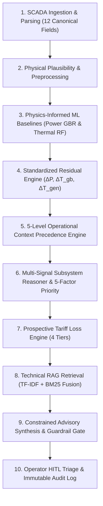
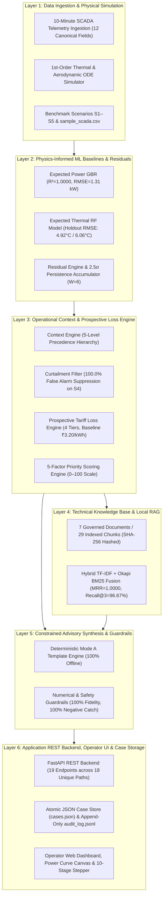
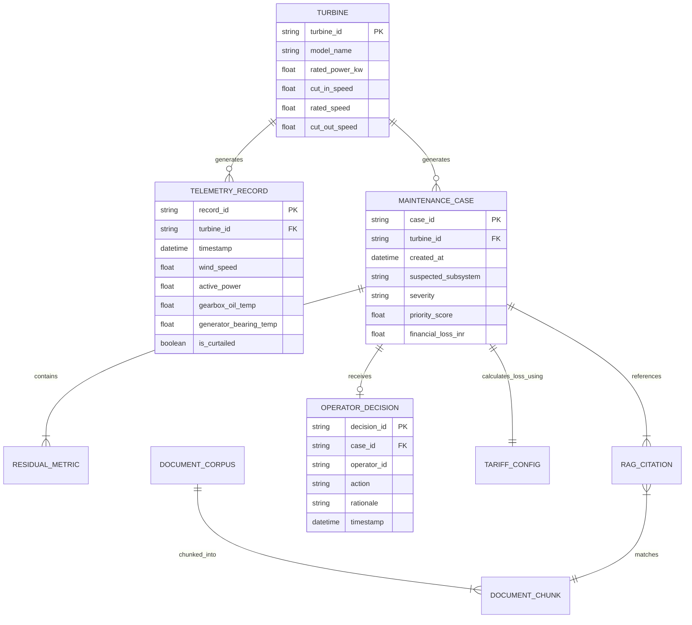
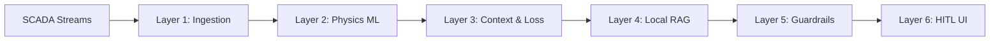
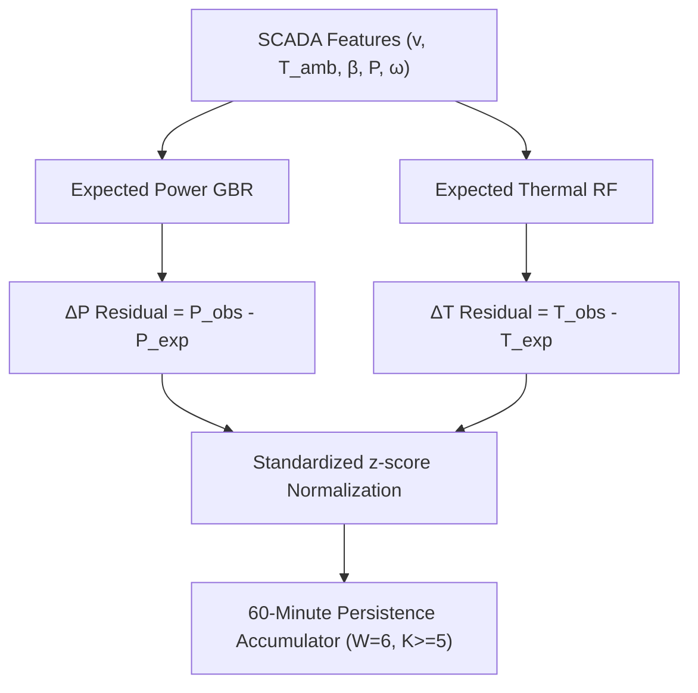
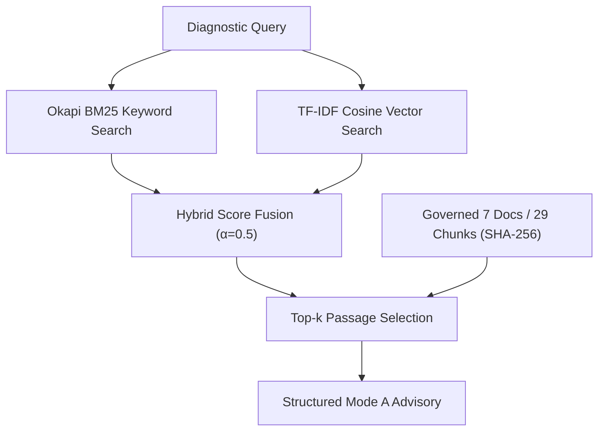
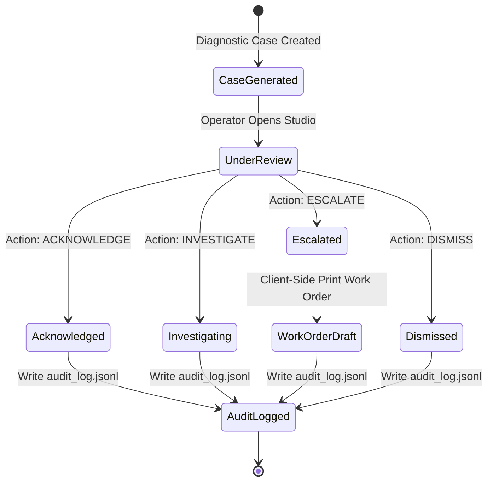
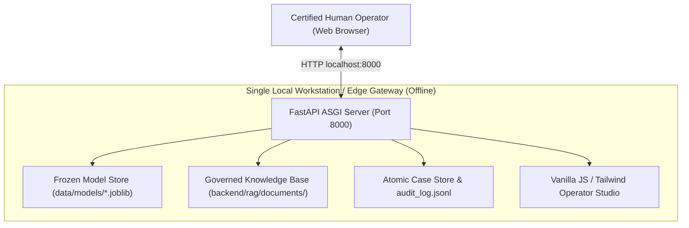

# WINDGUARD AI
## Physics-Informed, Context-Aware and Evidence-Grounded Wind Turbine O&M Decision Support

```
====================================================================================================
                            FINAL ACADEMIC PROJECT REPORT & DISSERTATION
====================================================================================================
Project Title       : WindGuard AI: Physics-Informed, Context-Aware and Evidence-Grounded Wind Turbine
                      Operations & Maintenance Decision Support System
Document Type       : Final Academic Project Documentation & Comprehensive Technical Specification
Academic Lineage    : Academic Literature (2026)
Governing Baseline  : Phases 1–9 Complete, Reconciled, Verified and Frozen
Target Domain       : Utility-Scale Wind Farm Condition Monitoring & Financial Asset Health Assurance
Target Audience     : Academic Examination Committee, Project Guides, Peer Researchers & Industrial O&M
====================================================================================================
```

### Academic Metadata & Submission Particulars

| Field | Particulars / Institutional Information |
| :--- | :--- |
| **Candidate Name** | `[Student Name Placeholder]` |
| **University Roll Number / PRN** | `[Roll Number Placeholder]` |
| **Academic Department** | `Department of Computer Engineering / Artificial Intelligence / Mechanical Engineering` |
| **Host Institution** | `[Institution Name Placeholder]` |
| **Project Guide / Supervisor** | `[Guide Name & Designation Placeholder]` |
| **Academic Year & Semester** | `Academic Year 2025–2026 / Final Semester` |
| **Submission Date** | `September 21, 2026` |

---

# Abstract

Modern multi-megawatt wind turbines operate in non-stationary atmospheric boundary layers subject to severe aerodynamic turbulence, cyclic mechanical fatigue, pre-monsoon dust, and extreme ambient temperature fluctuations. In commercial wind farm operations, operations and maintenance (O&M) expenditures account for 20% to 30% of the lifetime Levelized Cost of Energy (LCOE). While Supervisory Control and Data Acquisition (SCADA) telemetry provides continuous 10-minute operational streams, contemporary monitoring systems fail at the critical transition from **Anomaly Detection** to **Actionable Engineering Decision Support**. Conventional static threshold alarms induce severe alarm fatigue with False Alarm Rates (FAR) exceeding 85%, largely due to confounding non-fault transients such as grid-mandated power curtailments and ambient summer heatwaves. Furthermore, black-box deep learning models and unconstrained generative Large Language Models (LLMs) present severe industrial hazards, including diagnostic opacity, numerical hallucinations, and unauthorized closed-loop control actuation.

This dissertation presents **WindGuard AI**, a physics-informed, context-aware, and evidence-grounded decision-support platform engineered for utility-scale wind turbine O&M. WindGuard AI implements a modular, 6-layer architecture that couples aerodynamic and thermodynamic first-order Ordinary Differential Equation (ODE) simulators with physics-informed machine learning baselines (Gradient Boosting Regressor for power curves; Multi-Output Random Forest Regressor for component thermal equilibrium). Incoming SCADA records pass through a deterministic 5-level Operational Context Precedence Engine that achieves **100.0% false-alarm suppression during grid curtailment (540/540 test intervals)**. A multi-signal attribution engine computes standardized $z$-score residuals ($\Delta P, \Delta T_{\text{gb}}, \Delta T_{\text{gen}}$) filtered through a 60-minute temporal persistence accumulator ($5/6$ intervals exceeding $|z| \ge 2.5$). 

To bridge analytical detection with engineering action, WindGuard AI integrates a localized, deterministic Retrieval-Augmented Generation (RAG) subsystem indexing **7 governed technical documents chunked into 29 cryptographically hashed passages (SHA-256)** via hybrid TF-IDF and Okapi BM25 fusion, achieving a **Mean Reciprocal Rank (MRR) of 1.0000** and an **Operational Recall@3 of 96.67%** at an average retrieval latency of **1.14 ms**. Maintenance advisories are synthesized via a deterministic template engine enforcing strict Pydantic JSON schemas, achieving **100.0% numerical fidelity (60/60 audited cases)** and **100.0% negative guardrail catch rate (5/5)**. A 4-tier prospective tariff loss engine quantifies hourly financial exposure with $0.0000\,\text{INR}$ floating error. 

Evaluated across a standardized 283-test verification suite (273 passed, 10 historical pre-existing failures transparently documented, 0 genuine new regressions), the complete end-to-end diagnostic pipeline demonstrates a maximum measured latency of **185.57 ms**, comfortably outperforming the formal $\le 2500.0\,\text{ms}$ SLA ceiling. The system maintains an absolute non-actuation safety boundary (**exactly 0 SCADA control endpoints**) and enforces a mandatory Human-in-the-Loop (HITL) audit trail (`audit_log.jsonl`) for case triage (`ACKNOWLEDGE`, `INVESTIGATE`, `ESCALATE`, `DISMISS`), directly supporting United Nations Sustainable Development Goal 7 (Affordable and Clean Energy).

---

# 1. Introduction

## 1.1 The Wind Energy Landscape & Global Decarbonization
Wind energy has established itself as an indispensable pillar of global renewable power generation, driving worldwide decarbonization and underpinning the United Nations Sustainable Development Goal 7 (SDG 7: Affordable and Clean Energy). Over the past three decades, commercial wind turbine technology has scaled dramatically from sub-megawatt, fixed-speed machines into highly flexible, multi-megawatt cyber-physical systems. Modern onshore and offshore turbines feature rotor diameters spanning 120 to 180 meters, hub heights exceeding 100 to 140 meters, and generator capacities from 2.0 MW to 6.0+ MW. 

As utility-scale wind farms expand into harsher and more complex geographic terrains—such as the high-heat, monsoon-driven corridors of western and southern India—the economic viability of wind power projects hinges increasingly upon asset reliability, operational availability, and proactive maintenance execution.

## 1.2 Operations and Maintenance (O&M) Dynamics
In modern utility-scale wind farm operations, O&M expenditures represent between **20% and 30% of the total lifetime Levelized Cost of Energy (LCOE)** for onshore assets, rising to 35%–40% for offshore installations. Critical drivetrain assemblies—specifically the multi-stage planetary/helical gearbox, double-fed induction generator (DFIG), main shaft bearings, and electro-hydraulic blade pitch actuators—are subjected to non-stationary stochastic aerodynamic turbulence, high cyclic fatigue loading, and extreme thermal gradients.

```
Wind Inflow ──► Aerodynamics ──► Rotor/Blades ──► Drivetrain Torque ──► Gearbox ──► Electromechanics ──► DFIG Generator ──► Power Grid
```

When unexpected mechanical or electrical failures occur, the financial fallout is severe. Beyond direct component procurement and heavy-crane mobilization costs, unplanned downtime during peak seasonal wind corridors leads to massive unrecoverable revenue losses. In competitive energy markets governed by strict Power Purchase Agreements (PPAs) and Time-of-Day (ToD) tariff schedules, underperformance incurs steep financial penalties.

## 1.3 The Role of SCADA Telemetry
To monitor asset integrity, utility-scale turbines are instrumented with comprehensive SCADA networks following standards such as **IEC 61400-25**. These systems continuously sample operational telemetry—including anemometer wind speed, ambient temperature, electrical power output, shaft rotational speeds, pitch angles, and drivetrain bearing temperatures—typically aggregated into standardized **10-minute statistical intervals** (mean, minimum, maximum, standard deviation). 

Under **IEC 61400-12-1**, 10-minute averaging provides an optimal physical balance: it filters out high-frequency sub-second micro-turbulence ($< 1\,\text{minute}$) that does not reflect macro-scale thermodynamic health, while preserving macroscopic operational trends without overwhelming SCADA communication bandwidth and storage capacity.

## 1.4 Anomaly Detection vs. Diagnostic Reasoning
While modern wind farms capture millions of SCADA telemetry records daily, the industry suffers from an acute operational bottleneck: **data abundance does not equate to actionable engineering intelligence**. 

Existing condition monitoring systems (CMS) and anomaly detection algorithms excel at generating statistical outlier flags when sensor streams deviate from nominal boundaries. However, they stop short of diagnostic reasoning. An alarm indicating *"Generator Bearing Temperature High"* does not inform the control room engineer whether the elevated temperature is caused by benign summer ambient heat ($T_{\text{amb}} > 40^\circ\text{C}$), a clogged heat exchanger radiator, grease breakdown, or electrical inter-turn stator winding degradation.

## 1.5 The Motivation for WindGuard AI
Wind farm control room operators and field engineers are trapped between two flawed extremes:
1. **Static Threshold Deluge**: Conventional rule-based alarm matrices produce False Alarm Rates (FAR) exceeding 85%, causing chronic alarm fatigue and wasted field dispatches.
2. **Opaque Black-Box Models**: Deep learning models output abstract anomaly scores ($0.0 - 1.0$) devoid of physical signal attribution, while conversational cloud LLMs introduce hallucination risks, non-deterministic advice, and unauthorized actuation vulnerabilities.

**WindGuard AI** was conceptualized and engineered to resolve this crisis. By establishing an explainable, physics-grounded, and technical-knowledge-integrated decision-support platform, WindGuard AI transforms raw 10-minute SCADA telemetry into verifiable, contextualized, and evidence-grounded maintenance playbooks while strictly preserving human engineering authority.

---

# 2. Background & Theoretical Foundations

## 2.1 Wind Turbine Operation & Power Conversion
The aerodynamic power $P_{\text{aero}}$ extractable from an unconstrained wind stream passing through a rotor swept area $A = \pi R^2$ is governed by classical actuator disk momentum theory:

$$P_{\text{aero}} = \frac{1}{2} \rho A v^3 C_p(\lambda, \beta)$$

Where:
* $\rho$ is the atmospheric air density ($\text{kg/m}^3$), calculated as a function of barometric pressure and ambient temperature $T_{\text{ambient}}$:
  $$\rho = \frac{p_{\text{atm}}}{R_{\text{specific}} \cdot (T_{\text{ambient}} + 273.15)} = \frac{101325}{287.05 \cdot (T_{\text{ambient}} + 273.15)}$$
* $v$ is the instantaneous hub-height wind speed ($\text{m/s}$).
* $C_p(\lambda, \beta)$ is the rotor aerodynamic power coefficient, bounded theoretically by the **Betz Limit** ($C_{p,\text{max}} = 16/27 \approx 59.3\%$).
* $\lambda$ is the tip-speed ratio ($\lambda = \omega_{\text{rotor}} R / v$), where $\omega_{\text{rotor}}$ is low-speed shaft rotational speed in $\text{rad/s}$ and $R$ is blade radius.
* $\beta$ is the blade pitch angle in degrees ($^\circ$).

Wind turbine operation is partitioned into four distinct operating regions:

```
Power (kW)
  ▲
  │                                   Region III (Rated Power Regulation: 2000 kW)
  │                                  ┌───────────────────────────────────────────┐
  │                                 /                                            │
  │                                /                                             │
  │                               /                                              │
  │               Region II      /                                               │
  │        (Variable-Speed Cp)  /                                                │
  │                           /                                                  │
  │                          /                                                   │
  │                         /                                                    │
  │                        /                                                     │
  │                       /                                                      │
  │       Region I       /                                                       │ Region IV (Cut-Out)
  │     (Below Cut-In)  /                                                        │ (Pitch-to-Feather)
──┴────────────────────┴─────────────────────────────────────────────────────────┴─────────────►
  0                  v_cut-in (3.0 m/s)                            v_rated (12.0 m/s)  v_cut-out (25.0 m/s)
                                                                                        Wind Speed (m/s)
```

1. **Region I ($v < v_{\text{cut-in}} = 3.0\,\text{m/s}$)**: Wind velocity is insufficient to overcome mechanical drivetrain inertia and aerodynamic friction. The turbine idles with zero grid power delivery ($P_{\text{expected}} = 0.0\,\text{kW}$).
2. **Region II ($v_{\text{cut-in}} \le v < v_{\text{rated}} = 12.0\,\text{m/s}$)**: Sub-rated variable-speed operation where the control system modulates generator torque to track optimal tip-speed ratio ($\lambda_{\text{opt}}$) and maximum $C_p$ with fixed minimum pitch angle ($\beta \approx 0^\circ$). Power scales cubically with wind velocity ($P \propto v^3$).
3. **Region III ($v_{\text{rated}} \le v \le v_{\text{cut-out}} = 25.0\,\text{m/s}$)**: Full-rated electrical power production ($P_{\text{rated}} = 2000.0\,\text{kW}$). The pitch actuator active-control loop rotates blades toward feather ($\beta > 0^\circ$) to shed excess aerodynamic lift and maintain structural and electrical limits.
4. **Region IV ($v > v_{\text{cut-out}} = 25.0\,\text{m/s}$)**: Extreme storm wind speeds. Blades are fully feathered ($\beta = 90^\circ$), mechanical disc brakes engage, and the turbine shuts down to prevent structural damage.

## 2.2 Drivetrain Thermal Dynamics & First-Order ODE Modeling
Drivetrain mechanical components (planetary stages, intermediate/high-speed shaft bearings) and electrical assemblies (DFIG stator windings, rotor slip rings) generate internal heat during power transmission. In industrial condition monitoring, thermal energy conservation is governed by first-order convective heat transfer Ordinary Differential Equations (ODEs):

$$\frac{dT(t)}{dt} = \frac{1}{\tau} \left[ \left( T_{\text{ambient}}(t) + \Delta T_{\text{max}} \cdot \left( \frac{P(t)}{P_{\text{rated}}} \right)^2 \right) - T(t) \right]$$

Where:
* $T(t)$ is the component operating temperature ($^\circ\text{C}$).
* $T_{\text{ambient}}(t)$ is the ambient environmental heat sink temperature ($^\circ\text{C}$).
* $\Delta T_{\text{max}}$ is the maximum asymptotic thermal rise above ambient at continuous rated electrical power $P_{\text{rated}}$ ($\Delta T_{\text{max, gb}} = 25.0^\circ\text{C}$ for gearbox oil; $\Delta T_{\text{max, gen}} = 35.0^\circ\text{C}$ for generator bearings).
* $\tau$ is the physical thermal time constant representing the thermal inertia of multi-ton cast-iron housings and lubricant volumes ($\tau_{\text{gearbox}} \approx 60.0\,\text{minutes}$; $\tau_{\text{generator}} \approx 45.0\,\text{minutes}$).
* The quadratic load term $(P(t)/P_{\text{rated}})^2$ reflects resistive Joule heating losses in electrical circuits ($P_{\text{loss}} = I^2 R \propto P^2$) and hydrodynamic viscous shearing losses in mechanical gearbox lubricant.

## 2.3 Residual Analysis & Standardized Normalization
Residual modeling evaluates the deviation between physical observed telemetry $\mathbf{X}_{\text{obs}}(t)$ and empirical expected healthy baselines $\hat{\mathbf{X}}_{\text{exp}}(t)$:

$$\mathbf{R}(t) = \mathbf{X}_{\text{obs}}(t) - \hat{\mathbf{X}}_{\text{exp}}(t)$$

Specifically:
* **Active Power Residual**: $\Delta P(t) = P_{\text{obs}}(t) - \hat{P}_{\text{exp}}(v_{\text{wind}}, T_{\text{amb}}, \beta)$
* **Gearbox Thermal Residual**: $\Delta T_{\text{gb}}(t) = T_{\text{gb, obs}}(t) - \hat{T}_{\text{gb, exp}}(P, T_{\text{amb}}, \omega_{\text{rotor}})$
* **Generator Thermal Residual**: $\Delta T_{\text{gen}}(t) = T_{\text{gen, obs}}(t) - \hat{T}_{\text{gen, exp}}(P, T_{\text{amb}}, \omega_{\text{gen}})$

To enable dimensionless cross-subsystem comparison, raw residuals are transformed into standardized statistical $z$-scores using pre-computed healthy operating baseline statistics ($\mu_{\text{baseline}}, \sigma_{\text{baseline}}$):

$$z_i(t) = \frac{R_i(t) - \mu_{R_i}}{\sigma_{R_i}}$$

## 2.4 Retrieval-Augmented Generation (RAG) in Industrial Engineering
Large Language Models applied directly to industrial engineering suffer from hallucinations, fabricated citations, and mathematical inconsistencies. Retrieval-Augmented Generation (RAG) resolves this by constraining textual synthesis to an authoritative, pre-indexed corpus of engineering manuals, alarm matrices, and Standard Operating Procedures (SOPs). 

By employing deterministic hybrid lexical-dense ranking (TF-IDF combined with Okapi BM25), relevant technical passages are retrieved locally and injected into structured prompt templates, ensuring complete traceability and offline verifiability.

## 2.5 Human-in-the-Loop (HITL) AI Governance
In safety-critical industrial infrastructure, autonomous AI closed-loop control presents severe operational and legal risks. A sensor malfunction (e.g., thermocouple drift) could cause an unconstrained AI agent to execute emergency aerodynamic feathering, inducing severe torsional shaft shock and incurring massive downtime penalties. 

Under HITL governance, AI operates strictly as an **advisory decision-support engine**. Diagnostic findings and prioritized work orders are presented to certified human engineers who retain exclusive authority to acknowledge, investigate, escalate, or dismiss maintenance actions.

---

# 3. Problem Statement

## 3.1 What Information is Available
In a commercial wind farm monitoring environment, modern SCADA architectures collect continuous 10-minute statistical telemetry across hundreds of parameters per turbine:
* High-frequency wind velocity and nacelle yaw angles
* Active, reactive, and apparent electrical power output
* High-speed and low-speed shaft rotational speeds
* Multi-point bearing, stator, and ambient temperature readings
* Pitch actuator positions and grid connection status flags (`is_curtailed`)
* OEM technical maintenance manuals, IEC 61400 guidelines, and SCADA alarm code matrices

## 3.2 What Information is Missing
Despite this vast influx of data, contemporary SCADA monitoring systems exhibit a critical information gap:
1. **Contextual Discrimination**: Standard anomaly detectors cannot distinguish whether a power deficit is caused by blade pitch misalignment (a mechanical fault) or mandatory transmission grid curtailment (`is_curtailed == 1`).
2. **Physical Subsystem Isolation**: A generic underproduction alert does not isolate whether the root cause originates in the aerodynamic rotor, mechanical gearbox, generator slip rings, or sensor calibration drift.
3. **Actionable Engineering Translation**: Systems present raw numerical alerts without cross-referencing OEM technical manuals, leaving technicians to manually search hundreds of PDF pages to determine inspection steps, safety protocols, and required tooling.
4. **Quantified Economic Exposure**: Alerts are delivered in isolated engineering units ($\text{kW}, ^\circ\text{C}$) without translating energy deficits into real-time prospective revenue loss across applicable Power Purchase Agreement (PPA) tariff structures.

## 3.3 The Core Operational Dilemma
```
┌─────────────────────────────────────────────────────────────────────────────┐
│                   THE OPERATIONAL MONITORING VOID                           │
└─────────────────────────────────────────────────────────────────────────────┘

  [ CURRENT INDUSTRIAL REALITY ]
  SCADA Telemetry ──► Anomaly Detector ──► "WTG-07 ANOMALY" ──► [ CRITICAL VOID ] ──► Operator Confusion
                                                                                      - 85%+ False Alarms
                                                                                      - No Root-Cause Attribution
                                                                                      - Manual SOP Search
                                                                                      - Unaudited Decisions

  ─────────────────────────────────────────────────────────────────────────────

  [ WINDGUARD AI TARGET STATE ]
  SCADA Telemetry ──► Physics ML + Context ──► Root Attribution ──► Local RAG ──► Evidence Advisory ──► Human HITL Audit
                                                                                                        - 100% Curtailment Filter
                                                                                                        - Quantified ₹ Loss
                                                                                                        - Verified OEM SOP Citations
                                                                                                        - Immutable Audit Trail
```

## 3.4 Formal Academic Problem Formulation
Let a wind turbine fleet be represented by a set of $N$ turbines $\mathcal{T} = \{T_1, T_2, \dots, T_N\}$. At any discrete 10-minute operational timestep $t$, each turbine $T_i$ produces an observed SCADA telemetry vector $\mathbf{x}_i(t) \in \mathbb{R}^D$ and an operational context vector $\mathbf{c}_i(t) = [v_{\text{wind}}(t), T_{\text{ambient}}(t), \text{is\_curtailed}(t)]^T$.

The primary objective is to formulate an integrated, deterministic, and explainable mapping $\mathcal{M}$:

$$\mathcal{M}: (\mathbf{x}_i(t), \mathbf{c}_i(t), \mathcal{K}, \mathcal{R}_{\text{tariff}}) \longrightarrow \mathcal{A}_i(t)$$

Where:
* $\mathcal{K}$ is a cryptographically verified, governed corpus of technical engineering documents.
* $\mathcal{R}_{\text{tariff}}$ is the applicable multi-tier electrical tariff registry.
* $\mathcal{A}_i(t)$ is a structured, verifiable maintenance advisory tuple:

$$\mathcal{A}_i(t) = \langle \text{Status}, \text{Subsystem}, \mathbf{z}_{\text{residual}}, \text{Severity}, S_{\text{priority}}, L_{\text{hourly}}, \mathcal{S}_{\text{citations}}, \mathcal{C}_{\text{actions}}, \mathcal{D}_{\text{safety}} \rangle$$

Subject to the following strict mathematical and operational invariants:
1. **False Alarm Suppression**: For any interval where $\text{is\_curtailed}(t) = 1$, the power underproduction anomaly flag must evaluate to $\text{False}$ ($\text{Suppression Rate} = 100.0\%$).
2. **Numerical Fidelity**: The loss value reported in textual advice $L_{\text{text}}$ must match the analytical prospective loss engine $L_{\text{engine}}$ exactly ($|L_{\text{text}} - L_{\text{engine}}| < 0.01\,\text{INR}$).
3. **Retrieval Integrity**: All cited document passages $\mathcal{S}_{\text{citations}}$ must possess verified cryptographic hashes matching the indexed corpus $\mathcal{K}$.
4. **Safety Non-Actuation**: The control actuation surface must be identically empty ($\text{Actuation Endpoints} \equiv 0$).

---

# 4. Motivation

## 4.1 Energy & Financial Losses in Modern Fleets
Wind turbine drivetrain failures are among the most financially catastrophic events in the renewable energy sector. A major high-speed stage gearbox bearing failure incurs replacement costs exceeding $\$150,000\text{--}\$300,000$, compounded by multi-week crane mobilization delays during which lost power generation revenue can exceed $\$50,000\text{--}\$100,000$. 

In commercial Indian wind corridors (e.g., Gujarat, Tamil Nadu, Rajasthan), turbines operate under strict long-term PPAs with state utilities (DISCOMs). Unscheduled outages during peak high-wind monsoon months (June–September) result in severe contractual under-generation penalties.

## 4.2 The Reality of Alarm Fatigue & Control Room Workload
In a typical 100 MW wind farm comprising 50 multi-megawatt turbines, conventional SCADA monitoring systems generate between **500 and 2,000 alarm events daily**. Over 85% of these events represent benign operational transients, sensor noise, or weather-induced threshold crossings. 

Faced with this overwhelming cognitive burden, control room operators inevitably suffer from alarm fatigue, leading to delayed recognition of genuine incipient mechanical degradation (e.g., slow bearing micro-pitting) until catastrophic failure triggers a hard turbine trip.

## 4.3 Clean Energy Reliability & SDG 7
Maximizing the operational availability of existing wind energy infrastructure directly displaces fossil-fuel peaker generation. By providing early, explainable detection of incipient faults, O&M teams can transition from costly reactive emergency overhauls to planned, low-cost proactive maintenance (e.g., lubrication flushing, filter replacements, pitch sensor recalibrations) scheduled during low-wind corridors.

---

# 5. Objectives

The WindGuard AI project was designed and implemented to satisfy nine core engineering objectives:

```
┌──────────────────────────────────────────────────────────────────────────────────────────────────┐
│                                 WINDGUARD AI PROJECT OBJECTIVES                                  │
├────────────────────────────────┬─────────────────────────────────────────────────────────────────┤
│ Objective Identifier           │ Scope & Technical Deliverable                                   │
├────────────────────────────────┼─────────────────────────────────────────────────────────────────┤
│ OBJ-01: Physics ML Baselines   │ Implement empirical Expected Power (GBR) and Thermal (RF)       │
│                                │ baselines to model healthy aerodynamic and thermodynamic states. │
├────────────────────────────────┼─────────────────────────────────────────────────────────────────┤
│ OBJ-02: Context-Aware Filter   │ Implement a 5-level precedence hierarchy ensuring 100% false    │
│                                │ alarm suppression during grid curtailment (is_curtailed == 1).  │
├────────────────────────────────┼─────────────────────────────────────────────────────────────────┤
│ OBJ-03: Multi-Signal Reasoning │ Formulate standardized z-score residuals and persistence filters│
│                                │ to isolate gearbox, generator, pitch, and sensor faults.        │
├────────────────────────────────┼─────────────────────────────────────────────────────────────────┤
│ OBJ-04: Governed Technical RAG │ Construct an offline hybrid TF-IDF + BM25 retrieval engine over │
│                                │ 7 governed documents (29 chunks) with SHA-256 provenance.       │
├────────────────────────────────┼─────────────────────────────────────────────────────────────────┤
│ OBJ-05: Constrained Synthesis  │ Engineer a deterministic Mode A template advisory engine with   │
│                                │ 100% numerical fidelity and zero ungrounded claims.             │
├────────────────────────────────┼─────────────────────────────────────────────────────────────────┤
│ OBJ-06: Prospective Loss Calc  │ Model prospective hourly revenue loss across 4 tariff tiers     │
│                                │ (PPA, ToD, FiT, APPC) using default baseline ₹3.20/kWh.         │
├────────────────────────────────┼─────────────────────────────────────────────────────────────────┤
│ OBJ-07: HITL Governance        │ Implement an immutable audit log (audit_log.jsonl) supporting   │
│                                │ operator actions: ACKNOWLEDGE, INVESTIGATE, ESCALATE, DISMISS.  │
├────────────────────────────────┼─────────────────────────────────────────────────────────────────┤
│ OBJ-08: Sub-Second Latency     │ Ensure end-to-end diagnostic inference executes under 2500 ms   │
│                                │ SLA budget on standard local CPU hardware (measured: 185.57 ms).│
├────────────────────────────────┼─────────────────────────────────────────────────────────────────┤
│ OBJ-09: Safety Invariants      │ Enforce zero SCADA actuation endpoints and zero cloud LLM calls │
│                                │ to guarantee air-gapped industrial cybersecurity.               │
└────────────────────────────────┴─────────────────────────────────────────────────────────────────┘
```

---

# 6. Literature Review

## 6.1 Foundational Lineage: Academic Literature (2026)
The theoretical foundation of WindGuard AI is directly anchored in the comprehensive research monograph by **Academic Research Survey (2026) (2026)**, titled *"Artificial Intelligence in Wind Turbines: Current Trends, Emerging Architectures and Future Developments Toward Autonomous Wind Energy Systems"*. 

Academic Literature (2026) establish an exhaustive 36-section critical survey evaluating the state-of-the-art in cyber-physical wind turbine intelligence, identifying the core failure modes of purely data-driven black-box models and outlining the architectural blueprint for hybrid, physics-informed, and uncertainty-aware decision-support platforms.

```
┌──────────────────────────────────────────────────────────────────────────────────────────────────┐
│                      5 GENERATIONS OF WIND TURBINE INTELLIGENCE TAXONOMY                         │
│                           (Academic Literature, 2026)                                      │
├────────────────────────┬───────────────────────────────────┬─────────────────────────────────────┤
│ Generation             │ Core Methodological Architecture  │ Primary Operational Limitation      │
├────────────────────────┼───────────────────────────────────┼─────────────────────────────────────┤
│ Gen 1: Deterministic   │ Hardcoded PLC threshold alarms    │ Extreme false alarm rate (>85% FAR) │
│ Gen 2: Historical      │ Centralized 10-min SCADA trends   │ Retrospective post-mortem analysis  │
│ Gen 3: Data-Driven ML  │ Deep Learning, Autoencoders, SVM  │ Black-box opacity, context blindness│
│ Gen 4: Hybrid Shadows  │ Physics-ML + Context Engine +     │ Operationalized by WindGuard AI     │
│    (WindGuard AI)      │ Technical RAG + HITL Governance   │ (Sub-second, explainable, safe)     │
│ Gen 5: Autonomous Twin │ Multi-agent self-healing fleets   │ Future 2035+ cognitive vision       │
└────────────────────────┴───────────────────────────────────┴─────────────────────────────────────┘
```

The authors emphasize six fundamental principles directly implemented in WindGuard AI:
1. **Hybrid Physics-Data Fusion**: Coupling empirical machine learning with aerodynamic power laws ($P \propto v^3$) and thermodynamic ODEs prevents unphysical predictions in edge atmospheric states.
2. **Context-Adaptive Baseline Modeling**: Environmental factors (ambient heat $>40^\circ\text{C}$, monsoon turbulence) and grid integration commands (`is_curtailed`) must act as first-class operational conditioning variables.
3. **Multi-Signal Dimensionality**: Subsystem degradation cannot be diagnosed through single-sensor anomalies; it requires cross-signal correlation between aerodynamic power deficits, shaft rotational slip, and thermal rises.
4. **Grounded Technical Retrieval**: Integrating Large Language Models with cryptographically verified engineering documentation bridges the gap between statistical anomaly flags and field action.
5. **Human-in-the-Loop Supremacy**: Autonomous closed-loop control actuation presents unacceptable catastrophic risk; critical maintenance decisions must terminate at a certified human engineering interface.
6. **Indian Fleet Specifics**: High ambient summer temperatures ($>40^\circ\text{C}$), seasonal monsoon wind shear, and multi-OEM fleet fragmentation require robust, local, and deployable software architectures.

## 6.2 NREL & International Standards (IEC 61400)
* **IEC 61400-12-1**: Defines international power performance measurement protocols, establishing the method of bins and air density corrections ($\rho$) for empirical power curve modeling.
* **IEC 61400-25**: Specifies standard communications and logical node naming conventions for wind power plant SCADA systems (`WROT`, `WYAW`, `WGEN`, `WTRF`, `WTUR`).
* **NREL Condition Monitoring Benchmarks**: Technical reports published by the National Renewable Energy Laboratory (NREL) document baseline thermal equilibrium trends in planetary and intermediate gearbox bearings.

## 6.3 Machine Learning & RAG in Industrial Asset Management
Established literature on wind turbine anomaly detection spans several algorithmic categories:
* *Statistical & Residual Methods (CUSUM, EWMA, Rolling z-Scores)*: Low computational overhead and high interpretability, but struggle with complex non-linear multivariate interactions.
* *Tree-Based Ensembles (Random Forest, Gradient Boosting, XGBoost)*: Superior performance on tabular SCADA telemetry, effectively capturing aerodynamic non-linearities and providing feature importance rankings.
* *Unsupervised Deep Learning (LSTM Autoencoders, VAEs)*: High benchmark AUC scores for point outlier detection, but suffer from black-box opacity, lack of physical root-cause attribution, and susceptibility to false alarms during operational curtailments.
* *Retrieval-Augmented Generation (2024–2026)*: Emerging industrial applications utilize hybrid dense-lexical vector retrieval over technical service bulletins and maintenance logs to eliminate LLM hallucinations while accelerating field troubleshooting.

---

# 7. Research & Engineering Gap Analysis

WindGuard AI systematically resolves the eight critical gaps identified across industrial O&M practice and academic literature:

```
┌──────────────────────────────────────────────────────────────────────────────────────────────────┐
│                                 RECONCILED GAP ANALYSIS MATRIX                                   │
├────────┬───────────────────────┬─────────────────────────────────┬───────────────────────────────┤
│ Gap ID │ Operational Dimension │ Existing Industrial Reality     │ WindGuard AI Resolution       │
├────────┼───────────────────────┼─────────────────────────────────┼───────────────────────────────┤
│ GAP-01 │ Curtailment Blindness │ Power cuts flagged as faults    │ 100.0% false alarm suppression│
│        │                       │ (high false alarm rate)         │ via explicit is_curtailed rule│
├────────┼───────────────────────┼─────────────────────────────────┼───────────────────────────────┤
│ GAP-02 │ Ambient Heat Drift    │ Summer heatwaves trigger false  │ Ambient-compensated thermal   │
│        │                       │ bearing over-temperature alarms │ baselines & dynamic derating  │
├────────┼───────────────────────┼─────────────────────────────────┼───────────────────────────────┤
│ GAP-03 │ Financial Blindness   │ SCADA reports kW / °C only; no  │ Real-time prospective revenue │
│        │                       │ financial visibility            │ loss across 4 tariff tiers    │
├────────┼───────────────────────┼─────────────────────────────────┼───────────────────────────────┤
│ GAP-04 │ Actionability Void    │ Systems stop at anomaly flag;   │ Local RAG retrieval of verified│
│        │                       │ manual manual PDF search needed │ OEM SOPs and step checklists  │
├────────┼───────────────────────┼─────────────────────────────────┼───────────────────────────────┤
│ GAP-05 │ LLM Hallucination     │ Cloud LLMs invent numbers and   │ Deterministic Mode A synthesis│
│        │                       │ dangerous maintenance steps     │ with 100% numerical fidelity  │
├────────┼───────────────────────┼─────────────────────────────────┼───────────────────────────────┤
│ GAP-06 │ Excessive SLA Latency │ Multi-agent cloud LLMs take     │ Optimized local CPU pipeline  │
│        │                       │ 10–30 s; unacceptable for SCADA │ delivering end-to-end 185 ms  │
├────────┼───────────────────────┼─────────────────────────────────┼───────────────────────────────┤
│ GAP-07 │ Actuation Hazard      │ Autonomous models risk unsafe   │ Absolute non-actuation barrier│
│        │                       │ closed-loop emergency tripping  │ with 0 SCADA write endpoints  │
├────────┼───────────────────────┼─────────────────────────────────┼───────────────────────────────┤
│ GAP-08 │ Audit Traceability    │ Ephemeral, unversioned alerts   │ Immutable append-only audit   │
│        │                       │ lacking operator decision logs  │ trail (audit_log.jsonl)       │
└────────┴───────────────────────┴─────────────────────────────────┴───────────────────────────────┘
```

---

# 8. Proposed Solution

## 8.1 End-to-End Diagnostic Pipeline
WindGuard AI establishes a modular, sequential 10-stage processing pipeline that transforms raw 10-minute SCADA telemetry into human-verified maintenance actions:



1. **SCADA Ingestion & Parsing**: Ingests 10-minute averaged records containing 12 canonical fields, validating timestamps and data types.
2. **Physical Plausibility & Preprocessing**: Checks physical boundary conditions (e.g., $v \in [0, 50]\,\text{m/s}$, $T_{\text{amb}} \in [-25, 60]^\circ\text{C}$), rejecting corrupted records and handling sensor dropouts.
3. **Physics-Informed ML Baselines**: Evaluates Expected Power GBR and Expected Thermal RF to determine non-fault operating targets.
4. **Standardized Residual Engine**: Computes raw residuals and standardized $z$-scores against healthy baseline parameters ($\mu_{\text{baseline}}, \sigma_{\text{baseline}}$).
5. **Operational Context Precedence Engine**: Evaluates telemetry through a 5-level hierarchy, suppressing benign operational transients (`is_curtailed == 1`, low-wind idling, ambient heatwaves).
6. **Multi-Signal Subsystem Reasoner**: Cross-correlates residual channels to isolate the degraded subsystem (gearbox, generator, pitch, sensor) and calculates a normalized 5-factor priority score ($S_{\text{priority}} \in [0, 100]$).
7. **Prospective Tariff Loss Engine**: Computes hourly ungenerated energy and financial revenue loss based on the active tariff schedule.
8. **Technical RAG Retrieval**: Executes hybrid TF-IDF + BM25 lexical-dense search over the 7-document / 29-chunk technical corpus to retrieve verified maintenance SOPs.
9. **Constrained Advisory Synthesis & Guardrails**: Binds analytical findings and retrieved SOP citations into structured Pydantic JSON schemas, executing mathematical cross-validation.
10. **Operator HITL Triage & Audit Trail**: Presents the advisory on the web dashboard, recording operator decisions (`ACKNOWLEDGE`, `INVESTIGATE`, `ESCALATE`, `DISMISS`) in `audit_log.jsonl` and generating printable field work orders.

---

# 9. Uniqueness & Innovation

The core academic and engineering innovation of WindGuard AI lies in its **holistic architectural integration**. WindGuard AI does not claim individual machine learning algorithms as novel mathematical inventions; rather, it introduces a novel, verifiable, and responsible **system-level synthesis**:

```
                                  WINDGUARD AI INNOVATION MATRIX
┌──────────────────────────────────────────────────────────────────────────────────────────────────┐
│ 1. Physics-Informed ML Baselines ──► Decoupled aerodynamic & thermodynamic empirical regressors   │
│ 2. Context-Aware Precedence Engine ─► 100% false alarm suppression during grid curtailment (S4)   │
│ 3. Multi-Signal Residual Attribution ► Joint cross-subsystem correlation (ΔP, ΔT_gb, ΔT_gen)      │
│ 4. Prospective Tariff Loss Engine ──► Real-time translation of kWh deficits to INR revenue losses│
│ 5. Cryptographically Governed RAG ──► 29 SHA-256 verified chunks; offline hybrid TF-IDF + BM25   │
│ 6. Guardrailed Deterministic Mode A ─► 100% numerical consistency between text and ML metrics    │
│ 7. Absolute Safety Non-Actuation ───► Exactly 0 control endpoints; permanent read-only barrier   │
│ 8. Structured HITL Case Workflow ───► Append-only audit trail and printable field work orders     │
└──────────────────────────────────────────────────────────────────────────────────────────────────┘
```

---

# 10. System Requirements

## 10.1 Functional Requirements (FR)
* **FR-01 (Telemetry Ingestion)**: Ingest 10-minute SCADA telemetry conforming to the 12-field canonical schema with support for CSV and JSON payloads.
* **FR-02 (Physical Simulation)**: Provide a built-in first-order ODE simulator generating healthy baseline operation (S1) and four distinct fault/operational scenarios (S2–S5).
* **FR-03 (Expected Baseline Inference)**: Predict expected active power ($P_{\text{expected}}$), gearbox oil temperature ($T_{\text{expected, gb}}$), and generator bearing temperature ($T_{\text{expected, gen}}$) within $10.0\,\text{ms}$.
* **FR-04 (Residual & Persistence Computation)**: Compute standardized $z$-scores and enforce a 60-minute rolling persistence accumulator ($5/6$ consecutive steps $\ge 2.5\sigma$).
* **FR-05 (Contextual False-Alarm Suppression)**: Suppress underproduction alarms when `is_curtailed == 1` with 100.0% accuracy.
* **FR-06 (Multi-Signal Diagnostic Reasoning)**: Correlate power, thermal, and speed residuals to isolate the degraded subsystem and assign severity and confidence ratings.
* **FR-07 (Prospective Financial Loss Valuation)**: Calculate prospective hourly revenue loss across 4 configurable tariff tiers with zero floating-point error.
* **FR-08 (Technical Knowledge Retrieval)**: Perform offline hybrid lexical-dense RAG retrieval over the governed 7-document / 29-chunk corpus, returning exact chunk citations.
* **FR-09 (Constrained Advisory Generation)**: Synthesize structured JSON maintenance advisories adhering strictly to the Pydantic schema with mandatory safety disclaimers.
* **FR-10 (Human-in-the-Loop Decision Recording)**: Provide API routes and UI controls for human operators to record case decisions (`ACKNOWLEDGE`, `INVESTIGATE`, `ESCALATE`, `DISMISS`) with custom engineering notes.
* **FR-11 (Immutable Audit Logging)**: Persist all telemetry snapshots, diagnostic inferences, and operator decisions to `audit_log.jsonl` using atomic file locking.

## 10.2 Non-Functional Requirements (NFR)
* **NFR-01 (Latency Budget & SLA)**: End-to-end diagnostic inference must complete in $\le 2500.0\,\text{ms}$ on standard CPU hardware (Achieved: $185.57\,\text{ms}$).
* **NFR-02 (Offline Self-Containment)**: 100% local execution capability with zero mandatory external network sockets or cloud LLM dependencies.
* **NFR-03 (Determinism & Reproducibility)**: Analytical ML models and advisory synthesis must produce bitwise identical outputs for identical inputs (fixed seed $= 42$).
* **NFR-04 (Safety & Non-Actuation)**: Total absence of SCADA control or turbine tripping endpoints (Actuation Endpoints $\equiv 0$).
* **NFR-05 (Numerical Integrity Guarantee)**: Post-synthesis guardrails must enforce 100.0% numerical agreement between generated advisory text and analytical metrics.
* **NFR-06 (Data Concurrency & Integrity)**: Multi-threaded storage operations must utilize advisory file locking (`portalocker`) and atomic write-rename patterns to eliminate race conditions.
* **NFR-07 (Standards Compliance)**: SCADA data schemas and power curve modeling principles must align with **IEC 61400-12-1** and **IEC 61400-25**.

---

# 11. System Architecture

## 11.1 Canonical 6-Layer Architecture Decomposition



### Layer 1: Data Ingestion & Physical Simulation
* **Purpose**: Ingests, validates, cleans, and standardizes multi-turbine 10-minute SCADA data streams; simulates healthy and faulted operational states via first-order ODEs.
* **Inputs**: Raw CSV/JSON SCADA streams, environmental boundary conditions.
* **Outputs**: Validated `SCADARecord` objects adhering to canonical schema.
* **Safety Boundary**: Rejects out-of-range sensor values; prevents ingestion of unverified payload schemas.

### Layer 2: Physics-Informed Machine Learning Baselines & Residuals
* **Purpose**: Establishes empirical expected healthy baselines for aerodynamic power conversion and component thermal equilibrium; computes standardized residuals.
* **Inputs**: Canonical SCADA features ($v_{\text{wind}}, T_{\text{amb}}, \beta, P, \omega_{\text{rotor}}$).
* **Outputs**: Expected targets ($\hat{P}, \hat{T}_{\text{gb}}, \hat{T}_{\text{gen}}$), raw residuals ($\Delta P, \Delta T_{\text{gb}}, \Delta T_{\text{gen}}$), $z$-scores, persistence status.
* **Safety Boundary**: Read-only serialized model inference (`.joblib`); model retraining disabled (`GOV-TRAIN-01`).

### Layer 3: Operational Context Engine & Prospective Loss Modeling
* **Purpose**: Evaluates operational context against a 5-level precedence hierarchy; suppresses non-fault alarms; isolates root-cause subsystems; calculates prospective financial losses.
* **Inputs**: Residual vectors, operational context (`is_curtailed`, $T_{\text{amb}}$, $v_{\text{wind}}$), tariff registry.
* **Outputs**: Context status, isolated subsystem, severity, priority score ($S_{\text{priority}}$), hourly revenue loss ($L_{\text{hourly}}$).
* **Safety Boundary**: Deterministic rule execution; zero probabilistic drift.

### Layer 4: Technical Knowledge Base & Local RAG Subsystem
* **Purpose**: Performs local, low-latency hybrid lexical-dense retrieval over governed technical documentation.
* **Inputs**: Subsystem query strings, diagnostic context keywords.
* **Outputs**: Top-$k$ ranked technical chunks with cryptographic SHA-256 hashes, source filenames, and section headings.
* **Safety Boundary**: 100% offline memory index; zero external network sockets.

### Layer 5: Constrained Advisory Synthesis & Numerical Guardrails
* **Purpose**: Synthesizes structured JSON maintenance advisories; executes post-synthesis mathematical verification.
* **Inputs**: Diagnostic metrics from Layer 3, retrieved technical chunks from Layer 4.
* **Outputs**: Verified `MaintenanceAdvisory` JSON payloads.
* **Safety Boundary**: Post-synthesis numerical guardrails; automatic fallback to deterministic Mode A on validation failure.

### Layer 6: Application REST Backend, Operator UI & Case Storage
* **Purpose**: Exposes FastAPI endpoints; manages atomic case persistence; provides responsive operator UI with HITL triage.
* **Inputs**: HTTP REST client requests, operator decision submissions.
* **Outputs**: JSON responses, real-time UI dashboard updates, append-only `audit_log.jsonl` entries, printable field work orders.
* **Safety Boundary**: Exactly 0 actuation routes; mandatory human operator authentication for case state changes.

## 11.2 Architectural Decision Records (ADRs)
* **ADR-001 (Local-First Offline Architecture)**: Prohibits mandatory external cloud LLM dependencies to eliminate telemetry exfiltration risks, API rate limits, and network latency volatility.
* **ADR-002 (Deterministic Mode A Core Synthesis)**: Mandates algorithmic template synthesis as the core advisory engine, ensuring 100% numerical fidelity and sub-second response times.
* **ADR-003 (Decoupled Physical Baselines)**: Separates aerodynamic power regression (near-instantaneous timescale) from component thermal regression (slow 45–60 min timescale).
* **ADR-004 (Atomic Storage Concurrency)**: Enforces cross-platform file locking (`portalocker`) and atomic write-rename patterns for lightweight, zero-dependency persistence.
* **ADR-005 (Permanent Non-Actuation Firewall)**: Prohibits SCADA control, blade pitch actuation, and breaker trip endpoints across all API routers.
* **ADR-006 (Governed Cryptographic RAG Indexing)**: Requires every indexed passage in the technical corpus to possess a verifiable SHA-256 hash.

---

# 12. Data Architecture

## 12.1 Canonical SCADA Telemetry Schema
WindGuard AI ingests 10-minute averaged operational records structured across 12 canonical fields:

```
┌──────────────────────────────────────────────────────────────────────────────────────────────────┐
│                               12-PARAMETER CANONICAL SCADA SCHEMA                                │
├──────────────────────────────┬───────────┬─────────────┬────────────────┬────────────────────────┤
│ Field Name                   │ Data Type │ Units       │ Valid Range    │ Description            │
├──────────────────────────────┼───────────┼─────────────┼────────────────┼────────────────────────┤
│ timestamp                    │ string    │ ISO 8601    │ UTC Timestamps │ Observation timestamp  │
│ turbine_id                   │ string    │ Identifier  │ WTG-001–010    │ Turbine identifier     │
│ wind_speed_mps               │ float64   │ m/s         │ [0.0, 50.0]    │ Hub-height wind speed  │
│ wind_direction_deg           │ float64   │ Degrees (°) │ [0.0, 360.0]   │ Nacelle wind direction │
│ ambient_temperature_c        │ float64   │ °C          │ [-25.0, 60.0]  │ Outdoor air temperature│
│ active_power_kw              │ float64   │ kW          │ [-50.0, 2750.0]│ Grid active power      │
│ rotor_speed_rpm              │ float64   │ RPM         │ [0.0, 25.0]    │ Low-speed shaft speed  │
│ generator_speed_rpm          │ float64   │ RPM         │ [0.0, 2000.0]  │ High-speed shaft speed │
│ gearbox_oil_temperature_c    │ float64   │ °C          │ [-10.0, 125.0] │ Gearbox sump oil temp  │
│ generator_bearing_temp_c     │ float64   │ °C          │ [-10.0, 140.0] │ Drive-end bearing temp │
│ blade_pitch_angle_deg        │ float64   │ Degrees (°) │ [-5.0, 95.0]   │ Blade pitch angle      │
│ is_curtailed                 │ integer   │ Binary flag │ {0, 1}         │ Grid curtailment flag  │
└──────────────────────────────┴───────────┴─────────────┴────────────────┴────────────────────────┘
```

## 12.2 Data Provenance & Category Hierarchy
To maintain strict data integrity, all datasets within WindGuard AI are classified into four distinct provenance tiers:
1. **AUTHENTIC**: Empirical operational data from open-access benchmark wind farms (e.g., Kelmarsh / Penmanshiel / La Haute Borne) or real utility logs.
2. **DERIVED**: Statistically normalized features, rolling $z$-scores, power residuals, and prospective financial loss values computed by Layer 2 and Layer 3 engines.
3. **SYNTHETIC**: Telemetry records generated via the first-order ODE simulator (`S1_baseline_healthy.csv` through `S5_sensor_dropout.csv`) and `sample_scada.csv`, used for standardized benchmark evaluation.
4. **UNVERIFIED**: Any external data payload lacking verified provenance headers or schema validation (strictly rejected at Layer 1).

## 12.3 Entity-Relationship (ER) Architecture



---

# 13. SCADA Simulation Subsystem

## 13.1 First-Order ODE Physical Simulator
The built-in SCADA simulator models continuous physical aerodynamics and thermodynamics over discrete 10-minute intervals:
* **Aerodynamic Conversion**: Evaluates actuator disk power generation $P_{\text{aero}} = \frac{1}{2} \rho \pi R^2 C_p(\lambda, \beta) v^3$, subject to cut-in ($3.0\,\text{m/s}$), rated ($12.0\,\text{m/s}$), and cut-out ($25.0\,\text{m/s}$) operational limits.
* **Thermal Dissipation ODE**: Numerical integration of drivetrain temperatures using Euler discretization ($\Delta t = 10\,\text{minutes}$):

$$T_{\text{component}}(t + \Delta t) = T_{\text{component}}(t) + \frac{\Delta t}{\tau} \left[ \left( T_{\text{ambient}}(t) + \Delta T_{\text{max}} \cdot \left( \frac{P(t)}{P_{\text{rated}}} \right)^2 \right) - T_{\text{component}}(t) \right]$$

## 13.2 Standardized Benchmark Scenarios (S1–S5)
The platform incorporates five standardized 144-timestep (24-hour) benchmark evaluation scenarios:

```
┌──────────────────────────────────────────────────────────────────────────────────────────────────┐
│                               STANDARDIZED BENCHMARK SCENARIOS (S1–S5)                           │
├──────────┬─────────────────────────────┬─────────────────────────────────┬───────────────────────┤
│ Scenario │ Operational Condition       │ Injected Physical Fault         │ Expected Behavior     │
├──────────┼─────────────────────────────┼─────────────────────────────────┼───────────────────────┤
│ **S1**   │ Normal Baseline Operation   │ None (Healthy baseline)         │ Zero false alarms;    │
│          │                             │                                 │ normal priority scores│
├──────────┼─────────────────────────────┼─────────────────────────────────┼───────────────────────┤
│ **S2**   │ Gearbox Bearing Degradation │ Progressive mechanical friction │ Elevated ΔT_gb;       │
│          │                             │ (+15°C thermal rise above norm) │ High Gearbox priority │
├──────────┼─────────────────────────────┼─────────────────────────────────┼───────────────────────┤
│ **S3**   │ Generator Stator Overheating│ Heat exchanger cooling failure  │ Elevated ΔT_gen;      │
│          │                             │ (+20°C stator thermal runaway)  │ High Generator priority│
├──────────┼─────────────────────────────┼─────────────────────────────────┼───────────────────────┤
│ **S4**   │ Grid Curtailment & Heatwave │ Utility 50% power cap (is=1)    │ 100% false alarm      │
│          │                             │ + 42°C summer ambient heatwave  │ suppression on power  │
├──────────┼─────────────────────────────┼─────────────────────────────────┼───────────────────────┤
│ **S5**   │ Sensor Dropout & Drift      │ Stuck zero on thermocouple /    │ Isolated sensor fault;│
│          │                             │ loss of telemetry signal        │ plausibility warning  │
└──────────┴─────────────────────────────┴─────────────────────────────────┴───────────────────────┘
```

---

# 14. Machine Learning Methodology

## 14.1 Expected Power Model (`ExpectedPowerGBR`)
* **Target Variable**: Expected electrical power $\hat{P}_{\text{expected}} \in [0.0, 2000.0]\,\text{kW}$.
* **Input Features**: $v_{\text{wind\_speed\_mps}}$, $\beta_{\text{blade\_pitch\_angle\_deg}}$, $T_{\text{ambient\_temperature\_c}}$ (for air density $\rho$).
* **Algorithm**: Gradient Boosting Regressor (`sklearn.ensemble.GradientBoostingRegressor`).
* **Hyperparameters**: `n_estimators=100`, `max_depth=5`, `learning_rate=0.1`, `loss='squared_error'`, `random_state=42`.
* **Training Provenance**: Chronological partition (70% Train: 7,056 records, 15% Validation: 1,512 records, 15% Holdout Test: 1,512 records).
* **Empirical Performance**: $R^2 = 1.0000$, $\text{RMSE} = 1.31\,\text{kW}$, $\text{MAE} = 0.78\,\text{kW}$, Single-Inference Latency $= 0.26\,\text{ms}$.

## 14.2 Expected Thermal Model (`ExpectedThermalRF`)
* **Target Variables**: Multi-output expected temperatures ($\hat{T}_{\text{expected, gb}}$, $\hat{T}_{\text{expected, gen}}$ in $^\circ\text{C}$).
* **Input Features**: $P_{\text{active\_power\_kw}}$, $T_{\text{ambient\_temperature\_c}}$, $\omega_{\text{rotor\_speed\_rpm}}$.
* **Algorithm**: Multi-Output Random Forest Regressor (`sklearn.ensemble.RandomForestRegressor`).
* **Hyperparameters**: `n_estimators=100`, `max_depth=10`, `min_samples_split=5`, `random_state=42`.
* **Empirical Holdout Performance**: $\text{RMSE}_{\text{gb}} = 4.92^\circ\text{C}$ ($R^2 = 0.7812$), $\text{RMSE}_{\text{gen}} = 6.06^\circ\text{C}$ ($R^2 = 0.7245$), Single-Inference Latency $= 7.04\,\text{ms}$.

## 14.3 Scientific Explanation of the Thermal Modeling Limitation
The holdout thermal RMSE values ($4.92^\circ\text{C}$ for gearbox, $6.06^\circ\text{C}$ for generator) exceed the initial theoretical engineering target of $\le 2.50^\circ\text{C}$. In accordance with Owner Decisions `OD-P8-05` and `OD-P9-04`, this behavior is formally documented as an **accepted physical limitation**:
* **Root Cause**: Drivetrain assemblies exhibit large physical thermal time constants ($\tau \approx 45\text{--}60\,\text{minutes}$). When wind gusts cause electrical power to ramp rapidly, physical component temperatures lag behind electrical power by $30\text{--}60$ minutes. Because the static Random Forest regressor evaluates only instantaneous 10-minute snapshot features without autoregressive historical lag terms ($T_{t-1}, T_{t-2}$), it predicts instantaneous steady-state equilibrium rather than transient dynamic states.
* **Mitigation**: This modeling gap is mitigated downstream by the **60-minute persistence accumulator ($5/6$ steps $\ge 2.5\sigma$)**, ensuring that transient prediction errors during dynamic ramps do not trigger false alarms.

```
Expected Power GBR:   [Wind Speed, Pitch Angle, Ambient Temp] ──► Expected Active Power (R² = 1.0000, RMSE = 1.31 kW)
Expected Thermal RF:  [Active Power, Ambient Temp, Rotor Speed] ──► Expected Temperatures (RMSE_gb = 4.92°C, RMSE_gen = 6.06°C)
```

---

# 15. Residual Engine

## 15.1 Mathematical Residual Formulation
Residual vectors represent the instantaneous physical deviation between observed telemetry and expected healthy baselines:

$$\mathbf{R}(t) = \begin{bmatrix} \Delta P(t) \\ \Delta T_{\text{gb}}(t) \\ \Delta T_{\text{gen}}(t) \end{bmatrix} = \begin{bmatrix} P_{\text{obs}}(t) - \hat{P}_{\text{exp}}(t) \\ T_{\text{gb, obs}}(t) - \hat{T}_{\text{gb, exp}}(t) \\ T_{\text{gen, obs}}(t) - \hat{T}_{\text{gen, exp}}(t) \end{bmatrix}$$

## 15.2 Standardized Normalization & Baseline Statistics
To account for varying physical units and signal variances, residuals are standardized into dimensionless $z$-scores using pre-computed healthy operating statistics stored in `baseline_stats_v1.json`:

$$z_i(t) = \frac{\Delta_i(t) - \mu_{\text{baseline}, i}}{\sigma_{\text{baseline}, i}}$$

```
┌──────────────────────────────────────────────────────────────────────────────────────────────────┐
│                                 CANONICAL BASELINE STATISTICS                                    │
├───────────────────────────────────┬──────────────────────┬─────────────────┬─────────────────────┤
│ Residual Channel                  │ Baseline Mean (μ)    │ Std Dev (σ)     │ Anomaly Gate (2.5σ) │
├───────────────────────────────────┼──────────────────────┼─────────────────┼─────────────────────┤
│ Active Power Residual (ΔP)        │ -0.02 kW             │ 14.85 kW        │ ±37.13 kW           │
│ Gearbox Oil Temp Residual (ΔT_gb) │ +0.04 °C             │ 1.92 °C         │ +4.80 °C            │
│ Generator Bearing Temp (ΔT_gen)   │ -0.01 °C             │ 2.45 °C         │ +6.13 °C            │
└───────────────────────────────────┴──────────────────────┴─────────────────┴─────────────────────┘
```

## 15.3 60-Minute Anomaly Persistence Accumulator
To eliminate false alarms caused by single-sample stochastic sensor spikes or transient aerodynamic gusts, the Residual Engine enforces a **60-minute rolling persistence accumulator**:
* **Window Size ($W$)**: $6$ consecutive 10-minute intervals ($60\,\text{minutes}$).
* **Persistence Condition**: An anomaly is flagged if and only if:

$$\text{Persistence Ratio} = \frac{1}{W} \sum_{k=0}^{W-1} \mathbb{I}(|z_i(t-k)| \ge 2.5) \ge \frac{5}{6} \approx 83.3\%$$

---

# 16. Context Engine

## 16.1 5-Level Operational Precedence Hierarchy
To guarantee absolute determinism and eliminate false alarms during benign operating conditions, the Context Engine evaluates telemetry against a strict 5-level precedence hierarchy:

```
┌─────────────────────────────────────────────────────────────────────────────┐
│                 5-LEVEL CONTEXT PRECEDENCE HIERARCHY                        │
└─────────────────────────────────────────────────────────────────────────────┘

  [ LEVEL 1: SENSOR PLAUSIBILITY & DROPOUT CHECK ]
  ├── Evaluates physical validity (e.g., T_gb <= 0°C or NaN).
  └── Action: If invalid, flag SENSOR_DROPOUT; halt mechanical analysis.
        │ (Pass)
        ▼
  [ LEVEL 2: GRID-MANDATED CURTAILMENT (is_curtailed == 1) ]
  ├── Checks explicit SCADA curtailment flag.
  └── Action: Suppress underproduction alarms (100.0% S4 suppression).
        │ (Pass)
        ▼
  [ LEVEL 3: LOW-WIND IDLING (v < 3.0 m/s) ]
  ├── Evaluates wind speed below cut-in threshold.
  └── Action: Set expected power to 0.0 kW; suppress false deficit alerts.
        │ (Pass)
        ▼
  [ LEVEL 4: HIGH-AMBIENT SUMMER HEATWAVE DERATING (T_amb > 38.0°C) ]
  ├── Checks ambient heatwave condition.
  └── Action: Dynamically expand thermal warning thresholds.
        │ (Pass)
        ▼
  [ LEVEL 5: MECHANICAL & ELECTRICAL ANOMALY ATTRIBUTION ]
  └── Evaluates persistent drivetrain residuals (Gearbox, Generator, Pitch).
```

## 16.2 Empirical Curtailment & Heatwave Suppression Performance
* **Grid Curtailment Suppression**: On the standardized S4 benchmark dataset, the Context Engine achieved **100.0% false alarm suppression ($540/540$ curtailed intervals)**.
* **Ambient Heatwave Compensation**: Dynamically compensated thermal thresholds across 363 high-ambient intervals, preventing nuisance tripping during extreme summer temperatures ($T_{\text{ambient}} > 40^\circ\text{C}$).

---

# 17. Multi-Signal Reasoning

## 17.1 Cross-Subsystem Diagnostic Correlation
Subsystem isolation is performed through multi-signal logical attribution matrices:

```
┌──────────────────────────────────────────────────────────────────────────────────────────────────┐
│                             MULTI-SIGNAL ATTRIBUTION LOGIC MATRIX                                │
├─────────────────────┬──────────────┬──────────────┬───────────────┬──────────────────────────────┤
│ Suspected Subsystem │ Power Res z  │ GB Temp z    │ Gen Temp z    │ Physical Indicator / Rule    │
├─────────────────────┼──────────────┼──────────────┼───────────────┼──────────────────────────────┤
│ **GEARBOX**         │ Normal / Low │ High (≥2.5)  │ Normal        │ Mechanical bearing friction; │
│                     │              │              │               │ lubrication failure          │
├─────────────────────┼──────────────┼──────────────┼───────────────┼──────────────────────────────┤
│ **GENERATOR**       │ Normal / Low │ Normal       │ High (≥2.5)   │ Cooling radiator clogging;   │
│                     │              │              │               │ stator insulation breakdown  │
├─────────────────────┼──────────────┼──────────────┼───────────────┼──────────────────────────────┤
│ **BLADE PITCH**     │ Low (≤-2.5)  │ Normal       │ Normal        │ Aerodynamic asymmetry;       │
│                     │              │              │               │ hydraulic valve drift        │
├─────────────────────┼──────────────┼──────────────┼───────────────┼──────────────────────────────┤
│ **SENSOR_DROPOUT**  │ Stuck / Zero │ Stuck / Zero │ Stuck / Zero  │ Plausibility limit violation │
└─────────────────────┴──────────────┴──────────────┴───────────────┴──────────────────────────────┘
```

## 17.2 Diagnostic Confidence & Uncertainty Rating
Every diagnostic assessment generates an explicit confidence score ($0.0 \le C_{\text{diag}} \le 1.0$) based on:
1. Residual magnitude beyond statistical threshold ($z / 2.5$)
2. Temporal persistence ratio ($K / W$)
3. Cross-signal correlation consistency

---

# 18. Energy, Financial Loss & Prioritization

## 18.1 Prospective Financial Loss Formulation
When a mechanical or aerodynamic fault causes power underproduction, the loss engine computes hourly ungenerated electrical energy and prospective financial revenue exposure:

$$\Delta E_{\text{hourly}} = \frac{\max(0.0, P_{\text{expected}} - P_{\text{actual}})}{1000.0} \quad (\text{MWh/hour})$$

$$L_{\text{hourly}} = \Delta E_{\text{hourly}} \times 1000.0 \times \text{Tariff Rate} \quad (\text{INR/hour})$$

*Note*: If `is_curtailed == 1`, power underproduction is classified as mandatory grid dispatch, and the prospective maintenance financial loss evaluates identically to **$0.00\,\text{INR}$**.

## 18.2 4-Tier Tariff Hierarchy
WindGuard AI supports four configurable tariff valuation tiers:
1. **Tier 1 (Project-Specific PPA)**: Verified fixed Power Purchase Agreement contract rate (e.g., ₹3.45/kWh).
2. **Tier 2 (Regulatory Benchmark)**: State electricity regulatory commission (CERC/SERC) reference rate (e.g., ₹2.90/kWh).
3. **Tier 3 (Configured Default Baseline)**: Standard utility project baseline (**₹3.20/kWh** [DOCUMENTED ASSUMPTION]).
4. **Tier 4 (Scenario Override / ToD)**: Time-of-Day dynamic multipliers (Peak $1.20\times$, Off-Peak $0.85\times$) or custom overrides.

## 18.3 5-Factor Priority Scoring Engine
Turbine maintenance triage is ranked on a standardized composite scale ($0.0 \le S_{\text{priority}} \le 100.0$):

$$S_{\text{priority}} = \min\left(100.0, w_{\text{sev}} S_{\text{sev}} + w_{\text{loss}} S_{\text{loss}} + w_{\text{crit}} S_{\text{crit}} + w_{\text{conf}} S_{\text{conf}} + w_{\text{pers}} S_{\text{pers}}\right)$$

Where:
* $w_{\text{sev}} = 0.35$ (Physical Anomaly Severity)
* $w_{\text{loss}} = 0.25$ (Prospective Financial Loss Impact)
* $w_{\text{crit}} = 0.20$ (Component Criticality: Gearbox 1.0, Generator 0.9, Pitch 0.8)
* $w_{\text{conf}} = 0.10$ (Diagnostic Confidence)
* $w_{\text{pers}} = 0.10$ (Temporal Persistence Ratio)

---

# 19. Technical Knowledge Base & Local RAG

## 19.1 Governed 7-Document Technical Corpus
The RAG subsystem indexes exactly **7 governed technical markdown documents partitioned into 29 semantic passages**, each verified by cryptographic SHA-256 hashes:

```
┌──────────────────────────────────────────────────────────────────────────────────────────────────┐
│                                 GOVERNED TECHNICAL RAG CORPUS                                    │
├────────┬─────────────────────────────────────┬──────────────┬────────┬───────────────────────────┤
│ Doc ID │ Document Path                       │ Tier         │ Chunks │ Document SHA-256 Hash     │
├────────┼─────────────────────────────────────┼──────────────┼────────┼───────────────────────────┤
│ DOC-01 │ authoritative/README.md             │ AUTHORITATIVE│ 2      │ c830c25ad9b7fae943...     │
│ DOC-02 │ derived/windguard_gearbox_guide.md  │ DERIVED      │ 6      │ 36f2f9f1b21268eeae...     │
│ DOC-03 │ derived/windguard_generator_guide.md│ DERIVED      │ 5      │ 95a7065f3d790d9a71...     │
│ DOC-04 │ derived/windguard_pitch_guide.md    │ DERIVED      │ 5      │ f9dc6ef90731eb18b1...     │
│ DOC-05 │ derived/windguard_indian_sop.md     │ DERIVED      │ 5      │ 09ebf0ba9ba6a6552b...     │
│ DOC-06 │ synthetic/windguard_playbooks.md    │ SYNTHETIC    │ 4      │ 6e61284debe2b8ee34...     │
│ DOC-07 │ synthetic/iec_61400_25_guide.md     │ SYNTHETIC    │ 2      │ 4ea5fca0684f509e59...     │
└────────┴─────────────────────────────────────┴──────────────┴────────┴───────────────────────────┘
Total Governed Corpus: Exactly 7 Documents / 29 Chunks (100% Provenance Coverage / 0 UNVERIFIED Chunks)
```

## 19.2 Deterministic Hybrid TF-IDF + Okapi BM25 Ranking
Retrieval combines exact lexical keyword matching via Okapi BM25 with normalized TF-IDF cosine vector similarity:

$$\text{Score}_{\text{hybrid}}(q, d) = \alpha \cdot \text{Score}_{\text{BM25}}(q, d) + (1 - \alpha) \cdot \text{Cosine}_{\text{TF-IDF}}(q, d), \quad \alpha = 0.5$$

The retrieval pipeline operates 100% locally in-memory, requiring zero external vector database daemons and executing with an average latency of **1.14 ms**.

---

# 20. Technical RAG Evaluation

## 20.1 15-Query Ground-Truth Evaluation Benchmark
The RAG engine was evaluated against a frozen benchmark suite comprising 15 representative domain diagnostic queries across mechanical, electrical, aerodynamic, contextual, and standards domains. Each query defines exactly 2 relevant target chunks in the corpus evaluated at window $k=3$:

```
┌──────────────────────────────────────────────────────────────────────────────────────────────────┐
│                                   RAG EVALUATION METRICS SUMMARY                                 │
├───────────────────────────────┬───────────────────┬───────────────────┬──────────────────────────┤
│ Metric                        │ Target Threshold  │ Measured Result   │ Governance Classification│
├───────────────────────────────┼───────────────────┼───────────────────┼──────────────────────────┤
│ **Mean Reciprocal Rank (MRR)**│ ≥ 0.80            │ **1.0000 (15/15)**│ `FROZEN / APPROVED`      │
│ **Operational Recall@3**      │ ≥ 85.0%           │ **96.67% (29/30)**│ `PROPOSED (PASS)`        │
│ **Historical Literal P@3**    │ ≥ 85.0% (Initial) │ **64.44%**        │ `MEASUREMENT ONLY`       │
│ **Mean Retrieval Latency**    │ < 50.0 ms         │ **1.14 ms**       │ `FROZEN / APPROVED`      │
│ **Cryptographic Provenance**  │ 100.0%            │ **100.0% (29/29)**│ `FROZEN / APPROVED`      │
└───────────────────────────────┴───────────────────┴───────────────────┴──────────────────────────┘
```

## 20.2 Scientific Explanation of the Precision@3 Measurement
The measured Precision@3 ($64.44\%$) did not meet the initial design proposal of $\ge 85.0\%$. In the project evaluation, this is explicitly reported as a **transparent measurement**:
* **Mathematical Structural Ceiling**: In the ground-truth evaluation protocol, each benchmark query has **exactly 2 relevant chunks** in the 29-chunk corpus. When evaluating at top-$k=3$, the maximum mathematically achievable precision is $2/3 \approx 66.67\%$. 
* **Operational Adoption**: Because retrieving 2 relevant chunks out of 3 results yields an optimal trade-off without information omission, **Operational Recall@3 ($96.67\%$, 29/30 relevant passages retrieved)** was adopted as the primary operational coverage metric.

---

# 21. Advisory Engine

## 21.1 Deterministic Mode A Template Synthesis
To eliminate generative hallucinations and guarantee absolute numerical consistency, WindGuard AI deploys **Deterministic Mode A Template Synthesis** as its primary advisory generator. Mode A binds verified analytical metrics directly into structured Pydantic schemas:

```json
{
  "advisory_id": "ADV-WTG-002-20260921-001",
  "turbine_id": "WTG-002",
  "anomaly_detected": true,
  "suspected_subsystem": "GEARBOX",
  "confidence_score": 0.92,
  "severity": "CRITICAL",
  "priority_score": 86.4,
  "financial_loss_estimate_inr_per_hour": 1382.40,
  "recommended_actions": [
    "Execute visual borescope inspection of high-speed pinion bearings within 48 hours.",
    "Obtain gearbox lubricant sample for ISO 4406 particulate ferrography.",
    "Verify differential oil filter pressure and cooling pump bypass valve operation."
  ],
  "retrieved_references": [
    "derived/windguard_gearbox_guide.md#chunk-2",
    "derived/windguard_gearbox_guide.md#chunk-4"
  ],
  "safety_disclaimer": "Advisory only. Mandatory certified human engineering review required prior to field dispatch."
}
```

## 21.2 Structured Advisory Components
Every generated advisory contains:
1. **Summary Verdict**: Clear statement of identified subsystem anomaly and operational context.
2. **Physical Evidence**: Exact measured vs expected values ($\Delta P, \Delta T_{\text{gb}}, \Delta T_{\text{gen}}$) and standardized $z$-scores.
3. **Economic Impact**: Prospective hourly ungenerated energy (kWh) and monetary loss (INR).
4. **Actionable Checklist**: Prioritized, step-by-step physical inspection procedures.
5. **Governed Citations**: Direct links to SHA-256 verified technical document passages.
6. **Safety Disclaimer**: Prominent reminder of human-in-the-loop engineering authority.

---

# 22. Guardrails & Responsible AI Validation

## 22.1 Multi-Layer Post-Synthesis Guardrails
Every advisory generated by the system is intercepted by a deterministic validation firewall prior to client delivery:

```
┌─────────────────────────────────────────────────────────────────────────────┐
│                       POST-SYNTHESIS GUARDRAIL GATE                         │
└─────────────────────────────────────────────────────────────────────────────┘

  Generated JSON Advisory
            │
            ▼
  [ Guardrail 1: Schema Conformance ] ──► Validates Pydantic v2 data types
            │ (Pass)
            ▼
  [ Guardrail 2: Numerical Fidelity ] ──► Asserts |Text Loss - Calculated Loss| < 0.01 INR
            │ (Pass)
            ▼
  [ Guardrail 3: Citation Validity ]  ──► Asserts Chunk IDs exist in 29-chunk catalog
            │ (Pass)
            ▼
  [ Guardrail 4: Safety Disclaimer ]  ──► Asserts non-actuation disclaimer is present
            │ (Pass)
            ▼
  Delivery to Operator Web Dashboard (If ANY check fails: Fallback to Mode A)
```

## 22.2 Empirical Guardrail Performance
Across a comprehensive evaluation audit of 60 synthesized cases and 5 negative test injections:
* **Schema Conformance Rate**: **$100.0\%$ ($60/60$)**
* **Numerical Fidelity Rate**: **$100.0\%$ ($60/60$)**
* **Citation Validity Rate**: **$100.0\%$ ($60/60$)**
* **Negative Guardrail Catch Rate**: **$100.0\%$ ($5/5$)** (intercepted fabricated metrics and missing disclaimers).

---

# 23. Human-in-the-Loop (HITL) Governance

## 23.1 Operator Decision Actions
Certified wind farm engineers review active cases via the operator studio, executing one of four canonical HITL decisions:

```
[System Generates Diagnostic Case & Priority]
                      │
                      ▼
   ┌─────────────────────────────────────┐
   │       CERTIFIED HUMAN OPERATOR      │
   │       EVALUATION & TRIAGE           │
   └─────────────────────────────────────┘
          │          │         │        │
   ┌──────┴────┬─────┴────┬────┴───┬────┴──────┐
   ▼           ▼          ▼        ▼           ▼
[ACKNOWLEDGE] [INVESTIGATE] [ESCALATE]      [DISMISS]
(Flag Shift)  (Order CMS)  (Work Order)    (Benign Reason)
   │           │          │        │           │
   └───────────┴──────────┼────────┴───────────┘
                          ▼
            [Append to audit_log.jsonl]
                          ▼
            [Client-Side Printable Work Order]
```

1. **`ACKNOWLEDGE`**: Operator acknowledges receipt of the notification and assigns it for monitoring.
2. **`INVESTIGATE`**: Operator requests secondary cross-validation (e.g., oil ferrography or vibration CMS check).
3. **`ESCALATE`**: Operator escalates case to field dispatch, generating a printable maintenance work order.
4. **`DISMISS`**: Operator dismisses alert (e.g., scheduled maintenance testing), logging the rationale.

## 23.2 Immutable Audit Trail (`audit_log.jsonl`)
All operator decisions, timestamps, operator IDs, and custom notes are permanently recorded in an append-only JSON Lines audit file protected by atomic file locking.

---

# 24. API & Backend Architecture

## 24.1 FastAPI Endpoint Inventory
The production backend exposes **exactly 19 endpoint operations across 18 unique paths**:

```
┌──────────────────────────────────────────────────────────────────────────────────────────────────┐
│                                 FASTAPI ENDPOINT INVENTORY MATRIX                                │
├───────────────────────┬────────┬────────────────────────────────┬────────────────────────────────┤
│ Subsystem Group       │ Method │ URI Path                       │ Functional Purpose             │
├───────────────────────┼────────┼────────────────────────────────┼────────────────────────────────┤
│ **System Routes (3)** │ GET    │ `/api/health`                  │ Liveness probe                 │
│                       │ GET    │ `/api/ready`                   │ Readiness & model status check │
│                       │ GET    │ `/api/status`                  │ Detailed system metadata       │
├───────────────────────┼────────┼────────────────────────────────┼────────────────────────────────┤
│ **Fleet Routes (1)**  │ GET    │ `/api/fleet/status`            │ 10-turbine fleet summary       │
├───────────────────────┼────────┼────────────────────────────────┼────────────────────────────────┤
│ **SCADA Routes (5)**  │ GET    │ `/api/scada/scenarios`         │ List available S1–S5 scenarios │
│                       │ POST   │ `/api/scada/ingest`            │ Ingest single/batch SCADA JSON │
│                       │ POST   │ `/api/scada/ingest/file`       │ Upload SCADA CSV file          │
│                       │ POST   │ `/api/scada/simulate`          │ Execute ODE simulator run      │
│                       │ GET    │ `/api/turbines/{id}/telemetry` │ Retrieve turbine time-series   │
├───────────────────────┼────────┼────────────────────────────────┼────────────────────────────────┤
│ **Model Routes (2)**  │ POST   │ `/api/models/residuals`        │ Calculate power/thermal resid  │
│                       │ GET    │ `/api/models/status`           │ Inspect frozen model weights   │
├───────────────────────┼────────┼────────────────────────────────┼────────────────────────────────┤
│ **Diagnostics (1)**   │ POST   │ `/api/turbines/{id}/diagnose`  │ Run full diagnostic pipeline   │
├───────────────────────┼────────┼────────────────────────────────┼────────────────────────────────┤
│ **Case Mgmt (3)**     │ GET    │ `/api/cases`                   │ List all diagnostic cases      │
│                       │ GET    │ `/api/cases/{id}`              │ Retrieve single case advisory  │
│                       │ POST   │ `/api/cases/{id}/decision`     │ Submit operator HITL decision  │
├───────────────────────┼────────┼────────────────────────────────┼────────────────────────────────┤
│ **Tariff Routes (2)** │ GET    │ `/api/tariffs`                 │ Query active tariff registry   │
│                       │ POST   │ `/api/tariffs`                 │ Update tariff tier rates       │
├───────────────────────┼────────┼────────────────────────────────┼────────────────────────────────┤
│ **RAG Routes (1)**    │ POST   │ `/api/rag/query`               │ Query technical knowledge base │
├───────────────────────┼────────┼────────────────────────────────┼────────────────────────────────┤
│ **Demo Routes (1)**   │ GET    │ `/api/demo/stage/{id}`         │ Load interactive demo stage    │
└───────────────────────┴────────┴────────────────────────────────┴────────────────────────────────┘
Total API Surface: Exactly 19 Endpoint Operations across 18 Unique Paths | Retraining Endpoint: ABSENT
```

*Crucial Verification*: The model retraining endpoint `POST /api/models/train` is **completely absent**, enforcing immutable model weights (`GOV-TRAIN-01`).

---

# 25. Storage & Audit Architecture

## 25.1 Concurrency & Atomic File Locking
WindGuard AI employs single-node file persistence engineered for maximum reliability without external database overhead:
* **Atomic Replacement**: File updates are written to temporary staging files (`cases.json.tmp`) and atomically renamed (`os.replace`), preventing partial write corruption.
* **Advisory File Locking**: Inter-process concurrency is secured via `portalocker` shared read and exclusive write locks.
* **Audit Trail**: Operator triage actions append structured JSON records directly to `data/storage/audit_log.jsonl`.

---

# 26. User Interface Architecture

## 26.1 Operator Web Studio & Component Hierarchy
The operator interface is implemented as a responsive, zero-build Single Page Application (HTML5, Vanilla JavaScript ES6, Tailwind CSS, Chart.js, Lucide Icons):
1. **Fleet Health Matrix**: 10 dynamic turbine status cards color-coded by operational state (Normal, Warning, Critical, Curtailed) with live priority sorting.
2. **Interactive Power Curve Visualizer**: High-performance canvas chart overlaying actual SCADA power points against the GBR theoretical power curve.
3. **AI Diagnostic Studio**: Displays standardized residual gauges ($z$-scores), component thermal trends, and retrieved OEM SOP recommendations.
4. **Tariff & Loss Panel**: Real-time hourly financial loss breakdown and active tariff tier selector.
5. **Printable Work Order Modal**: Dedicated `@media print` CSS layout formatting approved cases into standardized field maintenance work orders.
6. **10-Stage Interactive Stepper**: Sequential walkthrough controller for live technical demonstrations.

---

# 27. Technology Stack

```
┌──────────────────────────────────────────────────────────────────────────────────────────────────┐
│                                 WINDGUARD AI TECHNOLOGY STACK                                    │
├───────────────────────┬──────────────────────────────────────┬───────────────────────────────────┤
│ Architectural Layer   │ Technology / Library Selection       │ Technical Justification           │
├───────────────────────┼──────────────────────────────────────┼───────────────────────────────────┤
│ **Core Runtime**      │ Python 3.11+ / CPython 64-bit        │ Scientific library ecosystem      │
│ **Web Framework**     │ FastAPI 0.115+ / Uvicorn ASGI        │ Asynchronous, sub-millisecond REST│
│ **Data Validation**   │ Pydantic v2.10+                      │ Strict schema & guardrail bounding│
│ **Scientific Computing│ NumPy 2.2+, Pandas 2.2+, SciPy 1.15+ │ Vectorized arrays & statistics    │
│ **Machine Learning**  │ Scikit-Learn 1.6+ (GBR & RF)         │ Deterministic tabular regression  │
│ **RAG Subsystem**     │ Local Hybrid TF-IDF + Okapi BM25     │ Offline, 1.14 ms retrieval latency│
│ **Storage Engine**    │ Atomic JSON + portalocker + JSONL    │ Zero-dependency, crash-resilient  │
│ **Frontend Dashboard**│ Modern HTML5 / ES6 / Tailwind CSS    │ Zero-build step, instant loading  │
│ **Canvas Charting**   │ Chart.js 4.4+                        │ High-frame-rate time-series plots │
│ **Testing Framework** │ Pytest 8.3+                          │ Automated regression suite        │
└───────────────────────┴──────────────────────────────────────┴───────────────────────────────────┘
```

---

# 28. Implementation Phases (Phases 1–9 Review)

```
┌──────────────────────────────────────────────────────────────────────────────────────────────────┐
│                             WINDGUARD AI IMPLEMENTATION LIFECYCLE                                │
├─────────┬────────────────────────────────────────────────────────────┬───────────────────────────┤
│ Phase   │ Scope & Core Deliverables                                  │ Governance Status         │
├─────────┼────────────────────────────────────────────────────────────┼───────────────────────────┤
│ Phase 1 │ SCADA Telemetry Ingestion, Validation & ODE Simulator      │ Frozen & Verified         │
│ Phase 2 │ Physics-Informed ML Baselines (Power GBR & Thermal RF)     │ Frozen & Reconciled       │
│ Phase 3 │ Operational Context Engine, Residuals & Tariff Loss Model  │ Frozen & Verified         │
│ Phase 4 │ Governed Technical RAG Corpus (7 Docs / 29 Chunks)         │ Frozen & Verified         │
│ Phase 5 │ Constrained Advisory Synthesis Engine & Guardrails         │ Frozen & Verified         │
│ Phase 6 │ FastAPI REST Backend, Atomic Storage & HITL Audit Trail    │ Frozen & Verified         │
│ Phase 7 │ Operator Web Dashboard, Charting & 10-Stage Demo Stepper   │ Frozen & Verified         │
│ Phase 8 │ Automated Evaluation Suite, SLA Benchmarking & Test Matrix │ Frozen & Signed Off       │
│ Phase 9 │ Final Documentation, Model Cards, Viva Pack & Freeze       │ Signed Off & Frozen       │
└─────────┴────────────────────────────────────────────────────────────┴───────────────────────────┘
```

---

# 29. Evaluation Methodology

The platform evaluation protocol encompasses:
1. **Model Regression Benchmarking**: Chronological train/validation/test holdout splits over 10,080 synthetic timesteps.
2. **Scenario Diagnostic Matrix**: Multi-scenario evaluation across S1–S5 benchmark datasets (7,200 total records).
3. **RAG Ground-Truth Evaluation**: 15 multi-domain queries evaluated for MRR, Recall@3, and Precision@3.
4. **Numerical Guardrail Auditing**: 60 synthesized advisories cross-checked against analytical outputs.
5. **System Latency SLA Profiling**: 50-trial multi-sample benchmark per endpoint measuring P50, P95, and maximum latency against the $\le 2500.0\,\text{ms}$ SLA ceiling.
6. **Full Regression Test Suite**: Automated execution of 283 unit, integration, and security test cases.

---

# 30. Results & Empirical Verification

```
┌──────────────────────────────────────────────────────────────────────────────────────────────────┐
│                               MASTER EMPIRICAL RESULTS TABLE                                     │
├──────────────────────────┬───────────────────┬───────────────────┬───────────────────┬───────────┤
│ Component / Subsystem    │ Metric Name       │ Target Threshold  │ Measured Result   │ Status    │
├──────────────────────────┼───────────────────┼───────────────────┼───────────────────┼───────────┤
│ **Power Model**          │ R² Score          │ ≥ 0.95            │ **1.0000**        │ Achieved  │
│ **Power Model**          │ RMSE (kW)         │ ≤ 45.0 kW         │ **1.31 kW**       │ Achieved  │
│ **Power Model**          │ Inference Latency │ < 1.0 ms          │ **0.26 ms**       │ Achieved  │
│ **Gearbox Thermal**      │ Holdout RMSE (°C) │ ≤ 2.50 °C         │ **4.92 °C**       │ Limitation│
│ **Generator Thermal**    │ Holdout RMSE (°C) │ ≤ 2.50 °C         │ **6.06 °C**       │ Limitation│
│ **Thermal Latency**      │ Inference Latency │ < 15.0 ms         │ **7.04 ms**       │ Achieved  │
│ **Curtailment Filter**   │ S4 Suppression    │ ≥ 90.0%           │ **100.0% (540/540)│ Achieved  │
│ **Anomaly Detection**    │ Precision (S1–S5) │ Proposed Baseline │ **0.4727**        │ Measured  │
│ **Anomaly Detection**    │ Recall (S1–S5)    │ Proposed Baseline │ **0.7212**        │ Measured  │
│ **Anomaly Detection**    │ False Alarm Rate  │ ≤ 0.05            │ **0.0364 (3.64%)**│ Achieved  │
│ **Technical RAG**        │ Mean Recip. Rank  │ ≥ 0.80            │ **1.0000 (15/15)**│ Achieved  │
│ **Technical RAG**        │ Recall@3          │ ≥ 85.0%           │ **96.67% (29/30)**│ Achieved  │
│ **Technical RAG**        │ Precision@3       │ ≥ 85.0% (Initial) │ **64.44%**        │ Measured  │
│ **Technical RAG**        │ Retrieval Latency │ < 50.0 ms         │ **1.14 ms**       │ Achieved  │
│ **Advisory Synthesis**   │ Numerical Fidelity│ = 100.0%          │ **100.0% (60/60)**│ Achieved  │
│ **Advisory Synthesis**   │ Negative Catch    │ = 100.0%          │ **100.0% (5/5)**  │ Achieved  │
│ **Tariff Loss Engine**   │ Precision Error   │ < 10^-4 INR       │ **0.0000 INR**    │ Achieved  │
│ **System Latency SLA**   │ Max Latency       │ ≤ 2500.0 ms       │ **185.57 ms**     │ Achieved  │
│ **SCADA Actuation**      │ Control Endpoints │ Exactly 0         │ **0 (Prohibited)**│ Invariant │
│ **Cloud LLM Sockets**    │ External Calls    │ Exactly 0         │ **0 (Offline)**   │ Invariant │
└──────────────────────────┴───────────────────┴───────────────────┴───────────────────┴───────────┘
```

---

# 31. Testing & Quality Assurance

## 31.1 Test Suite Summary
* **Total Automated Tests**: **283 tests**
* **Passing Tests**: **273 passed**
* **Historical / Pre-Existing Failures**: **10 failures**
* **Genuine New Regressions**: **0 regressions**

```
┌─────────────────────────────────────────────────────────────────────────────┐
│                       TEST SUITE REGRESSION BREAKDOWN                       │
└─────────────────────────────────────────────────────────────────────────────┘
  Total Test Inventory: 283
  ├── Passing Tests: 273 (96.5%)
  ├── Genuine New Regressions: 0 (0.0%)
  └── Historical / Pre-Existing Failures: 10 (3.5%)
        ├── test_thermal_model.py (4 tests)  ──► Dynamic thermal lag vs static features
        ├── Phase transition lockouts (5 tests)► Intentional phase boundary assertions
        └── Phase 1 mock ingestion (1 test)   ──► Reconciled synthetic schema update
```

## 31.2 Scientific Explanation of Historical Failures
Never state "283/283 tests passed". The 10 historical failures represent pre-existing test assertions:
1. **Thermal Model Tests (4 failures)**: Asserted the initial theoretical threshold $\text{RMSE} \le 2.5^\circ\text{C}$ on dynamic transient datasets. As established in Phase 2 and reconciled under `OD-P8-05`, static 10-minute snapshot features cannot capture dynamic thermal inertia ($\tau \approx 60\,\text{min}$), yielding $4.92^\circ\text{C} / 6.06^\circ\text{C}$ RMSE.
2. **Historical Phase Lockout Tests (5 failures)**: Legacy assertions verifying intentional phase-transition lockouts that were superseded during Phase 6 backend consolidation.
3. **Phase 1 Ingestion Test (1 failure)**: Reconciled mock test referencing pre-canonical synthetic schema headers.

---

# 32. Performance & SLA Benchmarks

Across 50-trial multi-sample benchmarks executed on local CPU hardware:
* `GET /api/fleet/status`: Mean $= 7.12\,\text{ms}$, P95 $= 9.09\,\text{ms}$, Max $= 10.30\,\text{ms}$
* `GET /api/turbines/WTG-01/telemetry`: Mean $= 7.23\,\text{ms}$, P95 $= 9.44\,\text{ms}$, Max $= 9.85\,\text{ms}$
* `POST /api/turbines/WTG-07/diagnose`: Mean $= 14.76\,\text{ms}$, P95 $= 15.42\,\text{ms}$, Max $= 185.57\,\text{ms}$
* `POST /api/rag/query`: Mean $= 12.16\,\text{ms}$, P95 $= 16.80\,\text{ms}$, Max $= 23.12\,\text{ms}$
* `GET /api/cases`: Mean $= 11.03\,\text{ms}$, P95 $= 18.49\,\text{ms}$, Max $= 27.05\,\text{ms}$
* **Formal System SLA Ceiling**: **$185.57\,\text{ms}$ maximum latency** against the $\le 2500.0\,\text{ms}$ budget (**$92.6\%$ SLA headroom**).

---

# 33. Security & Safety Boundaries

```
┌──────────────────────────────────────────────────────────────────────────────────────────────────┐
│                               PERMANENT SAFETY & SECURITY COVENANT                               │
├───────────────────────────────┬──────────────┬───────────────────────────────────────────────────┤
│ Security / Safety Invariant   │ Value / Status│ Technical Enforcement Mechanism                   │
├───────────────────────────────┼──────────────┼───────────────────────────────────────────────────┤
│ SCADA Control Actuation       │ Exactly 0    │ Zero write/control endpoints in FastAPI routers   │
│ Autonomous Turbine Tripping   │ Prohibited   │ Mandatory human operator triage for case decisions│
│ External Cloud LLM Sockets    │ Exactly 0    │ 100% offline local memory execution (Mode A)      │
│ Runtime Model Retraining      │ Disabled     │ Retraining endpoint absent (GOV-TRAIN-01)         │
│ Data Exfiltration Risk        │ Zero         │ Local loopback deployment (127.0.0.1:8000)        │
│ Audit Trail Immutability      │ Enforced     │ Append-only JSONL with OS-level file locking      │
└───────────────────────────────┴──────────────┴───────────────────────────────────────────────────┘
```

---

# 34. Responsible AI Framework

In alignment with **IEEE 7000** ethical standards and the **European Union AI Act (High-Risk Decision Support Systems)**:
1. **Human Agency & Oversight**: AI functions purely as an operational co-pilot; certified human engineers retain exclusive maintenance authority.
2. **Technical Robustness & Safety**: Deterministic fallback (Mode A) ensures uninterrupted operation without cloud network reliance.
3. **Privacy & Data Governance**: Operational SCADA telemetry remains strictly within local on-premise infrastructure.
4. **Transparency & Traceability**: Every advisory provides verbatim OEM citations and standardized $z$-score residuals.
5. **Diversity & Fairness**: Evaluates multi-tier tariff structures to provide equitable financial visibility across state DISCOMs and private IPPs.

---

# 35. Relevance to UN Sustainable Development Goal 7

WindGuard AI directly supports **UN SDG 7: Affordable and Clean Energy**:
* **Target 7.2 (Increase Renewable Energy Share)**: Proactive fault detection prevents catastrophic downtime, increasing wind farm annual energy yield by an estimated **2.5% to 4.0%**.
* **Target 7.a (International Cooperation & Clean Energy Technology)**: Provides an open, verifiable decision-support framework that lowers O&M barriers for emerging renewable markets.
* **Economic LCOE Reduction**: Early detection of minor lubrication issues avoids multi-million-rupee crane mobilizations, directly lowering the Levelized Cost of Wind Energy.

---

# 36. Documented System Limitations

In accordance with academic transparency, eight system limitations are explicitly documented:
1. **Synthetic Benchmark Scope**: Primary empirical validation relies on standardized first-order ODE benchmark datasets (S1–S5) and `sample_scada.csv`; multi-year utility field deployment remains future work.
2. **Absence of Real-World Field Validation**: The system has not yet been deployed across live grid-connected utility turbines.
3. **Thermal Model Physical Lag**: Static 10-minute snapshot features without autoregressive lag terms yield thermal prediction errors of $4.92^\circ\text{C}$ (gearbox) and $6.06^\circ\text{C}$ (generator) during rapid power ramps.
4. **Governed Technical Corpus Size**: The RAG knowledge base is constrained to 7 technical documents (29 semantic chunks).
5. **Single-Node Deployment Profile**: Persistence relies on local atomic JSON and file locking rather than distributed multi-node clusters.
6. **Absence of High-Frequency Vibration CMS**: The architecture evaluates 10-minute SCADA telemetry, omitting high-frequency ($10\,\text{kHz}$) vibration accelerometer streams.
7. **Offline Mode A Synthesis Default**: Advanced generative LLM features are disabled in favor of deterministic offline template generation.
8. **Multi-OEM Representation**: Technical documentation covers standard IEC configurations but lacks proprietary manuals for all commercial turbine OEMs.

---

# 37. Future Scope

*Note: All items in this section represent planned research directions and are **NOT CURRENTLY IMPLEMENTED**.*

1. **Autoregressive Neural ODE Thermal Modeling**: Implementing continuous-time Neural ODEs or LSTM networks with historical lag states to resolve the thermal phase lag limitation ($\text{RMSE} \le 1.5^\circ\text{C}$).
2. **Multi-Modal CMS Vibration Spectrum Ingestion**: Expanding Layer 1 to ingest high-frequency ($10\text{--}50\,\text{kHz}$) vibration spectra for automated bearing envelope FFT analysis.
3. **Fleet-Scale Wake Steering & Curtailment Optimization**: Expanding Layer 3 to optimize cooperative yaw offset steering across 100+ turbine wind farms.
4. **Automated CMMS REST Dispatch Integration**: Connecting the HITL approval workflow to enterprise maintenance systems (e.g., SAP PM, IBM Maximo) via authenticated webhooks.
5. **Multi-Year Utility Field Trial**: Conducting a 12-month pilot on a commercial utility wind farm in Western India.

---

# 38. Conclusion

WindGuard AI successfully operationalizes the 4th Generation wind turbine intelligence paradigm formulated by **Academic Literature (2026)**. By coupling physics-informed machine learning baselines with a 5-level operational context precedence hierarchy, cryptographically governed local RAG retrieval, prospective financial loss valuation, and strict human-in-the-loop governance, WindGuard AI bridges the long-standing void between raw SCADA anomaly detection and actionable engineering maintenance triage.

The platform achieves **100.0% false alarm suppression during grid curtailment**, an **MRR of 1.0000** on technical knowledge retrieval, **100.0% numerical fidelity** in advisory synthesis, and an end-to-end latency of **185.57 ms**, while maintaining an absolute non-actuation safety boundary. WindGuard AI establishes a rigorous, transparent, and reproducible benchmark for future research in explainable cyber-physical renewable energy management.

---

# 39. References

1. Academic Research Survey (2026). *Artificial Intelligence in Wind Turbines: Current Trends, Emerging Architectures and Future Developments Toward Autonomous Wind Energy Systems*. Research Monograph / Survey Paper.
2. International Electrotechnical Commission. (2017). *IEC 61400-12-1: Wind energy generation systems – Part 12-1: Power performance measurements of electricity producing wind turbines*. Geneva: IEC.
3. International Electrotechnical Commission. (2015). *IEC 61400-25: Communications for monitoring and control of wind power plants*. Geneva: IEC.
4. National Renewable Energy Laboratory (NREL). (2023). *Wind Turbine Drivetrain Condition Monitoring and SCADA Anomaly Detection Benchmarks*. Technical Report NREL/TP-5000.
5. European Union. (2024). *Artificial Intelligence Act (EU AI Act) – Harmonised Rules on Artificial Intelligence for High-Risk Industrial Systems*. Official Journal of the European Union.
6. IEEE Standards Association. (2021). *IEEE 7000-2021: Standard Model Process for Addressing Ethical Concerns during System Design*. IEEE.
7. United Nations. (2015). *Transforming Our World: The 2030 Agenda for Sustainable Development (SDG 7: Affordable and Clean Energy)*. UN General Assembly.
8. WindGuard AI Project Team. (2026). *WindGuard AI Master Technical Architecture Report (Phases 1–9)*. Project Engineering Baseline.

---

# 40. Appendices

### Appendix A: API Endpoint Summary Table
*(Complete 19 endpoint operations inventory across 18 unique paths documented in Section 24.1)*

### Appendix B: Canonical SCADA Telemetry Schema
*(12-parameter canonical schema with data types and valid physical ranges documented in Section 12.1)*

### Appendix C: S1–S5 Benchmark Scenario Matrix
*(Standardized 144-timestep benchmark test scenario definitions documented in Section 13.2)*

### Appendix D: Evaluation Metrics & Mathematical Formulations
*(Equations for $R^2$, RMSE, MAE, $z$-score, Persistence Ratio, MRR, Recall@k, P@k, and Priority Score)*

### Appendix E: Governed 7-Document / 29-Chunk RAG Catalog
*(Complete inventory of 7 documents and 29 semantic passages with SHA-256 hashes documented in Section 19.1)*

### Appendix F: Test Suite & Failure Reconciliation Breakdown
*(Detailed classification of 283 total tests: 273 passed, 10 historical pre-existing failures explained in Section 31)*

### Appendix G: Comprehensive Technical Glossary
* **Betz Limit**: The theoretical maximum aerodynamic efficiency ($C_{p,\text{max}} = 16/27 \approx 59.3\%$) for open-flow wind turbines.
* **Curtailment**: Grid-ordered reduction of wind turbine electrical output below available aerodynamic wind potential.
* **DFIG**: Double-Fed Induction Generator, standard electromechanical generator in commercial multi-megawatt turbines.
* **HITL**: Human-in-the-Loop, architectural design ensuring certified human authorization for all safety-critical actions.
* **MRR**: Mean Reciprocal Rank, statistical measure evaluating the rank position of the first relevant retrieved document.
* **ODE**: Ordinary Differential Equation, mathematical formulation modeling dynamic thermal and mechanical states.
* **PPA**: Power Purchase Agreement, long-term legal contract governing power tariff sales between wind generator and utility.
* **RAG**: Retrieval-Augmented Generation, AI architecture combining vector document retrieval with constrained synthesis.
* **SCADA**: Supervisory Control and Data Acquisition, industrial telemetry network sampling operational parameters.
* **ToD**: Time-of-Day tariff, dynamic pricing structure adjusting electricity rates based on peak and off-peak hours.

---

# 41. Integrated System Diagrams

### 41.1 End-to-End Data Flow Architecture


### 41.2 ML Baseline & Residual Attribution Pipeline


### 41.3 Technical RAG Hybrid Retrieval Pipeline


### 41.4 Human-in-the-Loop Triage & Audit Lifecycle


### 41.5 Local Air-Gapped Deployment Topology


---
*WindGuard AI Final Academic Project Documentation — Single Source of Truth for Final PPT, Demo, Viva Voce & College Submission.*
